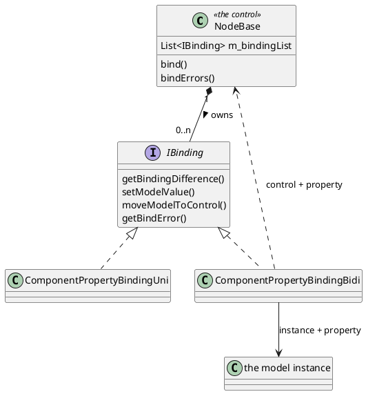
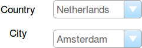

# Data binding details

[Data binding](../../building-pages/50-data-binding/index.md) shows what bindings do and
how to write them: `bind().to(instance, property)`, the two moments in a request at which
data moves, one-way bindings to properties other than the value, and `bindErrors()`. This
page is about the machinery under that - why binding hangs off the request cycle instead
of off setters, where a binding object actually lives, in what order bindings run, and
what "changed" means for a value that is not a simple one.

[TOC]

## Soft binding versus hard binding

DomUI data binding is what we call **soft binding**: the *component* remembers the
binding, and the data is actually moved by two global events - `controlToModel()` when a
request enters the server, and `modelToControl()` when the response is about to be
rendered back.

The alternative is "hard binding". There, all property setters of the model classes are
*observable*: they are coded so that they call listeners as soon as a `setXxx()` changes
the value of a property. That has three costs:

- Instrumenting every setter adds yet more boilerplate to Java's already very verbose
  properties.
- Having setters propagate changes makes it very hard to control *when* bindings execute.
- Since model objects may live quite a while, listeners on their properties have to be
  cleaned up, or the system leaks memory or CPU cycles.

Soft binding avoids all of it. The update moments are fixed by the request/response
cycle, and because the binding is held by the control, a binding disappears the moment
the control goes out of the page's scope - nothing to unregister. A control that is
detached from the page simply stops binding, and starts again when it is added back.

## Bidirectional and unidirectional bindings

A binding to a control's value is bidirectional; a binding to any other control property
moves data from model to control only. That is not a property of the individual binding
but of the kind: the builder creates a `ComponentPropertyBindingBidi` for the value and a
`ComponentPropertyBindingUni` for everything else.

!w There was a definite reason why the others needed to be unidirectional but I do not
!w remember at this time.

One consequence is worth knowing when writing components: because only the value binds
back, a control cannot return more than one value by exposing several bound properties.
Whatever a control produces has to come out through its value.

A second consequence is the `bindValue` property. Bindings read `getBindValue()` rather
than `getValue()` precisely because they read *every* control on *every* request, and
`getValue()` reports conversion and validation failures to the screen as a side effect;
[the tutorial](../../building-pages/50-data-binding/index.md) describes what the binding
then does with the error it catches, and how `bindErrors()` gets it on screen.

## Where a binding lives

The `bind()` call on a component creates a builder, which requires one of its `to()`
methods to be called to complete it. Completing the builder creates a
`ComponentPropertyBindingBidi` or `ComponentPropertyBindingUni` instance and stores it
*inside* the DomUI node of the control.



Because the bindings sit in the DomUI tree, walking the tree finds all of them, and
lifecycle management is automatic: a node that is removed from the display tree takes its
bindings out of play with it.

## Binding order

### Why is binding order important?

Components on the screen are ordered naturally, by their DOM location as created by the
developer. But to handle binding properly it is important that binding is done in the
proper order.

Let's give an example. We have a screen with two combo boxes:



The "Country" combo contains a few countries, the "City" combo contains cities in all of
these countries - not just of the selected country.

Now let's see what happens if we order binding in "dom order". Say the user changes
"Netherlands" to "Great Britain":

- The request enters the server, and binding executes *controlToModel*.
- "Country" changed to "Great Britain":
  - The model discovers that city "Amsterdam" is not in Great Britain, so it changes the
    "city" property to "London".
- But now we bind "city" which is "Amsterdam" from the UI code.
  - The binder overwrites "London" with "Amsterdam", and updates "Country" back to
    Netherlands.

Clearly this is not what we want. We need some "order" imposed on the bindings, so that
binding behaves as expected.

### How DomUI orders binding

When a request comes in, the binding handler (`DefaultBindingHandler`) runs
controlToModel after all components have obtained their value(s) from the request. It
does that as follows:

- Walk the tree, and find all bindings.
- Check each binding for a changed value, i.e. where the model value differs from the
  control value.
  - For items that have the same value: ignore
- We now have a list of bindings whose value changed. Order these bindings as follows:
  - A "deeper" binding comes before a "higher" binding
  - Bindings at the same "level" execute in order of dom traversal.
- Now bind all values as per the above ordering.

```plantuml svg title="controlToModel: collect everything first, then move it"
@startuml
skinparam shadowing false

start
partition "1. collect" {
  :walk the node tree, visiting\na node after its children;
  :ask every binding on the node\nwhat its difference is;
  if (does the control value equal the model value?) then (equal)
    :ignore this binding;
  else (changed)
    :add a BindingValuePair to the list;
  endif
  :the list is now in binding order:\ndeeper before higher, dom order within a level;
}
partition "2. move" {
  :set every collected value on its\nmodel property, in list order;
}
stop
@enduml
```

Collecting before moving is what makes the ordering possible at all: by the time the
first value is written into the model, every control has already been asked what it
holds, so a setter that changes another property can no longer be overwritten by a
control that was read afterwards.

Moving the other way round, modelToControl walks the same tree but the other way about -
a node *before* its children - so that a component may use binding internally as well.

By ordering like this most binding issues should resolve themselves automatically.

# Issues / pitfalls when using binding

## Binding performance

Bindings are visited twice every roundtrip: once to move controls to the model (at
request entry) and once to move the model back to the controls (when the response leaves
the server). Since bindings are handled so often we need special measures to ensure that
this does not get slow.

The core of binding handling is walking the node tree, which is quite fast, so currently
nothing is done to change that.

But moving data is optimized, and most of the optimizations are actually done by the
components themselves.

All DomUI components check, whenever some setter is called, whether the value that is set
actually changed. If it did not then the setter exits immediately. This ensures that
controls are only really updated when some value actually changes on them.

Once data actually changes most DomUI components simply call `forceRebuild()`. This call
destroys their current presentation and causes them to be rebuilt at render time. If
multiple values change on a component `forceRebuild()` gets called every time - but this
call is very cheap. The actual (expensive) rendering only happens when it is time to
present the thing, and at that time no changes will be made anymore.

## When has a value changed?

Most properties on a control are primitives or simple values (like dates and strings), so
checking whether they change in the setter is quite cheap and well defined.

But the value property can also be some complex data structure like a class instance with
multiple properties, a list or a map. For this there is an issue with "what is equal and
what is not".

All controls handling simple values use `equals()` to detect whether a new value has been
set or not. But calling equals on things like collections and maps can be very expensive.
What is worse is that the most common case (nothing changed) is the most expensive: every
object in the list/map needs to be checked. Most DomUI components that have these kinds
of properties will use `==` (reference equality) instead of `equals()` (structural
equality) for these properties (including the value property), to prevent binding from
becoming glacially slow.

This means that to make DomUI aware of a change in these properties you need to create a
new instance of the list, map or whatnot.

## Complex values (values with thingies in them)

In fact, all values that are compound (consist of multiple thingies) are something to be
aware of. Collections and Maps are obvious examples but it also goes for values that are
classes with multiple values in them. Take for instance a class like this:

```java
public class Person {
  public property String firstName;
  public property String lastName;
}
```

We can make some `IControl<Person>` which will edit/display a Person by binding it to
some datamodel property of the same type. This works fine if Person is immutable: in that
case the only way to change the data of a person is to create a new instance and do a
`setValue()` of that instance. This will be seen as a change by the control (as the
instance changes) and consequently the control's presentation is redone, showing the new
person data.

But if Person is mutable another way to change it is to do something like
`p.setFirstName("Frots")`. This changes the firstName property inside the instance, but
the control cannot notice that change because the instance it holds is still the same
instance, so comparing it (either by reference or even by `equals()`) never shows the
change. The net effect is that the data has changed - but the control shows an old value.
