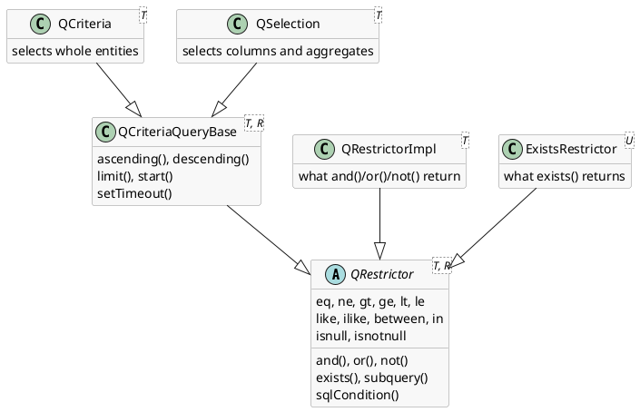
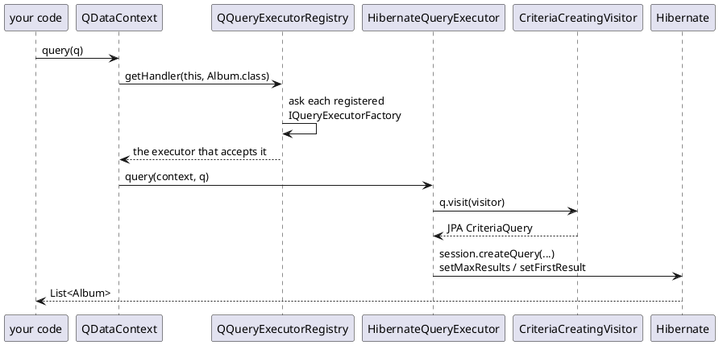

# The generic query layer (QCriteria)

[Using databases](../../building-pages/30-using-databases/index.md) shows what a query
looks like: `QCriteria.create(Album.class)`, restrictions, `or()`, dotted paths, `exists()`
and `limit()`, run on the context a page hands you. This page is about the layer itself -
what the query object *is*, what happens between `dc.query(q)` and the SQL, and the parts
of it a tutorial has no room for: selections, subqueries, raw SQL conditions, and running
a query with no database at all.

[TOC]

## The query is a tree, and nothing else

Everything you call on a query adds a node to an expression tree held in the query object.
There are only four classes involved:



`QRestrictor` is *a place to add conditions to*; `QCriteriaQueryBase` adds what a whole
query has on top of that - ordering, a limit, a timeout. `QCriteria` and `QSelection`
differ only in what a row of the result is. Everything else in the picture is a restrictor
you get handed back by `and()`, `or()`, `not()` or `exists()`, and it behaves exactly like
the query does.

The conditions themselves are `QOperatorNode`s - `QPropertyComparison` for
`property op value`, `QMultiNode` for an `and`/`or` with its children, `QUnaryNode` for
`not` and the null tests, `QExistsSubquery` for a child condition. Nothing interprets them
at the time you write them. They are walked later, by a **`QNodeVisitor`**, and which
visitor is doing the walking decides what the query becomes:

| Visitor | Produces |
| --- | --- |
| `QQueryRenderer` | the readable form you get from `toString()` |
| `CriteriaCreatingVisitor` (hibutil) | a JPA `CriteriaQuery`, to be run by Hibernate |
| `CriteriaMatchingVisitor` (domui) | a yes/no answer for one object already in memory |

That is what "database independent" means here in practice: a `QCriteria` holds no
connection, no session and no dialect, so building one needs no database, and the same
object can be printed, executed, executed again on another context, or matched against a
list.

## From query to SQL



The registry is a list of `IQueryExecutorFactory`, and it is asked **per queried class**:
each factory is offered the class and returns an executor or `null`, first non-null wins.
Setting up Hibernate registers two of them, in this order:

- **`JdbcQueryExecutor`** (`to.etc.webapp.qsql`), which accepts a class carrying
  **`@QJdbcTable`** - a small JDBC-only implementation for classes that are not entities
  of the ORM at all.
- **`HibernateQueryExecutor`**, which accepts everything else.

So a single `QDataContext` can serve both kinds of class, and which machinery runs a query
is decided at query time, from the class being selected. Registering a factory of your own
in front of those is all it takes to route some classes somewhere else entirely.

`limit()` and `start()` are not part of the criteria tree at all: they become
`setMaxResults()` and `setFirstResult()` on the finished query, and `setTimeout(seconds)`
becomes the query timeout.

!i `IQueryListener` is called with every query just before it is executed and may change
!i it - `HibernateConfigurator.registerQueryListener()` installs one. It is the place to
!i add a condition that must be on every query in an application, rather than putting it
!i in every screen.

## What the translator does with a dotted path

Each segment of `invoice.customer.firstName` that navigates *through* an association
becomes an **explicit join**, and the join type is chosen from the relation:

- an **optional** association is joined with a `LEFT` join,
- a **required** one with an `INNER` join, which returns the same rows and is cheaper.

The reason for going out of the way to do that is a trap in JPA: a path built with
`Path.get()` renders as an inner join, and an inner join silently drops the rows that have
no relation - so

```java
QRestrictorImpl<Server> or = q.or();
or.isnull("environment");
or.eq("environment.lifecycle", Lifecycle.ACTIVE);
```

would never return a server without an environment, although the first arm of the `or` asks
for exactly those.

Two more things happen there, and both matter when reading generated SQL:

- **Joins are cached per relation.** A query restricting on `invoice.billingCity` and
  `track.name` joins `Invoice` once and `Track` once, however many conditions use them, and
  an `or` over two different parents works as written.
- **A path that ends in the association's id needs no join**: `artist.id` is answered from
  the foreign key column that is already in the row.

## exists: how the subselect is built

`exists(Album.class, "albumList")` becomes a correlated subselect, and everything it needs
is taken from the mapping:

- the child class comes from the collection's element type,
- the join condition comes from the collection's **`mappedBy`** property: the subquery
  root's `artist` compared with the outer root.

That second point is a requirement: a one-to-many with no `mappedBy` - a unidirectional
collection - cannot be used, and the query fails with a `QQuerySyntaxException` saying so
rather than producing something wrong.

A path that crosses **more than one** collection is rewritten into nested `exists`
subqueries before translation, so these two are the same query:

```java
//-- One exists across two collections...
q.exists(Track.class, Artist_.albumList() + "." + Album_.trackList())
	.ilike(Track_.name(), "%word%");

//-- ...is rewritten into this.
q.exists(Album.class, Artist_.albumList())
	.exists(Track.class, Album_.trackList())
	.ilike(Track_.name(), "%word%");
```

The rendered form shows the path that was reached:

```
FROM to.etc.domui.derbydata.db.Artist WHERE exists (select 1 from $[parent.albumList.trackList] where name ilike '%word%')
```

The path may also walk *up* before it goes down - `exists(Invoice.class, "customer.invoiceList")`
from an `Order` - in which case the part before the collection becomes the parent side of
the join condition.

Why a child condition is a subselect rather than a join, and what it does for `limit()`, is
in [Using databases](../../building-pages/30-using-databases/index.md).

## Selections: more than one thing per row

`QSelection<T>` is the other query. It sits on the same base as `QCriteria`, so every
restriction, ordering and limit works identically; what differs is that you say which
*columns* you want, and a row comes back as an `Object[]`:

```java
QSelection<Invoice> q = QSelection.create(Invoice.class);
q.sum(Invoice_.total());
q.selectProperty(Invoice_.customer());

List<Object[]> rows = dc.query(q);           // {BigDecimal, Customer} per row
```

The selectors are `selectProperty`, `id`, `count`, `countDistinct`, `distinct`, `min`,
`max`, `avg` and `sum`, each with an optional alias, and each in a `String` and a typed
form.

!i **Grouping is implicit.** Every plain property selected - `selectProperty` and `id` -
!i is added to the `group by`; the aggregates are not. The query above therefore groups by
!i customer and sums the invoice totals per customer, and there is no `groupBy()` call to
!i forget.

### Reading the rows as something better than Object[]

An interface whose methods say where they sit in the row turns the array into something
readable, and `QDataContext` will do the mapping:

```java
private interface CustomerTotal {
	@QFld(0)
	double sum();

	@QFld(1)
	Customer customer();
}

List<CustomerTotal> list = dc.query(CustomerTotal.class, q);
```

Each method must carry `@QFld(index)`; the value at that index is converted to the method's
return type. There is a `queryOne(Class, QSelection)` for the single-row case. The
implementation is a `java.lang.reflect.Proxy` over the `Object[]`, so nothing is copied and
no class is generated.

`QQueryUtils.queryCount(dc, criteria)` goes the other way: it takes a `QCriteria` you
already built, moves its restrictions into a `QSelection` that counts `id`, and gives you
the number - the usual way to ask "how many would this find" without fetching them.

## Subqueries in a restriction

Two forms, for two different questions.

**`in` with a selection** - a plain, uncorrelated subquery:

```java
QSelection<Customer> subq = QSelection.create(Customer.class);
subq.selectProperty(Customer_.country());
subq.eq(Customer_.city(), "Paris");

QCriteria<Customer> q = QCriteria.create(Customer.class);
q.in(Customer_.country(), subq);             // country in (select country from ... )
```

**`subquery()`** - a correlated one, which can refer back to the outer query. This finds
the invoice lines that carry the highest unit price of their invoice:

```java
QCriteria<InvoiceLine> rootq = QCriteria.create(InvoiceLine.class);

QSubQuery<InvoiceLine, InvoiceLine> subq = rootq.subquery(InvoiceLine.class);
subq.max("unitPrice");
subq.join("invoice");                        // same invoice as the outer row
subq.join(rootq).ne("id", "id");             // ...but not the outer row itself

rootq.eq("unitPrice", subq);
```

`join(property)` correlates the subquery with the outer query over a relation, and
`join(otherQuery)` gives a restrictor whose comparisons take a property on each side rather
than a property and a value - `ne("id", "id")` is *their* ids differing, not an id
differing from a string.

## When the query layer will not do

`sqlCondition()` puts a fragment of raw SQL in the where clause, with its parameters kept
out of the string:

```java
q.sqlCondition("this_.Total > (select avg(Total) from Invoice)");
```

`this_` in the fragment refers to the root of the query and is rewritten to whatever alias
the generated statement actually uses, which is not predictable in advance. Everything else
in the fragment is yours, database dialect included - it is the escape hatch, not a
feature to reach for.

## A query without a database

Because a `QCriteria` is just a tree, it can be evaluated against objects you already have:

```java
List<Album> matching = MetaManager.query(albumList, q);
```

`CriteriaMatchingVisitor` walks the same restrictions against one object at a time using
DomUI's metadata to read its properties, and the result is sorted by the query's own
ordering. Restrictions and ordering are all it does: `limit()`, `start()` and anything
needing the database (`exists`, subqueries, `sqlCondition`) are not applied. It is the way
to filter a list that a screen is holding with the criteria that screen already builds.

For unit tests there is a second no-database route. Give a query a **`testId`** and
`TestDataContextMock` will return the result registered under that id instead of executing
anything, which lets code that queries be tested without a schema:

```java
QCriteria<Album> q = QCriteria.create(Album.class).testId("albums-by-title");
```

A query reaching the mock without a `testId` fails loudly rather than silently returning
nothing.

## If you know Hibernate's Criteria API

The shape is familiar but the semantics are not the same, and the differences are
deliberate:

- A `QCriteria` is always what Hibernate calls *detached*: it holds no session, so it is
  built, kept, passed around and executed wherever - and there is one class for it, not
  two unrelated ones.
- It is typed on the entity: `QCriteria<Album>` gives a `List<Album>` and the property
  methods have typed forms through
  [typed properties](../../building-pages/40-typed-properties/index.md).
- It is not tied to an ORM. The Hibernate translation is one executor among the registered
  ones, chosen per class.
- A condition on a child collection is an `exists` subselect, never a join - so an entity
  appears once however many children match, and `limit()` counts entities rather than
  joined rows. In Hibernate the same query returns the parent once per matching child, and
  a limit on it quietly limits the wrong thing.

## What is not implemented

- **`fetch()` and `QFetchStrategy` do nothing.** The path is checked against the class, and
  an unknown one is an error, but the strategy is then ignored: the current translator has
  no eager-fetch support, and a query that asks for one is executed without it.
- **`QMultiSelection`** - a selection over more than one operand - is rejected by the
  Hibernate translator.
- The translator builds a JPA `CriteriaQuery` but runs it on a Hibernate `Session`; there
  is no executor that works against a plain JPA `EntityManager` in the built code.
