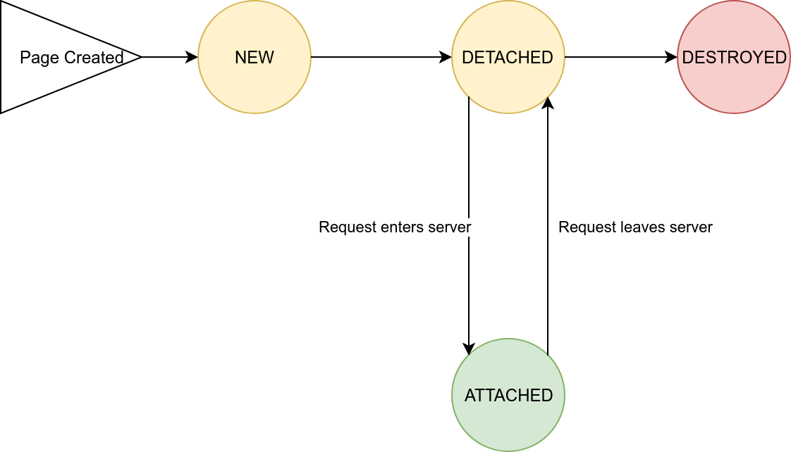

# DomUI State management

DomUI is a stateful framework. This is quite a big advantage when you are writing code because there is no nonsense like serialization nor a need to write a zillion web services to service your page. For more advantages see here.

But having state in the server requires work, because state needs to be managed properly to prevent out of memory errors and database connection problems. This article describes how DomUI state management works.

DomUI state management handles at the very least the following:

- Database connections
- Hibernate sessions or JPA EntityManagers (persistence layer sessions)
- Page state and page objects.

## The Conversation Context

Many things around a Page need to have some form of life cycle. To manage this each page is associated with a unique ConversationContext. This conversation manages all of the resources related to a page.

The ConversationContext related to a page has an ID which can be seen in the $CID parameter present on every DomUI URL: it is the thingy after the dot.

The ConversationContext has a life cycle as follows:

- NEW: The ConversationContext has just been created. The NEW state immediately transitions to ATTACHED.
- ATTACHED: A request has entered the server that needs the context. All of the resources of the Context are available for use.
- DETACHED: No request is currently executing for a page related to the Context. The context is valid but connections are released.
- DESTROYED: The context is still known, but all its resources have been released.

The ConversationContext is managed by DomUI. Attaching and detaching a ConversationContext is simply managed by requests entering or exiting the server. DomUI destroys a Conversation when it finds out that the page is no longer needed. This process is described later on in "destroying conversations".

The ConversationContext contains setAttribute() and getAttribute() calls with which you can add any object into a context, similar to a HttpSession. When an object added to the session attributes implements IConversationStateListener the methods on that listener are called as soon as the conversation's state changes. It is this mechanism which implements the state management of the shared QDataContext (see next section): the implementation for that is stored as an attribute in the ConversationContext and implements the above listener. As soon as that listener's "conversationDetached" method is called the connection for the context gets closed.

Conversation state management is heavily used in the stateful database interface used by DomUI, so let's continue by discussing the needs of the database layers: connection management and the persistence layer, then we'll look how DomUI handles those needs.

## The persistence layer interface inside DomUI

DomUI is designed to be used with either Hibernate Classic or Hibernate JPA. Other persistance frameworks can be used but they will need an implementation of the supporting code for DomUI - look into the module domui-hibutil for details.

Both Hibernate Classic and JPA use two concepts that are very central to the concept of a persistence framework in Java, but they use different names:

- A Hibernate Session or a JPA EntityManager. We will call this the Session from now on because most of the discussion applies to either.
- The Session Factory or EntityManagerFactory. We'll call that the SessionFactory. Its responsibility is to create new Sessions (new connections) where needed.

### The Session / EntityManager

The Session represents a *database connection*: it wraps a database connection and contains a stateful Object cache of Java entity POJO's that have been read using that interface. A key element here is that the Session maintains object identity: if a given record from the database is read multiple times each read, no matter where it comes from, returns the *single object that represents that row in the database*. This is a key requirement for writing proper and reliable business logic; it is important that logic that is constructed from multiple modules all see the changes made by one another. If you have multiple POJO instances for a single row chaos ensues: when multiple copies exist and logic changes both of them - what gets saved in the database?

A session is strictly single user and single threaded. A session contains a connection; as soon as database access needs to be performed it needs to have a connection to do so. Associated with this is a transaction if the session wants to write changes back to the database.

Sessions used in DomUI need to be *managed*: allocated sessions need to be released as soon as possible because they use resources. In addition the underlying connection needs to be managed too to prevent database issues like "Out of connections", deadlocks and transaction locks.

### The Session Factory / EntityManagerFactory

The SessionFactory represents the following:

- The DataSource or equivalent that is to be used to allocate connections
- The Hibernate/JPA database definition (the set of Entity classes and other configuration) that defines how the classes are to be used.

The SessionFactory does not need to be managed as it is just a definition of how the database is defined. But as soon as a Session is allocated from it the Session needs management so that it gets released at the right time.

### Session inside DomUI pages

#### The QDataContext interface

As DomUI supports multiple persistence frameworks we use parts of the QCriteria framework to represent whatever persistence layer "Session" we use. The QCriteria framework "wraps" most of the constructs we need to do database I/O. This includes database session management. A session in QCriteria terms is a QDataContext which is an interface.

This interface has more or less the same set of methods as the EntityManager or Session interfaces, but in a completely framework independent way. The specific interface module of DomUI defines the actual implementation of QDataContext which would be a wrapper around the appropriate Session / EntityManager / Whatever object.

#### Shared QDataContext for all page fragments and Nodes

A DomUI page can allocate a "default" QDataContext by calling getSharedContext(). This method is available on all DomUI nodes and can be called as soon as the node is attached (added) to some page. The getSharedContext returns a default QDataContext which will be stored with the Page. Subsequent calls to getSharedContext from any node in the page will always return the same QDataContext(). In this way all queries done using the shared data context always return objects related through a single Session/EntityManager.

The QDataContext returned by getSharedContext is a special one: it will not be closed even when someone calls close() on it. This ensures that the context remains available for DomUI components or fragments on the page.

The QDataContext is fully managed by DomUI: it will be closed automatically as soon as the DomUI page it belongs to is destroyed. This will also close any underlying connection.

### Database connection management for shared QDataContext's

A QDataContext needs a database connection as soon as it actually needs to do work. But a database connection is a very expensive resource, so it is important to release it as soon as possible to prevent scaling issues.

Another problem is that keeping a database connection (and underlying transaction) open quickly cause (dead)locks: when multiple users open pages that each keep connections open ti is easy to get into a state where pages need to wait on the transactions for those pages - even when the pages themselves are just presented on the screen. This shows itself as "busy" screens that run forever.

All of this that connections need to obey a simple rule:

- A connection can only be open shortly while some page code *executes in the server*!  As soon as the server is done with a page the connection **must** be released!

Closing a connection does not necessarily mean that the Session also needs to close, because that would mean we cannot keep state. While Hibernate has a concept of a "detached" object this concept is just one big problem: it is almost impossible to manage these detached objects when they need to be attached again.

DomUI uses "Long Running Sessions" to handle stateful pages. A long running session works as follows:

- As soon as a page requires a Session one gets allocated from the SessionFactory. This session gets stored in the ConversationContext (a thing related to the page requesting the session).
- As soon as the Session is used to get data this causes a Connection to be allocated.
- As soon as the page is rendered DomUI will inactivate the Session and close the underlying Connection. This will also rollback any Connection-level transaction.
- For every request entering the server DomUI will do the following:
  - The Session will be reactivated, and a new connection will be allocated to it.
  - The DomUI code that handles the request is executed. This code can now use the QDataContext at will, and earlier Entities read using the context are valid.
  - As soon as the request is handled and the response is sent back to the Browser the session is detached again and the connection closed.
- Once the Page is destroyed the Session connected to it is destroyed too, releasing all memory.

### Side effects of closing the connection in a Long Running Session

Closing the connection has a few consequences - nothing is perfect.

Because the connection is closed between requests this means that data cannot be saved to the database until it is really time to commit. Only at commit time are we sure that all data has been prepared properly, so at that time we can start all database I/O and commit after. To make sure that the persistent framework does not do I/O in between we put the session into *Manual Flush* mode. In this mode the framework will never do any database updates until commit time.

This has one important side effect having to do with queries... When you do a query most frameworks would first flush all changes to the database so that the database query would correctly see all changes already made to objects. So if you changes Person.name = 'Jal' somewhere and you would query for Persons with a name='jal' you would find that object.

But flushing at query time does not work with connections that gets closed. So having flush = manual means that querying will see database state *without* the changes so far made to Entity objects in the session.

In practice this does not pose a very big problem because most of the time it is important to handle entity changes inside pages in a different way anyway.

## What else: SubPages..

This all talked about UrlPages. In DomUI 2.0 [we also have SubPages, and they work differently](../../99-todo/subpages/index.md).
