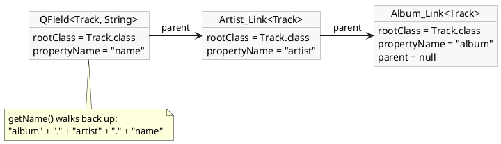

# Typed properties: the annotation processor

[Typed properties](../../building-pages/40-typed-properties/index.md) shows what
`Album_.artist().name()` buys you and how to switch the processor on. This page is the
other half: what the processor writes, how it decides which properties get a method - and
why a property you expected is sometimes not there at all.

[TOC]

## Two classes per annotated class

`AlbumOrder`, the model the data binding tutorial edits, is a plain class with six
properties and one annotation on it:

```java
@GenerateProperties
public class AlbumOrder {
	public String getCustomerName() { ... }
	public Genre getGenre() { ... }               // Genre is a JPA @Entity
	public Date getDeliveryDate() { ... }
	public Integer getCopies() { ... }
	public BigDecimal getPrice() { ... }
	public OrderState getState() { ... }          // an enum
}
```

Compiling it produces `AlbumOrder_`, verbatim as generated:

```java
@Generated(value = { "Generated by etc.to PropertyAnnotationProcessor 1.0" })
final public class AlbumOrder_ {
	private AlbumOrder_() {
	}

	@NonNull
	static public final QField<AlbumOrder, java.lang.String> customerName() {
		return new QField<>(AlbumOrder.class, "customerName");
	}

	@NonNull
	static public final to.etc.domui.derbydata.db.Genre_Link<AlbumOrder> genre() {
		return new to.etc.domui.derbydata.db.Genre_Link<>(AlbumOrder.class, null, "genre");
	}

	@NonNull
	static public final QField<AlbumOrder, to.etc.domuidemo.pages.tutorial.binding.OrderState> state() {
		return new QField<>(AlbumOrder.class, "state");
	}

	...
}
```

and, next to it, `AlbumOrder_Link`:

```java
@Generated(value = { "Generated by etc.to PropertyAnnotationProcessor 1.0" })
final public class AlbumOrder_Link<R> extends QField<R, AlbumOrder> {
	public AlbumOrder_Link(@NonNull Class<R> rootClass, @NonNull String propertyName) {
		super(rootClass, propertyName);
	}

	public AlbumOrder_Link(@NonNull Class<R> rootClass, @Nullable QField<R,?> parent, @NonNull String propertyName) {
		super(rootClass, parent, propertyName);
	}

	@NonNull
	public final QField<R,java.lang.String> customerName() {
		return new QField<R,java.lang.String>(getRootClass(), this, "customerName");
	}

	...
}
```

The two have the same property methods and different jobs:

- **`X_`** is where a path starts. It has a private constructor and nothing but static
  methods, so it is never instantiated - `AlbumOrder_.price()` is the only way in.
- **`X_Link<R>`** is how a path continues *through* an `X`, and it is itself a
  `QField<R, X>`. That is the whole trick behind chaining: `AlbumOrder_.genre()` returns a
  `Genre_Link<AlbumOrder>`, which is both a usable property (the genre itself) and the
  carrier of every `Genre` property (`.name()`).

Both are generated for every annotated class, whether or not anything ever links to it,
and both land in the package of the class they came from.

!i The names are the class name plus `_` and `_Link`. A hand-written class called
!i `AlbumOrder_Link` in that same package collides with the generated one.

## A path is a linked list, flattened on demand

`QField` is smaller than it looks. It holds three things and can answer two questions:

```java
public class QField<R, P> {
	@Nullable final private QField<R, ?> m_parent;
	@NonNull final private Class<R> m_rootClass;
	@NonNull final private String m_propertyName;

	@NonNull
	final public String getName() {
		QField<R, ?> parent = m_parent;
		if(parent == null)
			return m_propertyName;
		return parent.getName() + "." + m_propertyName;
	}

	@NonNull
	public Class<R> getRootClass() {
		return m_rootClass;
	}
}
```

Each step of a path is one object pointing back at the previous one:



`getName()` is where all the typing ends: from there on it is the string `album.artist.name`,
which is exactly what the same query would have got from a hand-written literal. That is
why a typed property can be handed to any API that accepts a `String` property path and
behaves identically, and why using them costs nothing at runtime beyond a couple of small
objects per call. `toString()` returns `getName()` as well, so a `QField` prints as its
path.

`getRootClass()` is the part a string cannot supply, and it is what makes a property
usable on its own - `MetaManager.getPropertyMeta(field.getRootClass(), field)` needs no
`Class` argument alongside the property, because the property carries one.

## Which properties get a method

The processor first collects the properties. A property is a method with **no arguments,
a non-`void` return type and a name starting with `get` or `is`**; the rest of the name,
decapitalised, is the property name. It scans the class, the interfaces it implements and
every superclass up to `Object`, so a property inherited from a base class or declared on
an interface is generated like any other, and the first definition of a name wins. Fields
are never looked at, which is why `@IgnoreGeneration` belongs on the getter; `getClass()`
is dropped.

Then, per property, the *type* decides what is generated, in this order:

1. The getter carries a **`@Column`** annotation - generated with the property's own type,
   whatever that type is. Persisted is persisted.
2. The type is a **simple type** - generated. Simple means any primitive (written as its
   wrapper: `int` becomes `QField<X, Integer>`), any enum, and exactly these classes:
   `Boolean`, `Byte`, `Character`, `Short`, `Integer`, `Long`, `Float`, `Double`,
   `BigInteger`, `BigDecimal`, `String`, `java.util.Date`, `java.sql.Date`.
3. The type has **no element to inspect** - an array like `String[]` - generated as it is.
4. The type is a **`Collection` or a `Map`** - generated as a `QField` of the collection
   type itself: `Album_.trackList()` is a `QField<Album, List<Track>>`. It is an endpoint,
   not a step: a path does not continue through it, which is why `exists()` wants the
   child class named beside the property.
5. The type's own class is annotated with **`jakarta.persistence.Entity` or
   `to.etc.annotations.GenerateProperties`** - generated as a `_Link` method, and the path
   continues.
6. Anything else - **nothing is generated**, silently.

That last rule is the one that surprises people:

```java
@GenerateProperties
public class Thing {
	public LocalDate getWhen() { ... }             // no Thing_.when()

	@Column(name = "Stamped")
	public LocalDate getStamped() { ... }          // QField<Thing, LocalDate>

	public UUID getKey() { ... }                   // no Thing_.key()
}
```

!! The `java.time` types are not in the simple list, and neither is `UUID`. On a JPA
!! entity you never notice, because those getters carry `@Column` and rule 1 catches them;
!! on a plain `@GenerateProperties` model class the property is simply absent, with no
!! error to say why. Put `@Column` on the getter, or make the type's own class generate.

One more shaping rule: a property whose name is a Java reserved word gets a trailing
underscore, so `getNew()` becomes `Thing_.new_()`.

## Properties that are not generated

The generated classes are for model classes. Components are not model classes and are not
generated - generating for the whole component tree would be a lot of work for nothing.
Instead the component properties that are worth binding to are hand-written `QField`
constants on the interfaces that declare them:

```java
static public final QField<NodeBase, Boolean> DISABLED = new QField<>(NodeBase.class, "disabled");
static public final QField<NodeBase, Boolean> READONLY = new QField<>(NodeBase.class, "readOnly");
```

`IControl.DISABLED` and `IControl.READONLY` are the two above; `CssBase.DISPLAY` and
`CssBase.VISIBILITY` are the same thing for the css properties. Nothing distinguishes them
from a generated property - they are `QField`s built by hand.

Wherever DomUI accepts a property it accepts both forms, and a `QField` overload sits next
to the `String` one: `QCriteria` and its restrictions, `NodeBase.bind()` and the `to()`
calls of both binding builders, `StyleBinding.to()`, `RowRenderer.column()`,
`MetaManager.getPropertyMeta()` and `findPropertyMeta()`.

The prettiest of those is the converting binding, where both ends are typed and the lambda
therefore needs no cast:

```java
Text2<BigDecimal> price = new Text2<>(BigDecimal.class);
price.bind(CssBase.VISIBILITY).to(m_order, AlbumOrder_.state(),
	state -> state == OrderState.Cancelled ? VisibilityType.HIDDEN : VisibilityType.VISIBLE);
```

`to(instance, property, converter)` takes a `FunctionEx<MV, CV>`, where `MV` is the type of
the model property and `CV` the type of the component property being bound. Both are known
here - `OrderState` in, `VisibilityType` out - because `CssBase.VISIBILITY` and
`AlbumOrder_.state()` each carry their type. Written with strings, the same binding would
need the types spelled out and the compiler could check neither end.

## Running the processor

The generated sources land where any annotation processor puts them,
`target/generated-sources/annotations`, and are compiled with everything else: there is
nothing to check in. Which poms and which IntelliJ settings the processor needs is under
"Turning it on" in [Typed properties](../../building-pages/40-typed-properties/index.md).

Two things are worth knowing when it appears not to work:

- The Eclipse batch compiler calls a processor more than once for the same class in some
  builds, which makes the `Filer` refuse the second attempt with *"source file already
  exists"*. The processor swallows exactly that message and reports every other failure as
  a compile error, so an error you *do* see is a real one.
- Setting the environment variable **`DOMUI_ANNDEBUG`** (to anything) makes it print every
  class it processes and every property it finds. That is the way to find out why a class
  produced nothing: either it never reached the processor, or its properties fell through
  rule 6 above.

The processor declares source version 21 and reacts to exactly two annotations,
`jakarta.persistence.Entity` and `to.etc.annotations.GenerateProperties`. A class annotated
with the old `javax.persistence.Entity` is not seen at all.

## Getting existing code to use them

Code written before the processor existed is full of property strings that now have a
typed equivalent. The [IntelliJ plugin](../../getting-started/intellij-plugin/index.md)
underlines those strings and offers a quick fix that replaces each with the generated
property, which is a good deal faster than doing it by hand.
