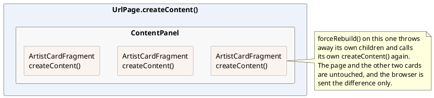

# Layout

The pages so far filled themselves with content. This one is about the shape
around that content: the panel a page's content sits in, the bar its buttons sit
on, and the tabs that put three screens in the space of one.

And then the more useful half: how you make a piece of screen **of your own** -
a class that draws one part of a page and can be used on ten of them.

[TOC]

## The panel a page sits in

```java
//-- Added to the page itself: no space around it at all.
Div outside = new Div();
add(outside);
outside.add("This line sits on the page itself: hard against the edge.");

//-- Everything else goes in here.
ContentPanel cp = new ContentPanel();
add(cp);
cp.add(new HTag(1, "Panels and button bars"));
```

!demo(to.etc.domuidemo.pages.tutorial.layout.LayoutPanelPage.ui, 100%, 300)

A `ContentPanel` is a `Div` with the css class `ui-cpnl` and nothing else: the
class is what gives it the padding the theme prescribes. The page body has no
padding of its own, which is what the first line of the demo shows - so
**a page's content goes inside a `ContentPanel`**, and that is the one rule of
this section.

Anything overlaying the page - a message box, a floating window - is added to the
page itself rather than to the panel, since it is not part of the content.

## The bar the buttons sit on

```java
ButtonBar2 bb = new ButtonBar2();
cp.add(bb);
bb.addBackButton();
bb.addButton("Save", Theme.BTN_SAVE, a -> save());
bb.addConfirmedButton("Delete", Theme.BTN_DELETE, "Delete this order?", a -> delete());
bb.right();                                    // Everything after this goes right
bb.addLinkButton("Help", Theme.ICON_BIG_INFO, a -> help());
```

The bar is a `Div` that arranges what it is given: a left group and a right
group, horizontal by default, vertical with `new ButtonBar2(Direction.VERTICAL)`.
What you add to it are not plain buttons but *kinds* of button:

| Call | What it adds |
| --- | --- |
| `addButton(text, icon, click)` | an ordinary `DefaultButton` |
| `addLinkButton(text, icon, click)` | the same as a link rather than a button |
| `addConfirmedButton(text, icon, question, click)` | a button that asks the question first and only calls the handler on yes |
| `addBackButton()` | goes back to the page you came from |
| `addCloseButton()` | closes the window |
| `addAction(instance, action)` | a button made from an `IUIAction`, which carries its own name, icon and enabled/disabled state |
| `addButton(node, order)` | anything at all, for what the list above does not cover |

`addBackButton()` reads the shelf of pages that
[page navigation](../60-page-navigation/index.md) is about: when there is nothing
to go back to it quietly becomes a **Close** button instead. Open the demo page
from the tutorial menu and it says Back; open it by its own URL and it says
Close.

Every `add...` method takes an optional `order` number and the bar sorts on it,
so where a button ends up does not depend on the order in which the code happened
to add it. Buttons added after the bar was built make the bar rebuild itself.

## Tabs

```java
TabPanel tp = new TabPanel();
cp.add(tp);

Div details = new Div();
details.add("The artist's details would be here.");
tp.tab()
	.label("Details")
	.content(details)
	.build();

Div albums = new Div();
ITabHandle albumTab = tp.tab()
	.label("Albums")
	.image(Icon.faMusic)
	.content(albums)
	.lazy()                                    // Built when it is first shown
	.build();
```

!demo(to.etc.domuidemo.pages.tutorial.layout.LayoutTabPage.ui, 100%, 460)

A tab is a label plus a body, and `tab()` is the builder that describes one:

| On the builder | |
| --- | --- |
| `label(String)`, `label(IBundleCode)`, `label(NodeBase)` | what the tab says |
| `image(IIconRef)` | an icon in front of the label |
| `content(NodeBase)` | the body |
| `lazy()` | do not build the body until the tab is first shown |
| `closable()` | give the tab a cross |
| `position(int)` | where in the row it goes |
| `onDisplay`, `onHide`, `onClose` | called when the tab is shown, hidden, closed |
| `build()` | makes the tab and returns an `ITabHandle` |

The `ITabHandle` is how the rest of the page talks to a tab afterwards:
`select()` shows it, `close()` removes it, `updateLabel()` and `updateContent()`
replace what it holds - the demo page has a button that selects the album tab
from outside.

Two things are worth knowing beyond that. `lazy()` matters for a tab whose body
costs a query: without it every tab is built when the page is, whether the user
ever looks at it or not. And `new TabPanel(true)` makes the panel an **error
fence** (the one from [telling something to a user](../90-telling-the-user/index.md)):
it catches the messages raised inside it and marks the tab that produced them, so
a validation error two tabs away is not invisible.

For a row of tabs that must stay on one line, with scroll arrows instead of
wrapping, use `ScrollableTabPanel` - the same class with a different header.

## A piece of screen of your own

Everything above is somebody else's class doing one job. Nothing stops you from
writing one:

```java
public class ArtistCardFragment extends Div {
	private final Artist m_artist;                 // What it shows
	private boolean m_showAlbums;                  // What it remembers

	public ArtistCardFragment(Artist artist) {
		m_artist = artist;
		setCssClass("dm-card");
	}

	@Override
	public void createContent() throws Exception {
		add(new HTag(2, m_artist.getName()));

		int albums = m_artist.getAlbumList().size();
		Div count = new Div();
		add(count);
		count.add(albums == 1 ? "1 album in the shop" : albums + " albums in the shop");

		add(new LinkButton(m_showAlbums ? "hide the albums" : "show the albums",
			m_showAlbums ? Icon.faAngleDown : Icon.faAngleRight,
			a -> {
				m_showAlbums = !m_showAlbums;      // Change the state...
				forceRebuild();                    // ...and build this fragment again
			}));

		if(m_showAlbums) {
			Ul ul = new Ul();
			add(ul);
			for(Album album : m_artist.getAlbumList()) {
				ul.add(new Li().add(album.getTitle()));
			}
		}
	}
}
```

Using it is one line, and using it three times is three:

```java
Div row = new Div("dm-cardrow");
cp.add(row);
for(Artist artist : artistList) {
	row.add(new ArtistCardFragment(artist));
}
```

!demo(to.etc.domuidemo.pages.tutorial.layout.LayoutFragmentPage.ui, 100%, 300)

Open the albums on one card and the other two do not move. Each card is a
separate instance with its own `m_showAlbums`, and `forceRebuild()` on one of them
redraws that card and nothing else.

That class is a **fragment**: a `NodeContainer` - almost always a `Div` - that
fills itself in `createContent()`. It is exactly what a `UrlPage` is, minus the
URL: the same method, the same lifecycle, the same rules.



### Why bother

- **The same block on more than one screen.** An address, a card, a search
  header, a totals line: written once, used wherever it belongs. When it changes,
  it changes everywhere.
- **A page's `createContent()` stays readable.** A three hundred line build
  method is three hundred lines of somebody else's problem; five fragments of
  sixty are five things with names.
- **Each part redraws on its own.** `forceRebuild()` on a fragment rebuilds that
  fragment; what the browser gets is the difference. A page-wide rebuild for a
  change in one corner is both slower and more disruptive - it throws away
  scroll positions and focus everywhere.
- **State lives with what owns it.** `m_showAlbums` is the card's business. The
  page that puts three cards on the screen has no field for it, and no handler
  for it either.
- **It is where the css class goes.** `setCssClass("dm-card")` in the
  constructor, `.dm-card` in the application's stylesheet: the layout of that
  block is written down in one place too.

### The rules inside one

They are the rules of a page, for the same reason:

- **The components it builds are local variables of `createContent()`.** A
  rebuild throws them away and makes new ones; a field would still point at the
  old.
- **The state it rebuilds from is in fields**, and a handler changes a field and
  calls `forceRebuild()`.
- **What comes in comes through the constructor**, and stays in a `final` field.
  A fragment that needs to be told something later gets a setter that changes the
  field and calls `forceRebuild()`.
- **What goes out goes through a listener.** A fragment does not know the page it
  is on; it hands back what happened, and the page decides what that means.

There is one deliberate exception to the first rule, and the next section is it.

## A section that folds shut

Here is a fragment written to be used rather than to be read - a titled section
with a chevron that folds it shut:

```java
public class CollapsibleSection extends Div {
	private final String m_title;

	/** The state this fragment rebuilds itself from. */
	private boolean m_expanded;

	/**
	 * The content, made once and kept: it holds what the caller put in it, so it
	 * has to survive this fragment being built again.
	 */
	private final Div m_content = new Div("dm-cs-c");

	@Nullable
	private INotify<CollapsibleSection> m_onToggle;

	public CollapsibleSection(String title) {
		this(title, true);
	}

	public CollapsibleSection(String title, boolean expanded) {
		m_title = title;
		m_expanded = expanded;
		setCssClass("dm-cs");
	}

	@Override
	public void createContent() throws Exception {
		Div header = new Div("dm-cs-h");
		add(header);
		header.add(new LinkButton(m_title, m_expanded ? Icon.faAngleDown : Icon.faAngleRight, a -> toggle()));

		if(m_expanded) {
			add(m_content);
		}
	}

	/** Where the caller puts what the section contains. */
	public Div getContent() {
		return m_content;
	}

	public boolean isExpanded() {
		return m_expanded;
	}

	public void toggle() throws Exception {
		setExpanded(!m_expanded);
		INotify<CollapsibleSection> onToggle = m_onToggle;
		if(null != onToggle) {
			onToggle.onNotify(this);
		}
	}

	public void setExpanded(boolean expanded) {
		if(expanded == m_expanded) {
			return;
		}
		m_expanded = expanded;
		forceRebuild();                            // Only this fragment is redrawn
	}

	/** Called after the section was opened or closed, for a page that wants to know. */
	public void setOnToggle(@Nullable INotify<CollapsibleSection> onToggle) {
		m_onToggle = onToggle;
	}
}
```

A page fills it and forgets about it:

```java
CollapsibleSection customer = new CollapsibleSection("Customer");
cp.add(customer);
FormBuilder fb = new FormBuilder(customer.getContent());
fb.label("Name").control(name);
fb.label("City").control(city);

CollapsibleSection albums = new CollapsibleSection("Albums", false);   // Starts closed
cp.add(albums);
albums.getContent().add(dt);

CollapsibleSection notes = new CollapsibleSection("Notes", false);
cp.add(notes);
notes.getContent().add("Nothing to say about this order.");
notes.setOnToggle(section -> log.add("Notes are now " + (section.isExpanded() ? "open" : "closed")));
```

!demo(to.etc.domuidemo.pages.tutorial.layout.LayoutSectionPage.ui, 100%, 460)

Three things in it are worth pointing at, because they are what every component
you write will have to answer.

**Where the content lives.** `m_content` is a `Div` in a field, which the rules
above just told you not to do. It is deliberate: that div holds what the *caller*
put in it - a form, a table, a paragraph - and the caller filled it before this
fragment was ever built. Rebuilding the section must not throw that away, so the
div is made once, in the field initialiser, and `createContent()` only decides
whether to `add()` it. Collapse the album section in the demo and open it again:
the table comes back as it was, because the object was never destroyed, only
detached.

The rule the fields obey is therefore not "no components in fields" but the
reason behind it: **a field may hold what the fragment does not build**. Its own
header and its own button are built in `createContent()` and are local.

**What it costs to open and close.** `setExpanded()` changes a boolean and calls
`forceRebuild()`. It does not touch the page, does not re-query anything, and the
browser is sent only the piece of DOM that changed.

**How it tells anyone.** `setOnToggle()` takes an `INotify<CollapsibleSection>`,
which is DomUI's general "something happened" callback - a lambda receiving the
sender. The section does not know what a page wants to do about it, and does not
need to. That is the shape every event on every DomUI component has.

What this fragment does *not* have is what separates a fragment from a
**component**: a value it holds and reports (`getValue()`), the read-only,
disabled and mandatory states, a place in the form builder, metadata deciding how
it looks. Those are the subject of
[building components](../../components/index.md).
