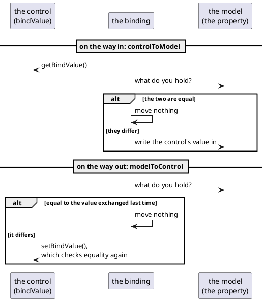

# Writing a component

The previous page ended with a fragment: a class that draws a piece of screen. A
**component** is a fragment that also holds a *value* - something a form builder
can put on a form, a binding can write into, and a page can ask for.

And that is all it is. There is no registry to enter, no base class you must
extend, no annotation to add: a component is a class that implements
`IControl<T>`.

[TOC]

## A control of your own

```java
public class StarRating extends AbstractDivControl<Integer> {
	private final int m_stars;

	public StarRating() {
		this(5);
	}

	@Override
	public void createContent() throws Exception {
		setCssClass("dm-rating");                          // setCssClass: this runs again on every rebuild
		if(isDisabled()) {
			addCssClass("dm-rating-disabled");
		} else if(isReadOnly()) {
			addCssClass("dm-rating-ro");
		}

		Integer value = internalGetValue();
		int rating = null == value ? 0 : value.intValue();
		for(int i = 1; i <= m_stars; i++) {
			int star = i;
			Span span = new Span(star <= rating ? "dm-rating-on" : "dm-rating-off", star <= rating ? "★" : "☆");
			add(span);
			if(!isDisabled() && !isReadOnly()) {
				span.setClicked(a -> starClicked(star));
			}
		}
	}
}
```

!demo(to.etc.domuidemo.pages.tutorial.component.ComponentStarPage.ui, 100%, 340)

Click the stars. Then press the buttons: the page sets a value into it, reads a
value out of it, switches it to read-only, disabled and mandatory - all the
things it would do with a `Text2`, because as far as the page is concerned there
is no difference.

## What IControl asks for

`IControl<T>` is the whole contract, and it is small. It inherits most of it:

| From | What it wants |
| --- | --- |
| `IControl<T>` itself | `setValue(T)`, `getValue()`, `hasError()`, `isReadOnly`/`setReadOnly`, `isMandatory`/`setMandatory`, `getErrorLocation`/`setErrorLocation` |
| `IActionControl` | `isDisabled`/`setDisabled`, `setFocus()`, `setTestID`/`getTestID`, `setHint()` |
| `IHasChangeListener` | `getOnValueChanged`/`setOnValueChanged` - the change event every control has |
| `INodeErrorDelegate` | `setMessage(UIMessage)`/`getMessage()` - how the control carries its own error |
| `IForTarget` | `getForTarget()` - the node a `<label for=...>` should point at, or null when there is no real input to point at |

Nothing in there says "node". The interface may be implemented on any object -
but a control that has to appear on a screen is a node in practice, and where it
starts decides how much of the list is already written for you: `Text2` and
`Checkbox` are built on the HTML input elements they wrap, and a control made of
a `div` full of other nodes starts at `AbstractDivControl`.

## AbstractDivControl

`AbstractDivControl<T>` is a `Div` that implements `IControl<T>` and keeps the
five pieces of state every control has - the value, read-only, disabled,
mandatory, and the change listener:

| It gives you | What it does |
| --- | --- |
| `internalGetValue()` / `internalSetValue(T)` | the value, with **no** side effects; where the control itself reads and writes it |
| `setValue(T)` | the equality check, then `internalSetValue()`, then `onValueSet()` |
| `onValueSet(T)` | `forceRebuild()` - override it when a redraw is too much |
| `setReadOnly`, `setDisabled`, `setMandatory` | the same "did it change?" check, then `readOnlyChanged()` / `disabledChanged()` / `mandatoryChanged()`, which rebuild |
| `getValue()` / `getBindValue()` | validation hooks and the value |
| `setBindValue(T)` | skip when equal, else `setValue()` |
| `getOnValueChanged` / `setOnValueChanged` | the change listener, kept for you |

Which leaves four things to write, and `StarRating` is exactly those four:

- **`createContent()`** - draw the value and the state. It runs again on every
  rebuild, so it must read `internalGetValue()` and `isReadOnly()` and the rest
  each time rather than remember anything.
- **`getForTarget()`** - return the input a label may point at, or `null`.
- **`validateBindValue()`** - what "invalid" means here.
- **turning what the user does into a value** - the click handler below.

## How the control learns about a change

For a control made of real HTML inputs, the browser sends the field values with
every request and the framework asks each node `acceptRequestParameter()`, which
answers *whether the value differed from what the node held*. Nodes that say yes
**and** have a change listener are collected, and their listeners are called
after the bindings have run and before the click handler -
[using components](../20-using-components/index.md) has that round trip.

A control like `StarRating` has no input element: the change is a click, so the
control has to do the work itself.

```java
private void starClicked(int star) throws Exception {
	Integer current = internalGetValue();
	Integer newValue = null != current && current.intValue() == star
		? null                                             // Clicking the current rating clears it
		: Integer.valueOf(star);

	setValue(newValue);                                    // Rebuilds, but only on a real change
	OldBindingHandler.controlToModel(this);                // This request's binding pass already ran
	IValueChanged<StarRating> onValueChanged = (IValueChanged<StarRating>) getOnValueChanged();
	if(null != onValueChanged) {
		onValueChanged.onValueChanged(this);
	}
}
```

Three lines, three obligations:

- **`setValue()`**, so the value goes in through the front door and the control
  redraws.
- **`OldBindingHandler.controlToModel(this)`**, because a click handler runs
  *after* the request's control-to-model pass. Without it the model would keep
  the old value until the next request, and a Save pressed in that same request
  would save the wrong thing. The framework's own click-driven controls - the
  lookup input among them - do exactly this.
- **the change listener**, because a page that asked to be told about changes has
  no other way of hearing about this one.

!i A control built out of *other DomUI controls* has a fourth option: let the
!i inner control do the work and pass the event on, the way `RadioGroup` does -
!i its buttons report their own change and delegate `internalOnValueChanged()` up
!i to the group.

## When has a value changed?

Everything above turns on that question, and the answer is one method:

```java
@Override
public void setValue(@Nullable T v) {
	if(MetaManager.areObjectsEqual(v, internalGetValue()))
		return;                                            // Nothing happens at all
	internalSetValue(v);
	onValueSet(v);                                         // forceRebuild()
}
```

Setting the value a control already holds costs nothing: no redraw, no event,
no delta to the browser. That is deliberate - it is what makes it safe for a
binding to push the model value into a control on every single request. But it
also means the control's idea of "changed" is entirely
`MetaManager.areObjectsEqual`, and that method is more clever than `equals()`:

| It compares | Result |
| --- | --- |
| `a == b` | the same value |
| `a.equals(b)` | the same value |
| classes unrelated | different |
| the class has a primary key in its metadata, and the keys are equal | **the same value** |
| arrays | element by element, with the same rules |
| anything else | different |

!demo(to.etc.domuidemo.pages.tutorial.component.ComponentEqualityPage.ui, 100%, 400)

The demo above is that table, pressed one button at a time. Two of its buttons
are the traps worth knowing by heart.

**A mutable object that changed inside is still the same value.**

```java
m_album.setTitle(m_album.getTitle() + "!");
badge.setValue(m_album);                                   // The same instance: nothing happens
```

The control was handed the very object it already held, `a == b` is true, and
`setValue()` returns without doing anything - so the screen keeps showing the old
title. Nothing is broken; the control was simply never told that anything
happened.

**Two objects with the same primary key are the same value.**

```java
Album copy = new Album();
copy.setId(m_album.getId());
copy.setTitle("A different object with id " + m_album.getId());
badge.setValue(copy);                                      // Also nothing: same row
```

That rule is what makes entity-valued controls work at all - a combobox holding
`Album #3` has to recognise a freshly loaded `Album #3` as the value it already
shows, whatever instance it is. The price is that a *changed* copy of the same
row does not register either.

The way out is any of these, and which one is right depends on what you are
modelling:

- **Treat a control's value as immutable.** Instead of changing the object, put a
  different object in: this is why value classes with a real `equals()` are worth
  writing.
- **Say it yourself**: `forceRebuild()` on the control redraws it whether or not
  it thinks its value changed. It is the honest answer when the object genuinely
  is the same one and only its contents moved.
- **Give the class an `equals()` that means what you want** - it is asked before
  the primary key rule.

!! A control cannot tell "set to null" from "never set" by equality either: both
!! are `null`. A control that has to know - `RadioGroup` does, to decide whether
!! anything is selected at all - keeps its own `m_valueIsSet` flag beside the
!! value.

## The same question, twice, in a binding

A binding moves data at the two moments
[data binding](../50-data-binding/index.md) describes, and at each of them it
asks the same question before moving anything.



On the way **in**, the binding reads the control's `bindValue` and compares it
with what the model property currently returns; equal means the user changed
nothing, so nothing is written.

On the way **out** it compares the model value with `m_lastValueFromControlAsModelValue`
- the value it last exchanged with that control - rather than with the control's
current value. That is what keeps a control in error showing the text the user
typed instead of having it overwritten by the unchanged model value.

Both comparisons are `areObjectsEqual`, so the trap above is the trap here:

```java
m_review.getAlbum().setTitle(m_review.getAlbum().getTitle() + "!");   // Invisible
m_review.setAlbum(anotherAlbum);                                      // Moves
```

Mutating the object the model already held changes nothing on screen: the
binding compares it against the same instance and concludes that nothing
happened. Putting a *different* object in the property moves it - unless it is
another instance of the same database row, which by the primary key rule is the
same value again.

Collections get one exception. Because a `List` that was added to is still the
same instance, `moveModelToControl` also compares a hash over the collection's
contents, and pushes when that changed. It is a patch over the same hole, and it
only covers `Collection` values.

!! **Bindings move data only when the value actually changed, and "changed" means
!! `areObjectsEqual` says so.** Change what is *inside* a bound object and no part
!! of the framework will notice. Replace the object, or tell the control.

## bindValue and value

Both halves of that story read the control through `bindValue` rather than
`value`, and the difference between the two is not what they return but **who is
told about the trouble**.

| | `getValue()` | `getBindValue()` |
| --- | --- | --- |
| who calls it | your code | the binding |
| when the value is invalid | posts the message on the control **and** throws `ValidationException` | throws, and reports nothing |
| who reports it then | nobody has to - it is on the screen | the binding keeps the error until `bindErrors()` is called |
| | `setValue()` | `setBindValue()` |
| what it does | changes the value if it differs | the same check, then `setValue()` |

The reason for the split is on the [data binding](../50-data-binding/index.md)
page: a binding reads *every* control on *every* request, so if it used
`getValue()` the first field a user filled in would light up every other field on
the form in red. `bind()` therefore binds the `bindValue` property when a control
has one, and falls back to `value` when it does not.

Writing that pair is one hook plus one override:

```java
/**
 * What "invalid" means for this control. It is called by both getValue() and
 * getBindValue(); the difference between those two is who gets told about it.
 */
@Override
protected void validateBindValue() {
	if(isMandatory() && null == internalGetValue()) {
		throw new ValidationException(Msgs.mandatory);
	}
}

/**
 * getValue() reports: it puts the message on the control before throwing, so
 * whoever asked for the value does not have to.
 */
@Override
public Integer getValue() {
	try {
		validateBindValue();
		setMessage(null);
		return internalGetValue();
	} catch(ValidationException vx) {
		setMessage(UIMessage.error(vx));
		throw vx;
	}
}
```

That is the shape every DomUI control has - `RadioGroup` and the comboboxes are
this method, word for word - and it is what makes the control behave in both
worlds:

```java
StarRating rating = new StarRating();
rating.setMandatory(true);
rating.bind().to(m_review, Review_.rating());              // Binds bindValue
```

!demo(to.etc.domuidemo.pages.tutorial.component.ComponentBindPage.ui, 100%, 340)

Press Save without picking a rating: `bindErrors()` finds the error the binding
kept and puts it on the control, exactly as it would for a `Text2`. Pick a
rating and the model has it before the Save handler runs. Change the model and
the stars follow on the way out.

What is left after this is not the control itself but how the *form builder*
finds it: a control factory that says "for a property of this type, with this
metadata, make one of these". That, and the css rules a component follows, are
in the [components](../../components/index.md) section.
