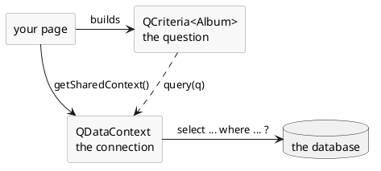
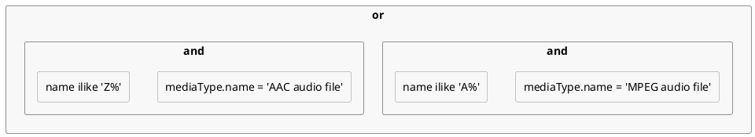

# Using databases

Most pages exist to show something that is in a database. DomUI does not make you
write SQL for that, and it does not tie you to one persistence framework either:
you describe the question as a Java object and hand it to something that can run
it.

Two classes carry that, and both live in `to.etc.webapp.query`:

- **`QCriteria<T>`** is the question - "all albums whose title contains *rock*,
  by title, at most twenty of them". It is typed on the entity it selects, it
  knows nothing about databases or connections, and it does nothing until it is
  executed.
- **`QDataContext`** is the thing that executes it: a database connection, or a
  Hibernate session, or a JPA entity manager, in disguise.

A page gets its `QDataContext` from **`getSharedContext()`**, which every node in
the tree has. You do not create it and you do not close it - the page owns it,
and everything on the page shares that one context.

[TOC]

## Your first query

```java
public class QueryFirstPage extends UrlPage {
	@Override
	public void createContent() throws Exception {
		setPageTitle("Your first query");
		...
		Text2<String> titlePart = new Text2<>(String.class);
		titlePart.setValue("rock");
		Div result = new Div("dm-tut");

		FormBuilder fb = new FormBuilder(cp);
		fb.label("Album title contains").control(titlePart);

		cp.add(new DefaultButton("Search", a -> search(titlePart, result)));
		cp.add(result);
		search(titlePart, result);
	}

	private void search(Text2<String> titlePart, Div result) throws Exception {
		QCriteria<Album> q = QCriteria.create(Album.class);
		String part = titlePart.getValueSafe();
		if(part != null) {
			q.ilike("title", "%" + part + "%");
		}
		q.ascending("title");
		q.limit(20);

		List<Album> albumList = getSharedContext().query(q);

		result.removeAllChildren();
		result.add(new HTag(2, albumList.size() == 1 ? "1 album" : albumList.size() + " albums"));
		for(Album album : albumList) {
			Div line = new Div();
			result.add(line);
			line.add(album.getTitle() + " - " + album.getArtist().getName());
		}
	}
}
```

!demo(to.etc.domuidemo.pages.tutorial.database.QueryFirstPage.ui, 100%, 520)

Change the word and press Search: the query is built again and run again, and
the result is rendered as plain `Div`s. Nothing in the page knows about databases
except the lines that build `q` and the one that runs it.

`QCriteria.create(Album.class)` is the whole of "select \* from Album". Everything
after it narrows that down:

- **`ilike("title", "%rock%")`** is a *restriction*: a condition on the where
  clause. There is one method per comparison - `eq`, `ne`, `gt`, `ge`, `lt`,
  `le`, `like`, `ilike` (case insensitive like), `between`, `in`, `isnull`,
  `isnotnull`.
- **`ascending("title")`** and `descending(...)` order the result.
- **`limit(20)`** and `start(...)` return a window of it.

Two things about that first line are worth saying out loud, because they hold for
every query you will write:

- A `QCriteria` is **typed**: `QCriteria<Album>` selects albums, so
  `query()` hands back a `List<Album>` with no cast anywhere.
- You restrict on the **property names of the entity class**, not on column
  names. `"title"` is `Album.getTitle()`; the mapping to the `Title` column is
  the ORM's business, not yours.

The value never becomes part of a statement string. `q.ilike("title", part)`
stores the value in the query tree, and the executor hands it to the database as
a JDBC parameter - the `?` in a statement along these lines:

```sql
select this_.AlbumId, this_.Title, this_.ArtistId from Album this_
where lower(this_.Title) like ?
```

So a query built from what the user typed cannot be an SQL injection, however
odd that input is.

## The query and the thing that runs it



A `QCriteria` is not bound to a connection, a session or a transaction. It is a
value: you can build one in a method that has no database access at all, keep it
in a field, pass it to a component, and run it later - or twice, on two different
contexts. Only `QDataContext` touches the database.

A `QDataContext` does more than run queries. The handful you will actually use:

| Call | What it does |
| --- | --- |
| `query(QCriteria<T>)` | run the query, return `List<T>` |
| `queryOne(QCriteria<T>)` | run it and return the single result, or `null`; more than one is an error |
| `find(Class<T>, pk)` | load one record by primary key, or `null` |
| `get(Class<T>, pk)` | the same, but throws when it does not exist |
| `save(o)`, `delete(o)` | make an object persistent, or remove it |
| `startTransaction()`, `commit()`, `rollback()` | the transaction around all of that |

### The shared context

`getSharedContext()` is defined on every node, so a component deep in the tree
reaches the same context as the page itself without anyone passing it around.
That sharing matters: entities read on one context are only valid on that
context, so a page that mixes contexts ends up with two versions of the same
record.

The context belongs to the page's [conversation](../../70-implementation-details/state-management/index.md).
It is opened the first time something asks for it during a request, and closed
again when the request ends and the conversation is detached - so a page waiting
for the user to press a button is not holding a database connection. The next
request opens a fresh one. Calling `close()` on it yourself does nothing: the
shared context ignores it, because it is not yours to close.

!i An entity is only alive on the context it was read on, and that context is
!i gone once the request ends. A field of your page survives across requests,
!i but the record you put in it does not stay usable - keep its primary key and
!i read it again, rather than the record itself.

## Restrictions and combinators

```java
QCriteria<Track> q = QCriteria.create(Track.class);

String wordValue = word.getValueSafe();
if(wordValue != null) {
	//-- Everything added to this restrictor is combined with "or".
	QRestrictorImpl<Track> or = q.or();
	or.ilike("name", "%" + wordValue + "%");
	or.ilike("composer", "%" + wordValue + "%");
}

Integer minutesValue = minutes.getValueSafe();
if(minutesValue != null) {
	//-- Added to the query itself, so combined with the above using "and".
	q.ge("milliseconds", minutesValue.longValue() * 60000L);
}
q.ascending("name");
q.limit(20);
```

!demo(to.etc.domuidemo.pages.tutorial.database.QueryRestrictionsPage.ui, 100%, 560)

The grey box on that page is the query's own `toString()`, which is worth
looking at while you change the fields:

```
FROM to.etc.domui.derbydata.db.Track
WHERE (name ilike '%brown%' or composer ilike '%brown%') and milliseconds>=240000L
order by name ASC
```

Restrictions added to the query itself are combined with **and** - that is why
the two `if` blocks above need no bookkeeping at all: each one adds what it has,
and the ones that fire are anded together. This is what makes building a query
from a search screen easy, because a field the user left empty simply adds
nothing.

For **or** you need a different thing to add to. `q.or()` returns a
`QRestrictorImpl<T>`: another restrictor, with the same comparison methods, that
combines what is added to it with `or` and hangs the result in the query as one
condition. `and()` does the mirror image, and `not()` negates a group.

So a restrictor is a *place to add conditions to*, and which combinator it uses
is the only difference between them. Nesting them builds an expression tree:

```java
QCriteria<Track> q = QCriteria.create(Track.class);
QRestrictorImpl<Track> or = q.or();
or.and().eq("mediaType.name", "MPEG audio file").ilike("name", "A%");
or.and().eq("mediaType.name", "AAC audio file").ilike("name", "Z%");
```



Levels of the same kind fold together, because `a and (b and c)` *is*
`a and b and c`. So an `and()` inside an `and()` costs nothing, and you never
have to think about where the brackets end up - only about which conditions
belong to which group.

## Querying over a relation

An `Album` has an `Artist` above it and a list of `Track`s below it; the `Artist`
in turn has a list of `Album`s. Both directions can be queried, but they are not
written the same way, and they do not mean the same thing.

### Upwards: a dotted property

```java
QCriteria<Album> q = QCriteria.create(Album.class);
//-- A dotted path walks to the parent record: this joins Artist in.
q.ilike("artist.name", "%" + part + "%");
q.ascending("artist.name").ascending("title");
```

A property name can be a **path**: `artist.name` is the `name` of the `Artist`
that this `Album`'s `artist` property points at. The executor makes that a join.
Paths work wherever a property name does - in restrictions and in the ordering
alike, as above - and they can be as long as the model allows
(`album.artist.name` from a `Track`).

### Downwards: exists

```java
QCriteria<Artist> q = QCriteria.create(Artist.class);
//-- "exists": every artist that has at least one such album, once.
ExistsRestrictor<Album> albums = q.exists(Album.class, "albumList");
albums.ilike("title", "%" + part + "%");
```

!demo(to.etc.domuidemo.pages.tutorial.database.QueryJoinPage.ui, 100%, 760)

`exists()` names the child collection to descend into - the `albumList` property
of `Artist` - and returns a restrictor for that child, on which you add
conditions in the usual way. Because Java has no first-class properties, the
element type cannot be derived from the property name, so you pass `Album.class`
as well.

What it generates is a subselect rather than a join:

```sql
select a.* from Artist a
where exists (select 1 from Album b where b.ArtistId = a.ArtistId and lower(b.Title) like ?)
```

That is deliberate, and it is the reason a child condition is written this way
instead of with a dotted path. Written as a join, an artist with four matching
albums comes back **four times**, and `limit(20)` then limits the *joined rows*
rather than the artists - so you get fewer than twenty artists, with nothing to
tell you that it happened. The subselect keeps the result one row per artist, so
`limit()` and `start()` mean what they say, and the database can stop reading a
child as soon as it finds one match.

!! `limit()` and `start()` in QCriteria limit the number of **entities**
!! returned, always. If you ever find a query where that is not true, the
!! query is wrong rather than the limit.

## Where to go from here

Everything above builds the query and renders the result by hand, which is the
best way to see what the query layer actually does. In a real screen you would
hand the `QCriteria` to a table component and let it do the paging - and let a
search screen build the restrictions from what the user filled in.

The [Generic Query framework](../../data/qcriteria/index.md) page goes further
into QCriteria itself: subselects, selections and projections, and the exact
differences with Hibernate's own Criteria API.
