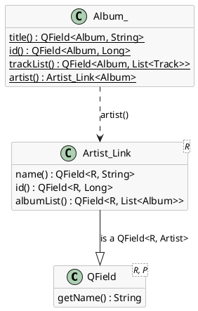

# Typed properties

Every query on the [previous page](../30-using-databases/index.md) named its
properties with a string:

```java
q.ilike("artist.name", "%" + part + "%");
q.ascending("title");
```

That works, and it is what QCriteria has always accepted. But a string is
invisible to the compiler, and this page is about getting it back in view.

[TOC]

## What a string costs you

Four things can be wrong with `q.ilike("artist.name", part)`, and the compiler
notices none of them:

- **A typo.** `"artst.name"` compiles perfectly.
- **A rename.** Rename `Artist.getName()` to `getFullName()` and your IDE
  rewrites every caller - except the ones inside strings. The query keeps
  compiling and stops working.
- **The wrong type.** `q.eq("title", 12)` compiles: the method takes an
  `Object`.
- **The wrong entity.** On a `QCriteria<Album>`, `q.ilike("composer", part)`
  compiles too, even though `Album` has no such property.

All four turn into a runtime failure, at the moment the query is executed - which
may well be the moment a user opens the screen. And it goes the other way too:
you cannot ask your IDE who uses `Artist.name`, because nothing *references* it.

## The same query, typed

```java
QCriteria<Album> q = QCriteria.create(Album.class);

String title = titlePart.getValueSafe();
if(title != null) {
	q.ilike(Album_.title(), "%" + title + "%");
}
String artist = artistPart.getValueSafe();
if(artist != null) {
	//-- artist() walks to the parent, name() is its property: both are checked.
	q.ilike(Album_.artist().name(), "%" + artist + "%");
}
q.ascending(Album_.title());
q.limit(20);
```

!demo(to.etc.domuidemo.pages.tutorial.typed.TypedQueryPage.ui, 100%, 560)

Fill in an artist and look at the query box: it says `artist.name`, exactly as
before. A typed property *is* that path - it produces the same query, and every
QCriteria method that takes a `String` property has a twin that takes a typed
one instead.

What changed is what happens when you get it wrong. All four mistakes above are
now compile errors:

```java
q.eq(Album_.title(), 12);              // no suitable method found for eq(QField<Album,String>,int)
q.ilike(Track_.name(), "%x%");         // no suitable method found for ilike(QField<Track,String>,String)
q.ilike(Album_.artst().name(), "%x%"); // cannot find symbol: method artst()
```

And the rename is no longer special: `Album_` is generated from `Album`, so
renaming the getter renames the method, and every call site that used it fails
to compile until you fix it. Asking the IDE for the usages of `Album_.title()`
now answers the question that `"title"` could not.

## What Album_ actually is

`Album_` is a generated class, sitting next to `Album` in the same package. It
has one static method per property, and each returns a **`QField<R, P>`**: `R` is
the class the path starts at, `P` is the type of the property at the end of it.

```java
QField<Album, String> title = Album_.title();
title.getName();                   // "title"

QField<Album, String> artistName = Album_.artist().name();
artistName.getName();              // "artist.name"
```

A property pointing at another generated class gets a second generated class, so
that the path can continue:



`Artist_Link<Album>` is itself a `QField<Album, Artist>`, so it can be handed to
a query as a property in its own right *and* it carries the `Artist` properties
as methods. That is the whole trick behind chaining: `Album_.artist()` is both a
property and the next step of a path.

## Paths of any depth, and child collections

```java
//-- Track -> album -> artist -> name, every step checked by the compiler.
q.ilike(Track_.album().artist().name(), "%" + part + "%");
q.ascending(Track_.album().title()).ascending(Track_.name());
```

```java
ExistsRestrictor<Album> albums = q.exists(Album.class, Artist_.albumList());
albums.ilike(Album_.title(), "%" + part + "%");
```

!demo(to.etc.domuidemo.pages.tutorial.typed.TypedPathPage.ui, 100%, 980)

The path can be as long as the model allows, and the query box shows what it
became: `album.artist.name`. A typo anywhere along it is a missing method rather
than a query that returns nothing.

`exists()` still wants the child class next to the property, because the type of
a `List<Album>` cannot be recovered from the property alone. The property itself
is checked, though: `Artist_.albumList()` only exists while `Artist` has that
collection.

!i Not every method has a typed twin yet, and the ones that do keep the string
!i form as well. Where you find only a `String` overload, that is what to use -
!i mixing the two in one query is fine.

## A property is a value

```java
QCriteria<Artist> aq = QCriteria.create(Artist.class);
aq.ascending(Artist_.name()).limit(5);
cp.add(listOf(getSharedContext().query(aq), Artist_.name()));
...
cp.add(listOf(getSharedContext().query(tq), Track_.album().artist().name()));
```

```java
/**
 * Render a list of anything, labelled by whatever String property of it you pass in.
 */
private <T> Div listOf(List<T> list, QField<T, String> labelProperty) throws Exception {
	PropertyMetaModel<String> pmm = MetaManager.getPropertyMeta(labelProperty.getRootClass(), labelProperty);

	Div box = new Div("dm-tut");
	for(T item : list) {
		Div line = new Div();
		box.add(line);
		line.add(pmm.getValue(item));
	}
	return box;
}
```

!demo(to.etc.domuidemo.pages.tutorial.typed.TypedGenericPage.ui, 100%, 620)

`listOf` works for artists, for albums and for tracks, and it never casts
anything. The `QField<T, String>` carries both halves of what the method needs:
`getRootClass()` says which class the property belongs to, and the `String` in
the type says what reading it gives back - so `pmm.getValue(item)` is a `String`
to the compiler as much as to the reader.

This is what typed properties buy you beyond queries. A property becomes an
ordinary value: you can pass it to a method, keep it in a constant, put a list of
them in a field. Written as strings, the same helper would need a `Class<T>`
alongside the name and a cast on the way out, and neither would be checked.

## Turning it on

The classes are generated during compilation, by an annotation processor. It
generates for every class annotated with either of:

- **`@jakarta.persistence.Entity`** - so all your JPA entities are covered
  without doing anything.
- **`@to.etc.annotations.GenerateProperties`** - for any other class. Typed
  properties are not a database feature; a plain model class gets them just as
  well.

Add the processor to the `maven-compiler-plugin` configuration of every module
that has such classes - or once, in the `pluginManagement` of the parent pom:

```xml
<plugin>
    <groupId>org.apache.maven.plugins</groupId>
    <artifactId>maven-compiler-plugin</artifactId>
    <configuration>
        <annotationProcessors>
            <annotationProcessor>db.annotationprocessing.PropertyAnnotationProcessor</annotationProcessor>
        </annotationProcessors>
        <annotationProcessorPaths>
            <dependency>
                <groupId>to.etc.domui</groupId>
                <artifactId>property-annotations-processor</artifactId>
                <version>${domui.version}</version>
            </dependency>
        </annotationProcessorPaths>
    </configuration>
</plugin>
```

`@GenerateProperties` itself lives in a small artifact of its own, which the
module needs as an ordinary dependency:

```xml
<dependency>
    <groupId>to.etc</groupId>
    <artifactId>annotations</artifactId>
    <version>${domui.version}</version>
</dependency>
```

The generated sources land where annotation processors always put them -
`target/generated-sources/annotations`, in the package of the class they came
from - and are compiled along with everything else. There is nothing to check in
and nothing to keep up to date by hand.

!! DomUI compiles with the Eclipse batch compiler through
!! `plexus-compiler-eclipse`, and annotation processing needs at least version
!! 2.8.4 of it. Older versions ignore the processor silently: no error, no
!! generated classes.

IntelliJ picks all of this up from the poms. If it complains that the processor
cannot be found - which happens when DomUI is a source submodule, because then
nothing formally *depends* on the processor - add the same
`property-annotations-processor` artifact as a plain dependency of the modules
that need it, and check
*Settings → Build, Execution, Deployment → Compiler → Annotation Processors*.

### What gets generated, and what does not

Generating a property for everything would be slow and useless, so the processor
generates one when the property's type is:

- a **simple type**: a primitive or its wrapper, `String`, `BigDecimal`,
  `BigInteger`, `java.util.Date`, `java.sql.Date`, or any enum;
- a class that is **itself annotated** with `@Entity` or `@GenerateProperties` -
  this is what produces the `_Link` class that lets paths continue;
- a **collection** of such a class;
- or anything at all whose getter carries a `@Column` annotation, since that
  says it is persisted whatever its type is.

To leave one out, put **`@IgnoreGeneration`** on the getter. Not on the field: a
property is defined by its getter, and the processor never looks at fields.
