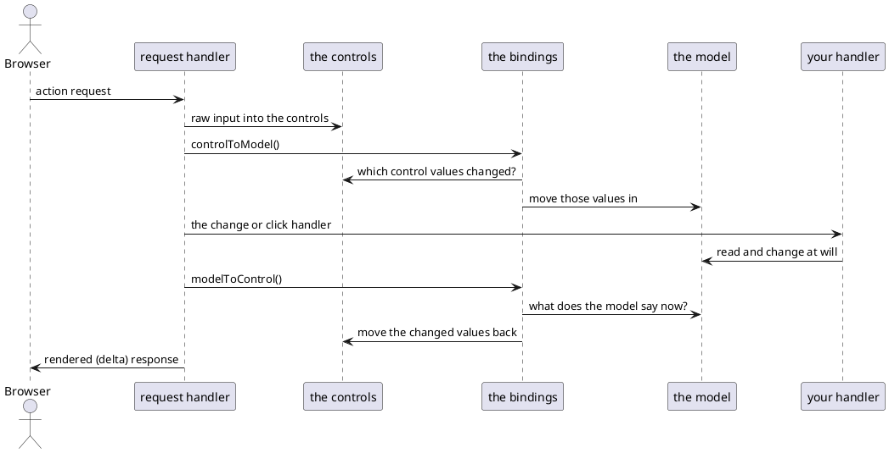
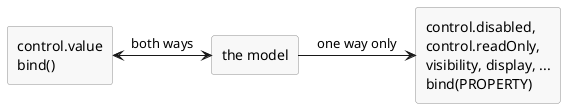
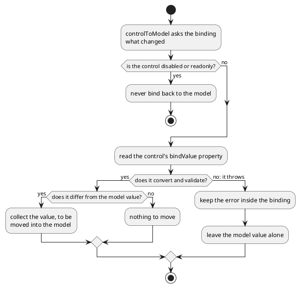

# Data binding

A screen that edits something spends most of its code moving values: out of the
thing being edited and into the controls, and back again afterwards. Data binding
is DomUI doing that for you. You say once which control belongs to which
property, and from then on the two follow each other.

What that buys is more than saved typing. The screen stops being the place the
data lives: the model is, and your logic only ever touches the model. Logic
written that way needs no browser to test.

[TOC]

## Carrying the values by hand

```java
public class BindByHandPage extends UrlPage {
	private final AlbumOrder m_order = new AlbumOrder();

	@Override
	public void createContent() throws Exception {
		...
		Text2<String> customer = new Text2<>(String.class);
		ComboLookup2<Genre> genre = new ComboLookup2<>(genreList);
		DateInput2 delivery = new DateInput2();
		Text2<Integer> copies = new Text2<>(Integer.class);
		Text2<BigDecimal> price = new Text2<>(BigDecimal.class);

		//-- Every control has to be filled from the model, one call per control.
		customer.setValue(m_order.getCustomerName());
		genre.setValue(m_order.getGenre());
		delivery.setValue(m_order.getDeliveryDate());
		copies.setValue(m_order.getCopies());
		price.setValue(m_order.getPrice());

		...
		cp.add(new DefaultButton("Save", a -> {
			//-- ...and every one of them has to be carried back again.
			m_order.setCustomerName(customer.getValue());
			m_order.setGenre(genre.getValue());
			m_order.setDeliveryDate(delivery.getValue());
			m_order.setCopies(copies.getValue());
			m_order.setPrice(price.getValue());
			showOrder(state);
		}));
	}
}
```

!demo(to.etc.domuidemo.pages.tutorial.binding.BindByHandPage.ui, 100%, 520)

Five controls, ten lines of carrying, and the two halves have to be kept in step
with each other for as long as the screen lives. Add a field and you write two
more lines in two different places; forget one of them and the screen quietly
loses a value. Worse, the model is only right for the instant just after Save:
anything the page wants to *do* with the order has to remember to copy the
controls in first.

## The same screen, bound

```java
customer.bind().to(m_order, AlbumOrder_.customerName());
genre.bind().to(m_order, AlbumOrder_.genre());
delivery.bind().to(m_order, AlbumOrder_.deliveryDate());
copies.bind().to(m_order, AlbumOrder_.copies());
price.bind().to(m_order, AlbumOrder_.price());
```

!demo(to.etc.domuidemo.pages.tutorial.binding.BindValuePage.ui, 100%, 560)

The ten lines of carrying are gone and no Save button is needed to move
anything. The bottom half of that screen is the same five properties again, as
read-only controls bound to the same model - type in a field, leave it, and the
mirror below follows.

`AlbumOrder` is a plain class with `@GenerateProperties` on it, so its
[typed properties](../40-typed-properties/index.md) exist just like an entity's.
Binding by string works too, but a binding is exactly the kind of thing you want
the compiler to check: `bind().to(m_order, AlbumOrder_.copies())` on a
`Text2<Integer>` is right by construction, where `"copys"` is a runtime surprise.

Now press **Clear the price**:

```java
cp.add(new DefaultButton("Clear the price", a -> m_order.setPrice(BigDecimal.ZERO)));
```

The handler touches the model and nothing else - it does not know a price control
exists - and both price fields on the screen change. That is the point of the
whole mechanism: your logic talks to the model, and the screen is a view of it.

### One line per field

The mirror at the bottom of that page does not create its controls at all:

```java
FormBuilder fb2 = new FormBuilder(cp);
fb2.property(m_order, AlbumOrder_.customerName()).readOnly().control();
fb2.property(m_order, AlbumOrder_.genre()).readOnly().control();
fb2.property(m_order, AlbumOrder_.deliveryDate()).readOnly().control();
fb2.property(m_order, AlbumOrder_.copies()).readOnly().control();
fb2.property(m_order, AlbumOrder_.price()).readOnly().control();
```

`property()` takes the model and the property, and from the property's type it
picks a control, labels it and binds it. `Genre` is an entity, so it gets a
lookup; `Date` gets a `DateInput2`; `BigDecimal` gets a `Text2<BigDecimal>`. The
labels come from a `AlbumOrder.properties` bundle next to the class - without it
you would be reading `customerName` on screen.

## When the moving happens

DomUI uses what it calls **soft binding**: nothing observes the model, and no
setter notifies anybody. A binding is an object stored *inside the control*, and
it is asked to do its work at exactly two moments in a request.



In between those two moves the model is nobody's business but yours. Whatever
your handler does to it - including the things it does indirectly, in a setter
that changes another property - is picked up by the second move, on the way out.

Because the binding lives in the control, it is alive exactly as long as the
control is part of the page. A node that is removed stops binding; add it back
and it binds again. There is nothing to unregister and nothing to leak.

!i This is also why a control is never kept in a field. `forceRebuild()` builds a
!i new tree with new controls carrying new bindings; a control left over in a
!i field is off the page, and its bindings are inert.

## Two kinds of binding

`bind()` with no argument means *the value of this control*, and that binding is
**bidirectional**: control to model when a request comes in, model to control on
the way out. It has to be, because the value is the one thing both sides have an
opinion about.

Every other property of a control binds **one way only**: model to control.



Here is what that is for. A button that may only be pressed once both choices
have been made:

```java
public class SendInfoModel {
	private Artist m_artist;
	private Customer m_customer;
	...
	/** There is nothing to send until both choices have been made. */
	public boolean isSendDisabled() {
		return m_artist == null || m_customer == null;
	}
}
```

```java
artistC.bind().to(m_model, SendInfoModel_.artist());
customerC.bind().to(m_model, SendInfoModel_.customer());
artistC.immediate();
customerC.immediate();

DefaultButton send = new DefaultButton("Send info", a -> ...);
cp.add(send);

//-- The model decides whether the button may be pressed; the button follows.
send.bind(IControl.DISABLED).to(m_model, SendInfoModel_.sendDisabled());
```

!demo(to.etc.domuidemo.pages.tutorial.binding.BindPropertyPage.ui, 100%, 300)

Pick an artist and the button stays off; pick a customer as well and it comes on.
Nothing in the page checks anything: `isSendDisabled()` is the only place the rule
is written, and it is in a class that mentions no component at all - which is what
makes it something a JUnit test can drive.

The control property to bind to is named by passing it to `bind()`, and it is a
typed property like any other. The ones you will want are constants on the
interfaces that define them:

| Constant | Property |
| --- | --- |
| `IControl.DISABLED` | `disabled` - the control is off |
| `IControl.READONLY` | `readOnly` - the value shows but cannot be changed |
| `CssBase.VISIBILITY` | `visibility` - the node is there but invisible |
| `CssBase.DISPLAY` | `display` - the node takes no space |

## When the input does not convert

```java
cp.add(new DefaultButton("Save", a -> {
	if(bindErrors()) {                        // Anything wrong anywhere below this node?
		return;                               // Yes: it is on screen now, stop here.
	}
	result.removeAllChildren();
	result.add("Saved: " + m_order.getCopies() + " copies for " + m_order.getCustomerName() ...);
}));
```

!demo(to.etc.domuidemo.pages.tutorial.binding.BindErrorsPage.ui, 100%, 440)

Put `abc` in Copies and press Save. The field goes red, the message says the
content is invalid, and nothing is saved. Fix it and Save works. Leave Customer
empty and it is the same story with "Mandatory field".

The interesting part is what happened *before* Save. When the request came in,
the binding asked the control for its value, the conversion failed - and the
binding kept quiet about it. It stored the error in itself and left the model
alone.



That quiet is deliberate. Reading a control with `getValue()` puts any error
straight on the screen, which is right when a handler asks for a value on
purpose - but binding reads *every* control on *every* request. If it used
`getValue()`, filling in the first field of a form would light up every other
field in red before the user had reached them. So bindings read `bindValue`
instead: `getBindValue()` converts and validates exactly like `getValue()`, but
it throws without reporting, and the binding catches that and holds on to it.

Which leaves the errors known but invisible, and that is what **`bindErrors()`**
is for. It walks the tree from the node it is called on, hands every kept error
to its control - which is what makes the field red and the message appear - and
returns `true` if it found any.

!! Call `bindErrors()` at the top of every handler that is about to use model
!! data, and return when it is true. Without it a Save works on a model that
!! silently kept its old value, and the user is never told.

You do not need to report anything yourself when it returns true: the messages
are already on screen by then.

## Binding a style

The last kind of binding does not move a value at all - it maps one onto a css
class:

```java
ComboFixed2<OrderState> stateC = ComboFixed2.createEnumCombo(OrderState.class);
stateC.bind().to(m_order, AlbumOrder_.state());
stateC.immediate();

Div box = new Div("dm-tut");
cp.add(box);
box.add("The state of this order decides the colour of this box.");

new StyleBinder()
	.define(OrderState.New, "dm-tut-new")
	.define(OrderState.Paid, "dm-tut-paid")
	.define(OrderState.Shipped, "dm-tut-shipped")
	.define(OrderState.Cancelled, "dm-tut-cancelled")
	.bind(box).to(m_order, AlbumOrder_.state());
```

!demo(to.etc.domuidemo.pages.tutorial.binding.BindStylePage.ui, 100%, 300)

Change the state and the box changes colour. `StyleBinder` is a map from model
value to css class name; `bind(node).to(instance, property)` attaches it to a
node as a binding like any other, and on every way out it removes the class it
added last time and adds the one the current value asks for. Any node will do -
it is a `NodeBase`, not a control, so a panel, a row or a whole section can carry
one.

A style binding only ever moves model to control: it has no value to give back,
and it can never be in error. Which is the same rule as every other binding that
is not a value.

## Where to go from here

Binding has a bit more to it than fits here: the order in which bindings run when
one setter changes another property, and what "changed" means for a value that is
a list or a mutable object. Both are in
[Data Binding - how does it work?](../../data/data-binding/how-does-it-work/index.md).
