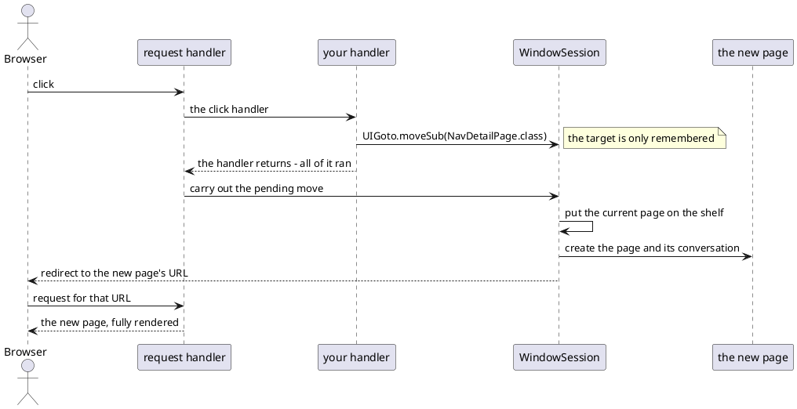
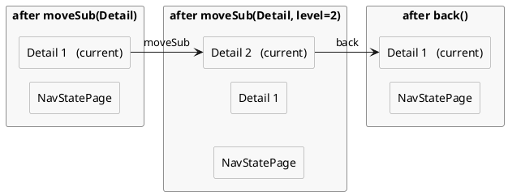

# Page navigation

A DomUI page is a Java object that lives in the server for as long as the user is
on it. Its fields are the state of the screen, and they are still there on the
next request without anything being saved or reloaded.

Moving to another page is therefore not an update of the screen you are on: it is
a real page change in the browser - another URL, another document, another Java
object. The page you leave is either put aside intact or destroyed, and which of
the two happens is what you choose when you write the move.

[TOC]

## A page remembers

```java
public class NavStatePage extends UrlPage {
	/** The state of this screen: two fields, and nothing else. */
	private int m_clicks;

	private String m_note;

	@Override
	public void createContent() throws Exception {
		Text2<String> note = new Text2<>(String.class);
		note.setValue(m_note);
		note.setOnValueChanged(c -> {
			m_note = note.getValueSafe();
			forceRebuild();
		});
		...
		Div state = new Div("dm-tut");
		cp.add(state);
		state.add("Clicks: " + m_clicks + ", note: " + (m_note == null ? "(empty)" : m_note));

		bb.addButton("Count a click", a -> {
			m_clicks++;
			forceRebuild();
		});
		bb.addButton("Detail (moveSub)", a -> UIGoto.moveSub(NavDetailPage.class));
	}
}
```

!demo(to.etc.domuidemo.pages.tutorial.navigation.NavStatePage.ui, 100%, 420)

Type a note, count a few clicks, open the detail page and press **Back**: the note
and the count are exactly as you left them. Nothing was written anywhere and
nothing was reloaded - the page object, with those two fields, simply stayed
alive while you were away.

The state is per page instance, not per class or per user: two pages of the same
class opened next to each other are two objects with two sets of fields.

## Moving is a page change

Everything else a click does arrives in the browser as a delta of the page you
are on. A `UIGoto` is the exception: it ends this page's turn. DomUI answers the
request with a redirect to the new page's URL, the browser loads it, and what
appears is a new document rendered from a different page object.



Two things follow from that. The first is that `UIGoto` does not jump out of your
code: it writes down where to go and returns, so the rest of the handler still
runs.

```java
bb.addButton("Save and close", a -> {
	UIGoto.back();                       // Only says where to go next...
	m_invoice.setState(PAID);            // ...so this still happens.
	dc.commit();
});
```

The second is that a move costs a full page: a new object, a new conversation, a
new render. When what you want is a different *part* of the same screen, change a
field and call `forceRebuild()` - navigate only when the user is really going
somewhere else.

## The moves

| Call | What it does |
| --- | --- |
| `UIGoto.moveSub(clz, ...)` | put the current page aside, go to a new one |
| `UIGoto.back()` | return to the page that was put aside |
| `UIGoto.replace(clz, ...)` | destroy the current page, put the new one in its place |
| `UIGoto.reload()`, `UIGoto.reload(...)` | destroy this page, start the same one again, empty |
| `UIGoto.moveNew(clz, ...)` | throw everything away, start again at this page |
| `UIGoto.redirect(url)` | leave DomUI: a plain HTTP redirect to any URL |

Every move except `back()` and `redirect()` takes the page's *class*, and the
parameters for it either as name/value pairs or as an `IPageParameters`:

```java
UIGoto.moveSub(TrackDetails.class, "id", track.getId());
```

The page on the other side receives them through `@UIUrlParameter` on a property,
by the name used in the move:

```java
@UIUrlParameter(name = "id")
public Track getTrack() {
	return m_track;
}
```

Those same parameters are what ends up in the URL, so the page above is
reachable as `TrackDetails.ui?id=17` and is bookmarkable. The type is converted
for you, and an entity property like this one is looked up by primary key.

## moveSub and the shelf

`moveSub()` does not destroy the page you are leaving. It puts it on the
**shelf** - a stack of pages kept by the `WindowSession`, which is DomUI's
per-browser-tab session - and creates the new page above it, in a conversation of
its own. `back()` destroys the top page and wakes up the one below it, in the
state it was in.



The demo page below prints that stack, straight from
`getShelvedPageStack()`, and walks up and down it with the buttons:

```java
List<IShelvedEntry> stack = UIContext.getRequestContext().getWindowSession().getShelvedPageStack();
for(int i = 0; i < stack.size(); i++) {
	IShelvedEntry se = stack.get(i);
	sb.append(i).append(": ").append(se.getName()).append("   ").append(se.getURL()).append("\n");
}
```

!demo(to.etc.domuidemo.pages.tutorial.navigation.NavDetailPage.ui, 100%, 380)

### The shelf is the breadcrumb

The trail at the top of that page is not something the page maintains: it is the
shelf, drawn.

```java
add(BreadCrumb2.createPageCrumb("Home"));
```

`createPageCrumb()` reads `getShelvedPageStack()` and makes one item per shelved
page, with the application's root page as the first item and, when there is
something to go back to, a back arrow in front of that. Clicking an item moves to
that page; the last item is the page you are on and does nothing. Every page in the demo application has one, which is why
you can watch the trail grow and shrink as you press the buttons above.

An item names its page in the first of these ways that produces something:

- what `getBreadcrumbName()` returns, if the page implements `IBreadCrumbTitler`
  (which can also give the item a tooltip through `getBreadcrumbTitle()`);
- the page's `getPageTitle()`;
- the simple name of the page class.

The shelf is what a button bar's back button reads as well:
`bb.addBackButton()` produces a **Back** button that calls `UIGoto.back()`, and
turns itself into a **Close** button when there is nothing below the page on the
shelf.

## What each move does to the shelf

| Move | The shelf | The page you were on |
| --- | --- | --- |
| `moveSub` | one entry deeper | shelved, alive, waiting |
| `back` | one entry shallower | destroyed |
| `replace` | unchanged in depth | destroyed |
| `reload` | unchanged in depth | destroyed and built again as a new page |
| `moveNew` | emptied, the new page is the only entry | destroyed |

Two rules cut across that table.

!! Before any of it, DomUI looks for the target on the shelf: same page class,
!! same parameters - and a move without parameters matches any. If it is found
!! the move becomes a move *back* to it: that page instance is woken up with its
!! state, and everything above it is destroyed. The shelf therefore never holds
!! the same page twice, and a `moveSub` to the page you came from returns you to
!! it instead of making a second copy of it.

The second rule is that moving to the application's root page - the class
`DomApplication.getRootPage()` returns - always empties the shelf first, whatever
move you used to get there. Home is the bottom of the stack, never a step in it.

`back()` on a shelf with nothing below the current page goes to that root page,
and empties the shelf on the way.

## What travels with a shelved page

A shelved page keeps its `ConversationContext`, and with it everything the page
put there: the shared `QDataContext`, the entities read through it, whatever you
stored yourself. That is what makes coming back cheap - and it is also the cost
of shelving: those objects stay in memory until the page is dropped. (The
database *connection* is not among them; it is released at the end of every
request.)

Each `moveSub` starts the new page in a **new** conversation, so the detail page
does not share entities with the page that opened it. The exception is deliberate:

```java
UIGoto.moveSub(clz, conversation, parameters);
```

Here the new page *joins* the conversation you pass, and works on the same data
context and the same entity instances. The page has to accept it: its constructor
must take that conversation type, or DomUI throws.

## Carrying something to the page you land on

```java
UIGoto.addActionMessage(MsgType.INFO, "Sent along by the page you came from");
UIGoto.moveSub(NavDetailPage.class);
```

Press **Detail with a message** on the first demo page above: the message appears
as a flare on the page you arrive at. The general form is
`UIGoto.addAction(IGotoAction)`, which hands you the new `UrlPage` after it has
been built, so you can do anything to it; the queued actions run once, on the
page you land on, and are then forgotten.

This is the way to say something about what just happened, because the page that
knew about it is gone by the time the user sees the result.

## Where to go from here

The conversation that carries a page and its data through all of this is the
subject of [state management](../../70-implementation-details/state-management/index.md).
