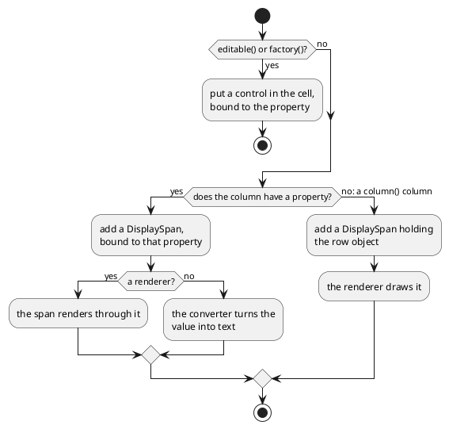
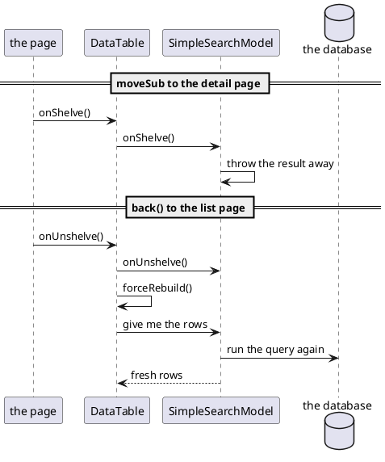

# Showing rows

A query returns many rows, and a screen has to show them. In DomUI that is three
objects working together: a **model** that has the rows, a **RowRenderer** that
says what a row looks like, and a **DataTable** that puts them on the screen.

They are separate on purpose. The model knows nothing about columns, the renderer
knows nothing about where rows come from, and the table only asks the two of them
for what it needs.

[TOC]

## Your first table

```java
//-- 1. The model: the question, and the thing that will run it.
QCriteria<Track> q = QCriteria.create(Track.class);
SimpleSearchModel<Track> model = new SimpleSearchModel<>(this, q);

//-- 2. The renderer: which columns, in which order.
RowRenderer<Track> rr = new RowRenderer<>(Track.class);
rr.column(Track_.name()).label("Track").ascending().sortdefault();
rr.column(Track_.album().title()).label("Album");
rr.column(Track_.unitPrice()).label("Price");

//-- 3. The table itself, plus a pager to walk through the result.
DataTable<Track> dt = new DataTable<>(model, rr);
cp.add(dt);
dt.setPageSize(10);
cp.add(new DataPager(dt));
```

!demo(to.etc.domuidemo.pages.tutorial.tables.TableFirstPage.ui, 100%, 620)

Sort by clicking a header, and walk through the pages at the bottom. The query is
not run when the model is made: it runs the first time the table needs rows,
which is when it is rendered.

Nothing in that code says how a price should look, yet the column reads `$ 0.99`,
right aligned. The metadata of `Track.unitPrice` says it is money, and a column
with nothing to say about presentation shows the value the way its property's
metadata asks for.

`SimpleSearchModel` takes the `QCriteria` from
[using databases](../30-using-databases/index.md) and the node it should get its
`QDataContext` from - `this`, the page, so it uses the page's shared context. For
rows you already have there is `SimpleListModel<T>`, which takes a `List`.

`setPageSize(10)` is what makes the table a paged one; without it every row it
got is shown at once. The pager is a separate component you place where you want
it - above the table, below it, or both - and it also reports the number of
records, with a marker next to it when the model hit its maximum. That maximum is
1000 rows by default and is what keeps a careless query from pulling a whole
table into memory; `model.setMaxRowCount()` changes it.

### Columns you did not define

The second table on that page has no columns at all:

```java
DataTable<Track> dt2 = new DataTable<>(model2, new RowRenderer<>(Track.class));
```

A renderer with no columns takes them from the metadata of the class - the
`@MetaObject(defaultColumns = ...)` on `Track`, with the labels from its
`Track.properties` bundle - which is why that table has a Title, a Duration, a
Price, an Album and an Artist without being told. The duration reads
`5m 43s 719ms` because `Track.milliseconds` carries
`@MetaProperty(converterClass = MsDurationConverter.class)`. A class without such
metadata throws instead: there is nothing to guess from.

## Defining the columns

Every `column()` call adds a `ColumnDef`, and everything you want to say about
that column you say by chaining onto it:

```java
//-- A label of your own, a width in characters, and the column sorted on initially.
rr.column(Track_.name()).label("Track").width(30).ascending().sortdefault()
	.cellClicked(t -> {
		clicked.removeAllChildren();
		clicked.add("Cell clicked: " + t.getName());
	});

//-- Nothing is said about the format: the property's metadata has the converter.
rr.column(Track_.milliseconds()).label("Duration").align(TextAlign.RIGHT);

//-- A property of a property: the column follows the relation.
rr.column(Track_.album().title()).label("Album").width(25);

//-- A renderer gets the column's value and fills the cell itself. It replaces
//-- the money format the metadata would have given this column.
rr.column(Track_.unitPrice()).label("Price").align(TextAlign.RIGHT)
	.renderer((node, price) -> {
		Span s = new Span(price.toString());
		node.add(s);
		if(price.compareTo(BigDecimal.ONE) >= 0)
			s.setCssClass("dm-tut-hi");
	});

//-- A column that is the whole row. It has no property, so say what it sorts on.
rr.column().label("Where it is from").maxWidth(40).sort(Track_.album().artist().name())
	.renderer((node, track) -> node.add(track.getAlbum().getTitle() + " by " + track.getAlbum().getArtist().getName()));

rr.setRowClicked(t -> {
	clicked.removeAllChildren();
	clicked.add("Row clicked: " + t.getName());
});
```

!demo(to.etc.domuidemo.pages.tutorial.tables.TableColumnsPage.ui, 100%, 560)

Click a track name and then anywhere else in a row: the name column has a cell
handler of its own, the rest of the row has the row handler. Sort on **Where it
is from** and the rows come back ordered by artist, even though that column has
no property at all. The last column is capped at 40 characters wide - what does
not fit is cut off, with the whole text as a hover title.

Two columns are worth comparing. Duration says nothing about its format and gets
the one from the property's metadata. Price has a renderer, and a renderer takes
over the whole cell - which is why the price here is a plain `0.99` with the
expensive ones highlighted, where the table above showed `$ 0.99`.

### Which column

| Call | The column shows |
| --- | --- |
| `column(Track_.name())` | a typed property, checked by the compiler |
| `column(Track_.album().title())` | a property across a relation |
| `column("album.title")` | the same, by name |
| `column(BigDecimal.class, "unitPrice")` | by name, with the type stated |
| `column()` | the row object itself - give it a renderer |

### What the column can be told

| Method | What it does |
| --- | --- |
| `label("Track")` | the header text; without it the label comes from metadata |
| `width(30)` | the width in characters |
| `width("20%")` | the width as css |
| `maxWidth(40)` | cap the width; longer content is cut and gets a hover title |
| `align(TextAlign.RIGHT)` | the text alignment of the cells |
| `css("...")` / `cssHeader("...")` | a css class on the cells / on the header |
| `nowrap()` / `wrap()` | whether the cell content may wrap |
| `hint("...")` | a tooltip on the column header |
| `converter(...)` | how the value is turned into text, overriding the metadata |
| `renderer(...)` | fill the cell yourself |
| `ascending()` / `descending()` | make it sortable, and in which direction first |
| `sortdefault()` | the column the table is sorted on when it first appears |
| `sort(Track_.album().title())` | what to sort on when the column has no property |
| `sortable(SortableType.UNSORTABLE)` | switch sorting off for this column |
| `cellClicked(handler)` | a click handler for this column's cells |
| `editable()` / `factory(...)` | put a control in the cell instead of text |

### What a cell actually is



A cell is not a piece of text, it is a `DisplaySpan` **bound** to the property of
the row object - the same [data binding](../50-data-binding/index.md) as anywhere
else. Change a value on a row object that is on screen and the cell follows,
without the table being rebuilt.

A renderer is an `IRenderInto<V>`: it is handed the cell to fill and the value to
show - the *column's value*, or the whole row for a `column()` column. Two things
about it are worth knowing:

- it is not called for a null value, so an empty cell needs no handling. If you
  do want to show something for null, implement `renderOpt()` instead of writing
  a lambda.
- it replaces the text, not the binding: the cell is still bound, and still
  re-renders when the value changes.

!! A column is either yours or the framework's. Combining `editable()` or
!! `factory()` with `renderer()` or `converter()` throws: an editable cell holds a
!! control, and a control does its own conversion and rendering, so do the
!! editing inside your renderer or leave the cell to the framework.

## A search screen

A list of everything is rarely what a user wants. `SearchPanel<T>` is the other
half of a list page: it shows a form, and turns what was filled in into a
`QCriteria` - the exact thing the model wants.

```java
SearchPanel<Track> sp = new SearchPanel<>(Track.class, "name", "album.title", "album.artist.name");
cp.add(sp);

//-- One more field, added by hand.
sp.add().property(Track_.unitPrice()).label("Price").control();

Div results = new Div();
cp.add(results);

sp.setClicked(a -> {
	QCriteria<Track> criteria = sp.getCriteria();
	if(null == criteria)                            // Bad input: the errors are on the screen already.
		return;
	results.removeAllChildren();

	SimpleSearchModel<Track> model = new SimpleSearchModel<>(this, criteria);
	RowRenderer<Track> rr = new RowRenderer<>(Track.class);
	rr.column(Track_.name()).label("Track").ascending().sortdefault();
	rr.column(Track_.milliseconds()).label("Duration");
	rr.column(Track_.album().title()).label("Album");
	rr.column(Track_.album().artist().name()).label("Artist");

	DataTable<Track> dt = new DataTable<>(model, rr);
	results.add(dt);
	dt.setPageSize(10);
	results.add(new DataPager(dt));
});
```

!demo(to.etc.domuidemo.pages.tutorial.tables.TableSearchPage.ui, 100%, 620)

Type `love` in Title and press Search.

The whole screen is in that one handler: ask the panel for the criteria, make a
model from it, make a table, put both in a `Div` that was empty until now. The
`Div` and the table are local variables the handler closes over - there is no
need to keep either of them in a field, and no need to rebuild the page, which
would throw away what the user typed.

`getCriteria()` returns `null` when one of the fields contains something that
cannot be searched with; the messages are already on the screen by then, so the
handler just returns. When nothing at all was filled in it returns a criteria
without restrictions - a search for everything.

### Where the fields come from

```java
new SearchPanel<>(Track.class)                             // the search fields from the metadata
new SearchPanel<>(Track.class, "name", "album.title")      // these properties, in this order
new SearchPanel<>(baseCriteria)                            // ...on top of a query you fix yourself
```

With no property names the panel takes the search properties from the class
metadata (`@MetaSearchItem` on the class, or `@MetaSearch` on the property). With
names it takes exactly those, and a name may walk a relation like
`album.artist.name`. The `QCriteria` form starts from a query of your own, so the
user searches within a set you decide - a base filter they cannot get out of.

For a field the panel would not have made itself, `add()` gives you a builder:

```java
sp.add().property(Track_.unitPrice()).label("Price").control();
```

`control()` with no argument picks the control for the property's type, the way
the constructor does; `control(myControl)` uses one you made, and
`defaultValue()`, `initialValue()`, `minLength()` and `ignoreCase()` are on the
same builder.

For each field the panel also knows *how* that type is searched, and the user can
say more in the box than a plain value:

| In a text field | Finds |
| --- | --- |
| `love` | everything starting with "love", case insensitive |
| `*love*` | everything containing "love" - `*` is the wildcard |
| `love.` | exactly "love" - a trailing point means no wildcard |

| In a number field | Finds |
| --- | --- |
| `0.99` | exactly that value |
| `> 200`, `<= 10`, `!= 3` | a comparison |
| `> 12 < 100` | a range |
| `*` / `!` | any value / no value at all |

The rest of the panel is the buttons: **Search** is what `setClicked()` handles,
**Reset** empties the fields, **Hide** collapses the panel once a result is on
screen. `setOnNew()` adds a "new" button for creating a record, `setOnClear()`
hooks the reset, and `setCollapsed()` decides how the panel starts out.

## Coming back to a list

A list where clicking a row opens a detail page has a problem the framework
solves for you. While the user is in the detail page - editing, saving - the list
page is [shelved](../60-page-navigation/index.md): alive, with the rows it read
before. Coming back to a screen full of stale data would be worse than useless.

So this happens instead:



!demo(to.etc.domuidemo.pages.tutorial.tables.TableShelvePage.ui, 100%, 620)

The counter on that page is incremented inside the query itself. Click a row to
open a track, press **Back**, and it says the query has run twice. Page through
the result and it stays where it is - the model read the whole result once, and
the pager only slices it. Sort on a column and it goes up: a different order is a
different query.

The mechanism is small. A `DataTable` is a node like any other, so it is told
when its page is shelved; it passes that on to its model if the model implements
`IShelvedListener`. `SimpleSearchModel` does, and all its `onShelve()` does is
drop the result it is holding. On the way back the table rebuilds itself, asks
for rows, and a model with no result runs its query. A model of your own gets the
same behaviour by implementing that one interface.

There is a second staleness underneath it, one query cannot fix. The list page
still has the persistence session it read those rows with, and a session hands
back the entity objects it already knows rather than overwriting them with what
the new query read. For that:

```java
model.setRefreshAfterShelve(true);
```

With this on, the model calls `refresh()` on the row objects it hands to the
table, so their values come from the database rather than from what the session
remembered. It costs a read per row shown, which is why it is not the default.

## Where to go from here

The session that keeps those entity objects alive, and what shelving does to it,
is the subject of [state management](../../70-implementation-details/state-management/index.md).
