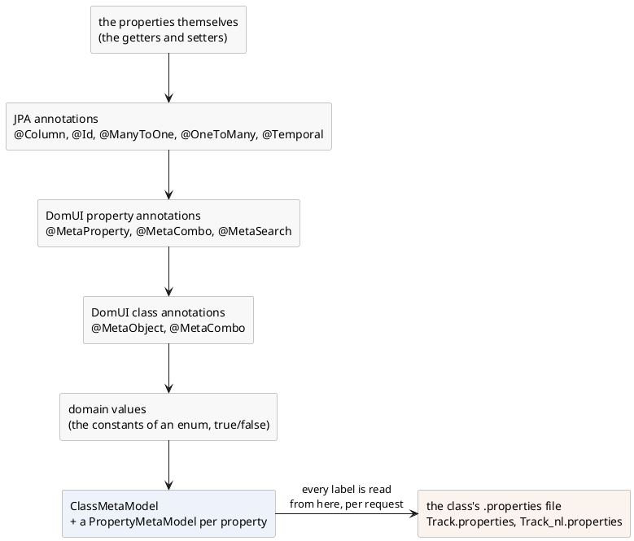
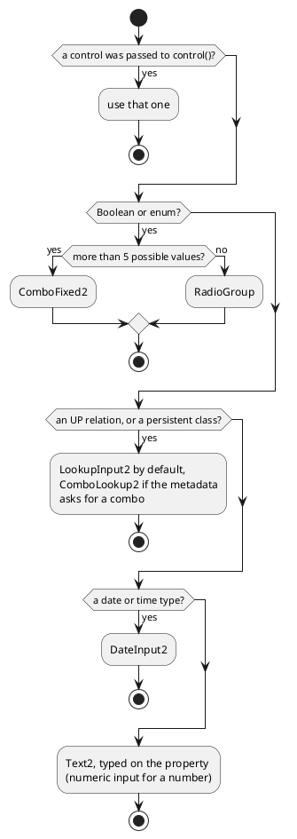
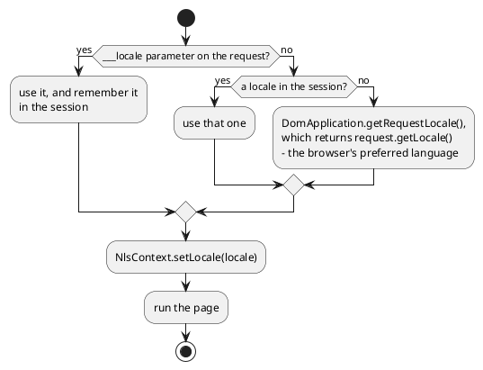

# Metadata

The table in [showing rows](../70-showing-rows/index.md) had to be told that the
duration column is a duration and that the price column is money. The edit
screens in [data binding](../50-data-binding/index.md) had to be told the same
things again, plus a label per field. That is the same knowledge, written down in
as many places as there are screens - and each of those places can be forgotten
when the field changes.

DomUI has one place for it. Every class has a **metadata model** describing its
properties: what each one is called on screen, how long it is, whether it is
required, how its value should be shown, which of them a table shows and in what
order. Screens ask for that model instead of repeating it.

[TOC]

## A form that repeats nothing

```java
Track track = getSharedContext().get(Track.class, 1L);

//-- Not one label, size, converter or mandatory marker here.
FormBuilder fb = new FormBuilder(cp);
fb.property(track, Track_.name()).control();
fb.property(track, Track_.composer()).control();
fb.property(track, Track_.milliseconds()).control();
fb.property(track, Track_.unitPrice()).control();
fb.property(track, Track_.album()).readOnly().control();
fb.property(track, Track_.mediaType()).readOnly().control();

//-- A RowRenderer without a single column() call.
SimpleSearchModel<Track> model = new SimpleSearchModel<>(this, QCriteria.create(Track.class));
DataTable<Track> dt = new DataTable<>(model, new RowRenderer<>(Track.class));
cp.add(dt);
dt.setPageSize(5);
cp.add(new DataPager(dt));
```

!demo(to.etc.domuidemo.pages.tutorial.meta.MetaFormPage.ui, 100%, 780)

Nothing in that code says "Title", "Duration" or "Price". Nothing asks for a
duration to be shown as `5m 43s 719ms` or a price as `$ 0.99`. Nothing marks
three of the fields mandatory, and nothing says which five columns the table has
or that it starts out sorted on the title. All of it comes from `Track`, and the
box at the bottom of the demo prints the metadata that produced it.

## Where it comes from

A class's metadata model is built once, in steps, each adding to what the step
before it found:



Each step may override what the one before it found, so a `@MetaProperty` that
names a converter wins over whatever the type would have given, and a
`@Column(length = 200)` sets a length that no annotation of DomUI's own had to
repeat.

The `.properties` file is not part of that: the model is built once and cached,
but a **label is looked up in the bundle every time it is asked for**, using the
locale of the request that is asking. That is what lets the same cached model
answer "Title" and "Titel" in the same second, and it is where the second half of
this page starts.

This is what `Track` says, and it is the whole of it:

```java
@MetaObject(defaultColumns = {
	@MetaDisplayProperty(name = "name", displayLength = 30)
	, @MetaDisplayProperty(name = "milliseconds", displayLength = 12)
	, @MetaDisplayProperty(name = "unitPrice", displayLength = 8)
	, @MetaDisplayProperty(name = "album.title", displayLength = 20)
	, @MetaDisplayProperty(name = "album.artist.name", displayLength = 40)
}, defaultSortColumn = "name", searchProperties = {
	@MetaSearchItem(name = "name")
	, @MetaSearchItem(name = "album")
	, @MetaSearchItem(name = "album.artist")
})
@Entity
@Table(name = "Track")
public class Track extends DbRecordBase<Long> {

	@Column(name = "Name", length = 200, nullable = false)
	public String getName() { ... }

	@MetaProperty(converterClass = MsDurationConverter.class)
	@Column(name = "Milliseconds", precision = 10, scale = 0, nullable = false)
	public long getMilliseconds() { ... }

	@MetaProperty(numericPresentation = NumericPresentation.MONEY_FULL)
	@Column(name = "UnitPrice", precision = 10, scale = 2, nullable = false)
	public BigDecimal getUnitPrice() { ... }

	@ManyToOne(fetch = FetchType.LAZY, optional = false)
	@JoinColumn(name = "AlbumId")
	public Album getAlbum() { ... }
}
```

and this is `Track.properties`, next to `Track.java`:

```properties
name.label=Title
composer.label=Composer
album.label=Album
album.title.label=Album
album.artist.name.label=Artist
genre.label=Genre
mediaType.label=Media type
milliseconds.label=Duration
bytes.label=Size in bytes
unitPrice.label=Price
```

### What each source contributes

| From | What it gives |
| --- | --- |
| `@Column(length)` | the maximum input length of a string field |
| `@Column(precision, scale)` | the size and the range check of a numeric field |
| `@Column(nullable = false)` | the field is required |
| `@Id`, `@EmbeddedId` | the primary key, and "this is a persistent class" |
| `@ManyToOne`, `@OneToOne` | an UP relation; `optional = false` makes it required |
| `@OneToMany` | a DOWN relation (a list of children) |
| `@Temporal` | date, time or date-and-time |
| `@Transient` | the property is not persistent |
| `@MetaProperty` | everything JPA cannot say: converter, numeric presentation, validators, a regexp, display size, sortability, read-only, a required-ness of its own |
| `@MetaObject` | the default columns of a table, the default sort column, the search fields |
| `@MetaCombo` | how instances of this class are shown in a combobox |
| `@MetaSearch` (on a getter) | this property is a search field |
| `ClassName.properties` | every label and hint, and the labels of enum values |

!! `@MetaProperty` **adds** to what was already found - it does not restate it.
!! Do not copy a length or a required-ness out of `@Column` into it; only put in
!! it what JPA has no way of saying.

Metadata is not only for entities. Any class works: the demo's `Shipment` is a
plain class with a `@GenerateProperties` annotation and a `.properties` file next
to it, and it gets labels, control choice and enum labels exactly like `Track`
does.

## Asking for the model yourself

```java
ClassMetaModel cmm = MetaManager.findClassMeta(Track.class);
PropertyMetaModel<?> pmm = cmm.getProperty("unitPrice");

PropertyMetaModel<BigDecimal> typed = MetaManager.getPropertyMeta(Track.class, Track_.unitPrice());

pmm.getDefaultLabel();          // "Price"
pmm.getPrecision();             // 10
pmm.getNumericPresentation();   // MONEY_FULL
pmm.isRequired();               // true
```

`MetaManager` is the way in. `findClassMeta(clz)` gives the `ClassMetaModel` -
built once and cached - and `getPropertyMeta` gives one `PropertyMetaModel`,
either from a name or from a [typed property](../40-typed-properties/index.md).
A dotted name walks a relation: `cmm.getProperty("album.artist.name")` returns a
property model that reads the artist name through the album, and it has the
metadata of the property it ends at.

| On a `PropertyMetaModel` | |
| --- | --- |
| `getName()` | the property name |
| `getActualType()` | the type of the value |
| `getDefaultLabel()` | the label, in the language of this request |
| `getDefaultHint()` | the tooltip text, or null |
| `getLength()` | the maximum length, or -1 |
| `getPrecision()` / `getScale()` | the numeric size, or -1 |
| `getDisplayLength()` | the width to show, in characters, or -1 |
| `isRequired()` | whether a value must be given |
| `getReadOnly()` | YES if it may not be edited |
| `getConverter()` | the converter set on the property, or null |
| `getNumericPresentation()` | MONEY_FULL, PERCENTAGE, NUMBER, ... |
| `getTemporal()` | DATE, TIME, DATETIME |
| `getValidators()` | the validators to run on input |
| `getRelationType()` | NONE, UP or DOWN |
| `getDomainValues()` | for an enum or boolean: the possible values |
| `getDomainValueLabel(loc, value)` | the label of one of those values |
| `getSortable()` | whether a table may sort on it, and which way first |

| On a `ClassMetaModel` | |
| --- | --- |
| `getProperties()` | all properties |
| `getProperty(name)` / `getProperty(QField)` | one property, dotted path allowed |
| `getPrimaryKey()` | the primary key property, or null |
| `isPersistentClass()` | whether it is mapped to a table |
| `getTableDisplayProperties()` | the default columns from `@MetaObject` |
| `getDefaultSortProperty()` / `getDefaultSortDirection()` | the initial sort |
| `getSearchProperties()` | the default search fields |
| `getComboDisplayProperties()` | how one instance is shown in a combo |
| `getDomainValues()` / `getDomainLabel(loc, value)` | for an enum: its values and their labels |
| `getClassBundle()` | the `.properties` file of this class |
| `getUserEntityName()` / `getUserEntityNamePlural()` | the `entity.name` and `entity.pluralname` keys |

## What metadata decides

### The label

`FormBuilder.property()` takes the label from `getDefaultLabel()`, which reads
`<propertyname>.label` from the class bundle. If the bundle has no such key the
**property name itself** is used, so a missing translation shows up on screen as
`mediaType` rather than as an empty label - which is how you find it.

`<propertyname>.hint` gives the tooltip, and a table column, a search field and a
lookup all take their header from the same place. Say it once, and it is right
everywhere - and it changes everywhere at the same time.

### Which control



`FormBuilder.property(...).control()` without an argument asks the
`ControlCreatorRegistry` for a control. Every creator in it scores the property
and the highest score wins, so the choice is made from the metadata alone: the
type of the value, whether it is a relation, and the hints the annotations left.
An enum of six values becomes a combobox and an enum of three becomes a row of
radio buttons; a relation becomes a lookup, which is what a relation gets unless
something asks for a combobox.

That asking is `componentTypeHint`, and it beats everything else:

```java
@MetaProperty(componentTypeHint = Constants.COMPONENT_COMBO)   // "comboLookup"
public Genre getGenre() { ... }
```

`Constants.COMPONENT_LOOKUP` forces the other way, and a hint containing
`textarea` gets a `TextArea` where a string would otherwise get a one-line input.
Passing a control to `control(...)` yourself of course settles it entirely.

Whatever is chosen is then configured from the same metadata: mandatory when the
property is required, disabled when it is read-only, and - unless
`DomApplication.setDefaultHintsOnControl(false)` turns it off - the tooltip from
the property's hint.

### The limits of the field

For a `Text2` the numbers turn into the size of the input box and into what may
be typed into it:

- `@Column(length = 200)` becomes `maxLength(200)`, and - when that is a
  reasonable width - the displayed size too.
- `@Column(precision = 10, scale = 2)` becomes a validator that rejects a number
  outside that range, plus a calculated width that leaves room for the minus
  sign, the thousand separators, the decimal separator and, for money, the
  currency symbol.
- `@MetaProperty(displaySize = ...)` overrides the calculated width without
  touching what may be entered.
- `@MetaProperty(validator = ..., regexpValidation = ...)` adds validators that
  run when `getValue()` is called.

!! JPA's `@Column(length)` defaults to **255**, which makes it impossible to see
!! whether a length was given or not. DomUI therefore accepts 255 only for
!! `String` properties, and ignores it elsewhere. If a string really is 255 long,
!! say so - it will be used.

### How the value is shown

A `BigDecimal` is just a number until something says what kind of number it is.
That is `numericPresentation`:

```java
@MetaProperty(numericPresentation = NumericPresentation.MONEY_FULL)
@Column(name = "UnitPrice", precision = 10, scale = 2, nullable = false)
public BigDecimal getUnitPrice() { ... }
```

The `ConverterRegistry` picks a converter for a value by asking every converter
factory to score the type *plus the property metadata*, so the money factory
claims a `BigDecimal` that says `MONEY_FULL` and the plain number factory gets
the rest. The same happens for a date: `@Temporal(DATE)` gets a date converter
where a plain `Date` gets a date-and-time one.

Where no factory can work it out, name the converter yourself:

```java
@MetaProperty(converterClass = MsDurationConverter.class)
public long getMilliseconds() { ... }
```

A converter set on the property beats everything else, and it works in every
place the value is shown - a form field, a table cell, a read-only display -
because they all ask the same registry. That is the difference between putting
it on the property and putting it on one column of one table.

### The table, the sort order and the search fields

`@MetaObject` describes the class as a list of rows:

- `defaultColumns` is what a `RowRenderer` shows when you define no columns
  yourself, in the order given. A `@MetaDisplayProperty` may walk a relation
  (`album.artist.name`), give a `displayLength`, a converter of its own, or a
  `join` that glues it to the next column into one cell.
- `defaultSortColumn` and `defaultSortOrder` are the sort the table starts with.
- `searchProperties` is what a `SearchPanel` puts on the screen when it is given
  no property list.

Define one column on the renderer and none of the default columns are used - it
is all or nothing. The default sort still applies either way: a renderer with no
`sortdefault()` of its own falls back to the class metadata's default sort
property.

## Labels for enum values

An enum value has a name, and a name is not a label. Its labels go in a
`.properties` file next to the enum, keyed by the constant:

```properties
# ShippingMethod.properties
Standard.label=Standard delivery
Express.label=Express (next day)
PickUp.label=Pick up at the shop
```

and one property may override one of them, in the bundle of the class that has
that property:

```properties
# Shipment.properties
method.label=Delivery
returnMethod.label=If it comes back
returnMethod.PickUp.label=Customer brings it back
insured.label=Insured
state.label=State
```

```java
FormBuilder fb = new FormBuilder(cp);
fb.property(m_shipment, Shipment_.method()).control();
fb.property(m_shipment, Shipment_.returnMethod()).control();
fb.property(m_shipment, Shipment_.insured()).control();
fb.property(m_shipment, Shipment_.state()).control();
```

!demo(to.etc.domuidemo.pages.tutorial.meta.MetaEnumPage.ui, 100%, 560)

The first two fields hold the same enum, and `PickUp` reads differently in each:
the second one has an override for it. The lookup goes
`<property>.<VALUE>.label` in the bundle of the class that has the property,
then `<VALUE>.label` in the bundle of the enum, and only then falls back to
`name()`.

`Insured` is a `Boolean`, and its two labels are not yours at all - `Yes` and
`No` come from DomUI's own bundle. And `State` is a combobox rather than a row of
buttons only because its enum has six values instead of three.

To do the same lookup outside a control:

```java
MetaManager.getEnumLabel(ShippingMethod.PickUp);                     // the enum's own bundle
MetaManager.getEnumLabel(propertyMeta, ShippingMethod.PickUp);       // the property's override first
MetaManager.createEnumList(ShippingMethod.class);                    // value + label, ready for a combo
```

## Internationalization

Every label so far came out of a `.properties` file, and every one of those
files can have a translation next to it. That is the whole of it: nothing else
needs to change to make the screens above speak another language.

### One page, two languages

```java
setPageTitle($("title"));
cp.add(new HTag(1, $("title")));

Invoice invoice = getSharedContext().get(Invoice.class, 1L);
FormBuilder fb = new FormBuilder(cp);
fb.property(invoice, Invoice_.invoiceDate()).readOnly().control();
fb.property(invoice, Invoice_.total()).readOnly().control();
fb.property(invoice, Invoice_.customer()).readOnly().control();
fb.property(invoice, Invoice_.billingAddress()).readOnly().control();
fb.property(invoice, Invoice_.billingCity()).readOnly().control();
fb.property(invoice, Invoice_.billingCountry()).readOnly().control();
```

!demo(to.etc.domuidemo.pages.tutorial.meta.MetaNlsPage.ui, 100%, 700)

Click **Nederlands**. Every label changes, the date turns from `2007-01-02` into
`02-01-2007` and the total from `3.96` into `3,96` - and not a line of the page
knows about it.

Two fields stay English: `Invoice_nl.properties` has no key for them, so those
two labels come from `Invoice.properties`. Translation falls back **per key**,
not per file.

Then click **Deutsch**. There is no German bundle anywhere, so the application's
own texts fall back to their default file - which is English here - while the
framework's own texts fall back to *theirs*, which is Dutch. The date is German,
because that comes from the JDK and not from a bundle.

!! **DomUI's own bundles have Dutch as their default language**, with English in
!! the `_en` files. An application whose users are neither Dutch nor English will
!! see Dutch in the framework's own texts - pager text, error messages, `Yes` and
!! `No`. Either supply the missing translations or force a supported locale in
!! `getRequestLocale()`.

### The locale of a request



A DomUI server serves many languages at the same time: the locale belongs to the
**request**, not to the application and not to the machine. Before a request is
handled the locale is worked out and put in `NlsContext`, and everything that
formats or translates reads it from there:

```java
Locale loc = NlsContext.getLocale();
```

It is a `ThreadLocal`, so every request has its own and no call needs to carry a
locale parameter. This is the call to use anywhere your own code needs the
language of the user it is answering.

By default the locale is the browser's preferred language, as the servlet
container reports it. There are two ways to decide otherwise:

- Add `___locale=nl_NL` to the URL (three underscores). It applies to that
  request and is kept in the session, so it holds until it is set again. This is
  what the language links on the demo page do.
- Override `getRequestLocale()` in your `DomApplication`:

```java
@Override
public Locale getRequestLocale(HttpServletRequest request) {
	return DUTCH;
}
```

Money is a separate question, because the language someone reads in and the
currency they pay in are not the same thing. `NlsContext.getCurrencyLocale()`
answers it, set per request with `setCurrencyLocale()` and falling back to
`setDefaultCurrencyLocale()`.

### Why the JDK's own localization is not used

DomUI does not use `java.util.ResourceBundle`. It is built for a program that
picks a language once, at startup, and a server is not that program - it answers
one user in Dutch and the next in English on the same second. Four concrete
things follow:

- **A `ResourceBundle` is one language.** `ResourceBundle.getBundle(name, loc)`
  hands back a bundle already bound to `loc`. There is no object that means "all
  the translations of these keys", so a bundle cannot be a `static final`
  constant and cannot be passed around: every place that reads a message must
  also know the locale and look the bundle up again.
- **A missing translation silently becomes the wrong language.** When the JDK
  finds no bundle for the requested locale it does *not* go to the base file. It
  first retries the whole search with `Locale.getDefault()` - the locale of the
  **machine the server runs on**. A missing Dutch file on a server started in a
  French locale gives that user French, not the base language. This is decided
  by `ResourceBundle.Control.getFallbackLocale()`, and turning it off means
  writing a `Control` subclass.
- **The search order cannot be extended.** DomUI resolves a bundle over four
  levels - dialect, language, country, variant - so that one installation can
  override single texts of an otherwise shared application. `ResourceBundle` has
  no room for a level it does not know about.
- **The encoding is a trap.** See the warning at the end of this page: a
  `.properties` file that is not UTF-8 is not rejected, it is quietly read in
  another encoding.

DomUI's answer is `BundleRef`, and the difference is one sentence: **a JDK bundle
decides the language when it is loaded; a `BundleRef` decides it at every
lookup**, from `NlsContext.getLocale()`.

### BundleRef: all translations of a set of keys

```java
public static final BundleRef BUNDLE = BundleRef.create(UserInfoPage.class, "messages");

String text = BUNDLE.getString("ui.dt.empty");
String message = BUNDLE.formatMessage("ui.pagertext", 12, 120, 1212);
```

A `BundleRef` names a *place*: the resource files called `messages*.properties`
in the package of `UserInfoPage`. It has no language of its own, which is why it
is a constant and why it can be handed around freely. `formatMessage` fills the
`{0}`, `{1}` placeholders using the JDK's `MessageFormat`, and picks the file to
read them from at that moment.

Two `BundleRef.create()` calls for the same place return the **same instance**,
so declaring the same constant in five classes of a package costs one bundle.

The files themselves are ordinary Java `.properties` files:

```properties
# messages_nl.properties
ui.pagertext=Pagina {0} van {1}, {2} record(s)
ui.pagerover=Het aantal resultaten is afgekort naar {0}
ui.pagerempty=Geen resultaten
```

#### Which file, and in which order

For a request in `nl_NL`, `messages` is looked for as:

```
messages_nl_NL.properties
messages_nl.properties
messages.properties
```

and with a dialect set (`NlsContext.setDialect()`) that dialect is tried at each
level first. Every file that exists is kept, in that order, and a key is looked
up in all of them until one has it. So a translation may be *partial*: put the
few keys that differ between `en_GB` and `en_US` in their own files and leave the
rest in `messages_en.properties`. It is what makes the two English labels appear
on the Dutch demo page above.

The file without any language in its name is the **default**, and it must exist:
it is what a locale nobody translated for falls back to. Everything in it should
be in one and the same language - whichever language your application treats as
its base.

### Bundle codes instead of strings

A `String` key is a poor way to name a message: it is not checked, it must be
remembered, and on its own it does not say which bundle it lives in. An enum
implementing `IBundleCode` is both at once.

```java
public enum FormulaError implements IBundleCode {
	attributeReferenceExpected,
	invalidRealNumber,
	invalidNumber
}
```

The bundle is `FormulaError.properties`, in the same package as the enum, and
every constant is a key in it. Getting the text needs nothing else:

```java
IBundleCode code = FormulaError.invalidNumber;
String message = code.format(someValue);
String plain = code.getString();
```

Because a code carries its own bundle it can be passed anywhere a message is
wanted, which is what the framework does with its own:

```java
throw new CodeException(FormulaError.invalidNumber, input);          // a translated exception
UIMessage.error(FormulaError.invalidNumber, input);                  // a translated error on the screen
fb.property(order, AlbumOrder_.copies()).label(MyLabels.copies).control();
```

DomUI's own messages are the enum `to.etc.domui.util.Msgs`, over
`to/etc/domui/util/messages.properties`. `Msgs.mandatory`, `Msgs.notValid`,
`Msgs.uiPagerText` and the rest are what every validation error and every
component text on the screen comes from - which is why they translate with
everything else.

This is the way to do message bundles. Use it rather than string keys.

### The bundle of a page, and $()

Every `NodeBase` - so every page, every fragment, every component - can look up a
text without naming a bundle at all:

```java
MsgBox2.on(this).info($("recordNotFound", getName()));
```

`$()` finds the bundles that belong to the class it is called on, reads the key
from the first one that has it, and runs `MessageFormat` over the result with the
remaining arguments. The bundles it searches are collected once per class:

- `ClassName.properties`, next to the class;
- `messages.properties` in the class's own package;
- `messages.properties` in each package above that one;
- and then the same three again for the superclass, and its superclass, up to the
  end of the hierarchy.

The first bundle that has the key wins, and the list starts at the actual class.
That is what makes a text overridable: a `CustomerListPage` extending an
`AbstractListPage` whose button text comes from `$("newButton")` only has to put
`newButton=...` in `CustomerListPage.properties` to change it, without touching
the base class.

`setComponentBundle()` replaces the whole search with one bundle you name. It
has to be called before the first `$()`, and it is worth it only when a set of
components genuinely shares one bundle.

### The keys metadata looks for

This is where the two halves of this page meet. The bundle that
`ClassMetaModel.getClassBundle()` returns is an ordinary `BundleRef` -
`ClassName.properties` next to the class - so everything above about
translations, fallback and partial files applies to labels, unchanged:

| Key | What it names |
| --- | --- |
| `<property>.label` | the label of a property |
| `<property>.hint` (or `.help`) | its tooltip |
| `<path.to.property>.label` | the label of a property reached over a relation, e.g. `album.artist.name.label` |
| `<VALUE>.label` | in an **enum's** bundle: the label of that constant |
| `<VALUE>.hint` | its tooltip |
| `<property>.<VALUE>.label` | in the **owning class's** bundle: that value's label for that property only |
| `entity.name` | the name of the class in the user's words, singular |
| `entity.pluralname` | the same, plural |

Add `Track_nl.properties` next to `Track.properties` and every screen showing a
track is Dutch for a Dutch user - forms, tables, search panels and lookups
together, without one of them being changed.

### Properties files are UTF-8

!! **Save every `.properties` file as UTF-8.** DomUI reads bundles with
!! `PropertyResourceBundle`, which on Java 9 and later decodes UTF-8 - but when
!! the bytes are not valid UTF-8 it does not fail. It silently re-reads that one
!! file as ISO-8859-1 and carries on.

That fallback is what makes a wrong encoding so unpleasant. It is decided **per
file** and nothing is logged, so a project can be half UTF-8 and half something
else and still look like it works:

- An ISO-8859-1 file is read back correctly, by accident: its accented bytes are
  not valid UTF-8, so the fallback catches it. That holds until someone puts a
  `€`, a `—` or a `’` in it - characters ISO-8859-1 does not have at all.
- A Windows-1252 file is *not* ISO-8859-1, though the fallback reads it as one.
  The two differ in exactly the byte range that holds `€`, `—`, `’` and `“` -
  the characters people actually paste in - so those come out as control
  characters or as nothing.
- A file that was UTF-8 and got saved once as Latin-1 can be *valid* UTF-8 for
  the wrong characters. `café` becomes `café`, is read as UTF-8 without
  complaint, and shows up as `café` on the screen.
- Because the decision is per file and depends on the bytes, adding one character
  to one bundle can flip how that bundle is read while every other file keeps
  working. Text that was fine yesterday is wrong today, in one language only.

So:

- Set the editor and the IDE to write `.properties` in UTF-8 - not the platform
  default. In IntelliJ that is *Settings > Editor > File Encodings*, where the
  encoding of properties files is a setting of its own.
- Keep `<project.build.sourceEncoding>UTF-8</project.build.sourceEncoding>` in
  the pom, which is where the DomUI build has it.
- Write the characters themselves. `\uXXXX` escapes still work, but they exist
  only because the JDK once had no other option, and they make a translation
  unreadable to the person who has to check it.
- To stop the fallback hiding a mistake, start the JVM with
  `-Djava.util.PropertyResourceBundle.encoding=UTF-8`. A file that is not UTF-8
  then throws instead of being quietly reinterpreted - which is what you want on
  a build server, and arguably everywhere.

The demo page above prints `café, naïve, € 12,50, 20 °C, — an em dash` from its
bundle in both languages. If any of that arrives mangled, the file was not UTF-8.
