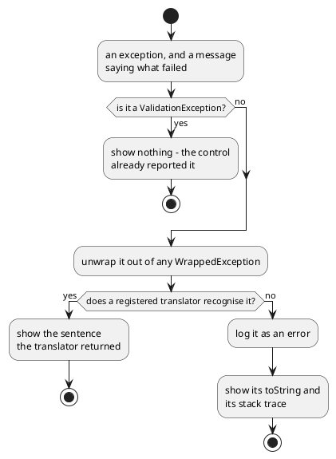
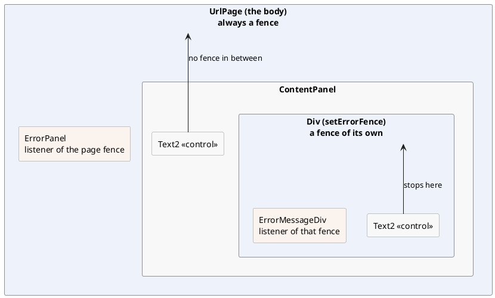

# Telling something to a user

A page usually answers by changing itself: a row appears, a field turns
read-only, a total is recalculated. Sometimes that is not enough and the
application has to *say* something - the save worked, the shop is out of stock,
the delete needs confirming, the code fell over.

DomUI has three ways to do that, and they differ in how much they interrupt.
A **message box** puts a window over the page and waits. A **message** is a line
of text that stays on the page next to what it is about. An **exception dialog**
shows what went wrong when code threw.

[TOC]

## A box on top of the page

```java
MsgBox2.on(this).info("The album has been saved.");

MsgBox2.on(this).warning("This album has no tracks yet, so nobody can buy it.");

MsgBox2.on(this).error("The album could not be saved: the shop is closed.");
```

!demo(to.etc.domuidemo.pages.tutorial.messages.MsgBoxPage.ui, 100%, 340)

`MsgBox2.on(node)` makes a box and hangs it on the page that node belongs to, so
there is nothing to `add()` yourself; everything after it is the box being
described, and it appears when the request is finished.

The **type** picks the icon and the window title: `info()`, `warning()`,
`error()` and `question()`, each also available as a one-liner taking the text.
The text itself is either a `String`, a bundle code with parameters, or a piece
of DOM:

```java
Div content = new Div();
content.add("The import finished with these results:");
Ul ul = new Ul();
content.add(ul);
ul.add(new Li().add("212 albums read"));
ul.add(new Li().add("3 albums skipped: no artist"));

MsgBox2.on(this)
	.title("Import finished")                  // Overrides the title the type would give
	.warning()
	.content(content)                          // Instead of .text(...)
	.button(MsgBoxButton.OK)
	.size(500, -1)                             // -1: as high as the content needs
;
```

`text(IBundleCode, Object...)` is the translated form of `text(String)`, and
`title(IBundleCode, Object...)` the same for the title.

!! A message box does not block the code that made it. `MsgBox2.on(this).info(...)`
!! returns at once and the rest of the handler runs; the box only exists on the
!! *next* screen the user sees. Everything that has to happen after the user
!! answers belongs in the answer handler below - not on the line after the box.

## Asking something

```java
MsgBox2.on(this)
	.question()
	.text("Delete the album \"Big Ones\"? This cannot be undone.")
	.yesNo()
	.onAnswer(button -> {
		if(button == MsgBoxButton.YES) {
			delete();
		}
	});
```

!demo(to.etc.domuidemo.pages.tutorial.messages.MsgAskPage.ui, 100%, 340)

The answer arrives in a handler, and which handler depends on what the buttons
are:

| Buttons | Handler | What it gets |
| --- | --- | --- |
| `yesNo()`, `continueCancel()`, `button(MsgBoxButton)` | `onAnswer` | the `MsgBoxButton` that was pressed |
| `button(String label, Object value)` | `onAnswer2` | the value you attached to that button |
| `button(String label, IClicked)` | its own click handler | nothing - it does not answer the box |
| `input(label, control, handler)` | the input handler | the value of the control |

Add no buttons at all and the box gets `CONTINUE`, plus `CANCEL` when it carries
inputs. Buttons are laid out by priority rather than by the order you add them:
the primary one (`OK`, `YES`, `CONTINUE`) ends up on the right, `CANCEL` and `NO`
to its left. Closing the box with the cross counts as `CANCEL`.

An input box asks for a value instead of a decision:

```java
Text2<Integer> copies = new Text2<>(Integer.class);
copies.setMandatory(true);

MsgBox2.on(this)
	.title("Order")
	.input("Copies", copies, value -> order(value))
	.onValidate(button -> {
		if(button != MsgBoxButton.CONTINUE) {
			return true;                                  // Cancelling is always allowed
		}
		Integer value = copies.getValueSafe();            // Reports "mandatory" itself when empty
		if(null == value) {
			return false;
		}
		if(value.intValue() > 10) {
			copies.setMessage(UIMessage.error(TutorialMsg.orderTooLarge, 10));
			return false;                                 // Keeps the box open
		}
		return true;
	});
```

The control is an ordinary control - it converts, validates and reports the same
way it would on a page. `onValidate` runs *before* the answer handler and before
the box closes, and returning `false` from it leaves the box standing with the
message on it, which is how a box refuses an answer it cannot use.

### MsgBox, the older form

```java
MsgBox.info(this, "The album has been saved.");
MsgBox.yesNo(this, "Delete the album?", answer -> { ... });
```

`MsgBox` is the same window with a fixed set of static methods instead of a
builder: one method per combination of type, buttons and handler. It is still
used in a great deal of existing code, so it is worth recognising - but every one
of its methods is a combination `MsgBox2` can build, and combinations it cannot
build. Write new code with `MsgBox2`.

## A message that stays on the page

```java
//-- About the page as a whole.
addGlobalMessage(UIMessage.warning(TutorialMsg.orderStockLow, "Big Ones", 3));

//-- About one field.
copies.setMessage(UIMessage.error(TutorialMsg.orderTooLarge, 10));
```

!demo(to.etc.domuidemo.pages.tutorial.messages.MsgMessagePage.ui, 100%, 520)

A `UIMessage` is what DomUI passes around instead of a string, because a string
on its own does not carry enough:

| Part | What it is for |
| --- | --- |
| the **code** and its parameters | an `IBundleCode`, so the text is looked up in the request's language *when it is shown*, not when the message is made |
| the **type** | `MsgType.INFO`, `WARNING` or `ERROR` - the icon, the colour, and which message wins when two land on one control |
| the **error location** | the name of the field it is about; it is printed in bold in front of the text |
| the **node** | the control it belongs to, which is what makes that control turn red |
| the **group** | a name, so a set of related messages can be removed in one call |

Making one is a static call per severity, and the location is either passed with
it or added afterwards:

```java
UIMessage.info(TutorialMsg.orderSaved, 3);
UIMessage.warning(TutorialMsg.orderStockLow, "Big Ones", 3);
UIMessage.error(TutorialMsg.orderTooLarge, 10);
UIMessage.error("Copies", TutorialMsg.orderEmpty);          // With an error location
UIMessage.error(TutorialMsg.orderEmpty).location("Copies"); // The same, chained
UIMessage.error(codeException);                             // The code and parameters of the exception
```

The bundle code is the same `IBundleCode` enum that
[metadata](../80-metadata/index.md) uses for every other text: the message is
written down once, per language, in a `.properties` file next to the enum, and
the code that posts it never sees a sentence.

Putting a message on the screen is one of two calls:

- `control.setMessage(uiMessage)` puts it **on that control**: the field is
  marked, and the message is shown with the field's label in front of it.
  `setMessage(null)` takes it off again. A control holds one message at a time,
  and a less severe message does not push a more severe one aside - an info
  message does not overwrite an error.
- `node.addGlobalMessage(uiMessage)` posts a message that is **about no
  particular field**. `clearGlobalMessage()` removes them again, and
  `clearGlobalMessage(code)` only those with one code.

Most of the messages on a screen are not posted by your code at all: a control
that cannot convert its input posts one itself, and so does every failing binding
when `bindErrors()` reports it. Which is why the last two sections of this page
are about where all of them end up.

## Showing an exception

```java
try {
	save();
} catch(Exception x) {
	ExceptionDialog.create(this, "Saving the order failed", x);
}
```

!demo(to.etc.domuidemo.pages.tutorial.messages.MsgExceptionPage.ui, 100%, 300)

`ExceptionDialog` is the answer to "something threw and the user is still
sitting there". It shows a box with the message you passed as its title, and
what it puts inside depends on whether anything recognises the exception:



A **translator** is a function from an exception to an `ExceptionPresentation` -
a sentence, or a piece of DOM - which returns `null` for exceptions it does not
know. DomUI registers a handful of its own, and the Hibernate integration adds
one for constraint violations:

| Exception | What the user sees instead of a stack trace |
| --- | --- |
| `CodeException` (and `MessageException`) | the message of the exception, translated |
| `QConcurrentUpdateException`, JPA's `OptimisticLockException` | "somebody else changed this data" |
| a `SQLException` with SQL state 23505 | "this value already exists" |
| Hibernate's `ConstraintViolationException` | the message registered for that constraint name, or the 23505 text |

Your own exceptions get the same treatment by registering a translator for them:

```java
ExceptionDialog.register(x -> x instanceof OutOfStockException osx
	? new ExceptionPresentation(TutorialMsg.orderOutOfStock.format(osx.getAlbum()))
	: null);
```

The list is global and the last translator registered is asked first, so this
belongs in the `initialize()` of your `DomApplication` - it is a decision of the
application, not of a page.

The try/catch around a call that may fail is so common that `NodeContainer` has
it built in:

```java
executeWithDialog("Saving the order failed", () -> save());
```

It runs the code, shows the dialog if it threw, and returns `false` in that case.

### The exceptions nobody catches

An exception that escapes a click handler ends up at the framework, which asks
the application whether anything has been registered for it:

```java
addExceptionListener(QNotFoundException.class, (ctx, page, source, x) -> {
	String url = DomUtil.createPageURL(ExpiredDataPage.class,
		new PageParameters(ExpiredDataPage.PARAM_ERRMSG, x.getLocalizedMessage()));
	UIGoto.redirect(url);
	return true;                                   // Handled: do not rethrow
});
```

That one is DomUI's own: a page whose record has meanwhile been deleted goes to
an "expired data" page instead of a stack trace. Listeners are registered per
exception class, the **most specific** class registered wins, and the handler
returns `true` when it dealt with the exception and `false` to let it travel on.
It is handed the request, the page and - when the exception came out of a click -
the component that was clicked, which is enough to put a message on the screen
next to it.

## Where a message ends up: the error fence

Nothing in the code above says *where* a message is shown. That is decided by the
tree, and the rule is one sentence: a message posted on a node travels upwards
until it meets a node that is an **error fence**, and that fence shows it.



The demo page has three fences in it - the two panels and the page around them -
and the same control error lands in a different place depending on which panel it
was raised in:

!demo(to.etc.domuidemo.pages.tutorial.messages.MsgFencePage.ui, 100%, 560)

A fence is not a component: it is an `IErrorFence` sitting *on* a
`NodeContainer`, holding a list of listeners. The pieces are:

- **The page body is always a fence**, made in the `Page` constructor. A message
  can therefore never fall off the tree - if nothing catches it earlier the page
  does.
- **A container becomes one** with `setErrorFence()`, and stops being one with
  `setErrorFence(null)`.
- **Showing the messages is a listener's job.** A component that wants to display
  them implements `IErrorMessageListener` and registers itself on the fence it
  finds above it - which is exactly what `ErrorPanel` and `ErrorMessageDiv` do.
- **`new ErrorMessageDiv(panel)` does both at once**: it makes `panel` a fence and
  registers itself as its listener, which is the whole of what the demo page does
  per panel.
- **A fence with no listeners asks the application.** When a message arrives and
  nothing is listening, `DomApplication.addDefaultErrorComponent()` is called to
  put a display component in the container - by default an `ErrorPanel` at the
  top. Overriding that one method changes how messages look in the entire
  application; the demo application does it to put its messages under the page
  header rather than above it.
- **`PropagatingErrorFenceHandler`** is a fence that also passes what it catches
  to the fence above it, for a message that has to be visible in both places.

So a screen that shows its own messages - a panel, a tab, a dialog - is a fence
plus a listener, and everything inside it keeps its complaints inside it.

## And the errors the bindings kept

One source of messages does not report itself: a binding whose value would not
convert keeps the error to itself, because reading every control on every request
would light up half a form the user has not reached yet.
[Data binding](../50-data-binding/index.md) has the mechanism; the rule it ends
in belongs here as well:

```java
cp.add(new DefaultButton("Save", a -> {
	if(bindErrors()) {                        // Anything wrong anywhere below this node?
		return;                               // Yes: it is on screen now, stop here.
	}
	save();
}));
```

`bindErrors()` walks the tree from the node it is called on, hands every kept
error to the control that produced it - which is what makes the field red and
sends the message off to its fence - and returns `true` if it found any. Call it
first in every handler that is about to use bound data, and return when it says
`true`: the user has been told by then.
