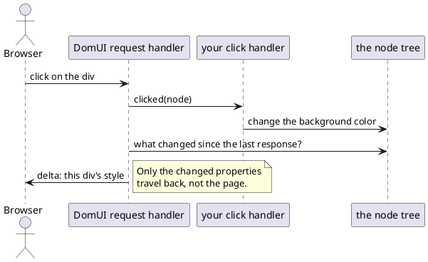

---
menu:
  sort: "05"
---
# Building your first page

A DomUI page is a Java class. There is no template, no jsp, no html file and no
javascript to write: you write a class, the class builds a tree of nodes, and
DomUI renders that tree to the browser and keeps it in sync from then on.

This page builds three small ones. They only use *tags* - the DomUI equivalents
of plain html elements. DomUI's [components](../../components/index.md) are
built out of exactly the same material, so everything here keeps being true once
you start using them.

## A page is a class extending UrlPage

The smallest page that does something:

```java
package to.etc.domuidemo.pages.tutorial.first;

import to.etc.domui.dom.html.Div;
import to.etc.domui.dom.html.UrlPage;

public class HelloPage extends UrlPage {
	@Override
	public void createContent() throws Exception {
		setPageTitle("My first page");

		Div box = new Div("dm-tut");
		add(box);
		box.add("Hello, world!");
	}
}
```

That is the whole page, and this is it running:

!demo(to.etc.domuidemo.pages.tutorial.first.HelloPage.ui, 100%, 260)

Three things are worth naming in those few lines:

- The class extends [UrlPage](../urlpage/index.md). Every page does. `UrlPage`
  *is* the `<body>` element of the rendered document - when you `add()`
  something to the page, you are adding it inside the body.
- `new Div(...)` creates a `<div>` tag; the string is its css class. Every html
  element has a class like it in `to.etc.domui.dom.html`: `Div`, `Span`, `Para`,
  `HTag`, `ATag`, `Img`, `Table`, `UL`, `Li` and so on.
- `setPageTitle()` names the page. That name is what the demo application's top
  bar and its breadcrumb show. It is *not* the browser tab title: that one is the
  page's `title` property (`setTitle()`), and when it is not set DomUI falls back
  to `getDefaultPageTitle()` in your `DomApplication`.

Nothing here renders itself. You build a tree, and DomUI decides what html that
becomes and when it needs to be sent.

## The class name is the URL

A page is addressed by its **fully qualified class name plus `.ui`**, appended to
the root URL of the web application. The demo application above lives at
`https://demo.domui.org/`, and its class is
`to.etc.domuidemo.pages.tutorial.first.HelloPage`, so the page is at

> [https://demo.domui.org/to.etc.domuidemo.pages.tutorial.first.HelloPage.ui](https://demo.domui.org/to.etc.domuidemo.pages.tutorial.first.HelloPage.ui)

There is no mapping to write and nothing to register: a class that extends
`UrlPage` and is on the classpath is reachable, and moving it to another package
changes its URL. The `.ui` extension is configured once, on the `AppFilter` in
`web.xml`; `ui` is the default.

Two things extend that basic rule:

- The application's root URL itself shows the page returned by `getRootPage()` in
  your `DomApplication` class - the demo returns its `HomePage`.
- Anything between the web application root and the class name is a
  [URL context](../url-contexts/index.md), which the page can read if it wants to.
  It does not change which class is addressed.

## createContent() builds the page

`createContent()` is the method you write a page in. DomUI calls it for you, in
this order:

1. the page class is instantiated with its no-argument constructor;
2. parameters from the URL are injected into the page's properties that are
   annotated with `@UIUrlParameter`;
3. `createContent()` is called, once, before the page is first rendered.

That order is the reason page content is built in `createContent()` and not in
the constructor: in the constructor the URL parameters have not arrived yet, so
a page that builds itself there cannot show anything that depends on them.

`createContent()` is called **once per build**, not once per request. A click,
a keystroke or any other event does not rebuild the page - the tree stays alive
between requests, and handlers change it in place. When you do want a page to
build itself again from scratch, call `forceRebuild()` on it: DomUI throws the
existing children away and calls `createContent()` again before the next
response goes out.

## A page is a tree of tags

Tags are added to the tag that must contain them, and that is all the structure
there is:

```java
public class HelloTreePage extends UrlPage {
	@Override
	public void createContent() throws Exception {
		setPageTitle("A tree of tags");

		Div box = new Div("dm-tut");
		add(box);

		box.add(new HTag(1, "Hello, world!"));

		Para para = new Para();
		box.add(para);
		para.add("This paragraph sits inside a div, and this ");
		para.add(new Span("dm-tut-hi", "span"));
		para.add(" sits inside the paragraph. What you add something to decides where it ends up.");
	}
}
```

!demo(to.etc.domuidemo.pages.tutorial.first.HelloTreePage.ui, 100%, 300)

`add()` on the page adds to the body; `add()` on a node adds inside that node.
The `add(String)` used above adds text, so a paragraph is written as the mix of
text and tags that it is. Because this is Java rather than a template, a loop is
a loop and a condition is a condition - building a list of rows is a `for` over
`add()` calls, and the compiler checks the result.

## Reacting to a click

Any tag can be given a click handler. The handler is ordinary server side Java:

```java
public class HelloClickPage extends UrlPage {
	static private final String OFF = "#d9e8ff";

	static private final String ON = "#ffd9a0";

	private boolean m_on;

	@Override
	public void createContent() throws Exception {
		setPageTitle("Clicking a tag");

		Div box = new Div("dm-tut");
		add(box);
		box.add("Click me to change my color");
		box.setBackgroundColor(m_on ? ON : OFF);

		box.setClicked(clickedNode -> {
			m_on = !m_on;
			clickedNode.setBackgroundColor(m_on ? ON : OFF);
		});
	}
}
```

Click the box a few times:

!demo(to.etc.domuidemo.pages.tutorial.first.HelloClickPage.ui, 100%, 260)

The handler receives the node it was attached to, so one handler instance can
serve several tags. It changes a field on the page and a property of that node -
and then it is done. There is no code that writes html, no code that updates the
browser, and no id to look up on the other side.

That last part is what DomUI does for you:



DomUI keeps the tree as it was last rendered to the browser. After your handler
has run it compares the tree with that state and sends back only the difference.
For the click above, the entire response is one line:

```xml
<changeTagAttributes select="#_2" style="background-color:#ffd9a0;" class="dm-tut" .../>
```

The page you see is never re-sent, and the browser never reloads - which is why
"just change the node" is a complete answer.

## Only tags so far

Everything above is a tag: a `Div`, a `Para`, a `Span`, an `HTag`. That is the
bottom layer, and it is worth having seen, but it is not how you write screens
day to day. A real page uses [components](../../components/index.md) - inputs,
buttons, tables, lookup fields - which are themselves nodes built out of these
same tags, and it uses [data binding](../../data/data-binding/index.md) to move
data between those components and your objects instead of setting values by hand.

All three pages above are in the demo application, under "Tutorial pages" on its
home page. Every demo page has a source icon in its top bar that shows the Java
source of the screen you are looking at.
