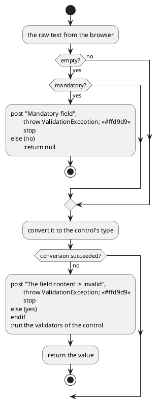
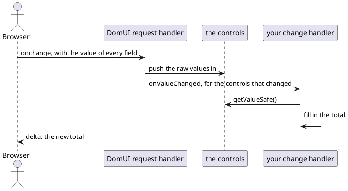

---
menu:
  sort: "06"
---
# Using components

A component is a ready-made piece of screen: an input field, a date input, a
combobox, a button. You add one to your page the way you added a `Div` on the
[previous page](../first-page/index.md), you give it a value, and you ask it for
the value the user typed.

[TOC]

## A form of components

```java
public class ComponentFormPage extends UrlPage {
	@Override
	public void createContent() throws Exception {
		setPageTitle("A form of components");

		ContentPanel cp = new ContentPanel();
		add(cp);
		cp.add(new HTag(1, "A form of components"));

		Text2<String> title = new Text2<>(String.class);
		Text2<Integer> copies = new Text2<>(Integer.class);
		Text2<BigDecimal> price = new Text2<>(BigDecimal.class);
		DateInput2 released = new DateInput2();
		ComboFixed2<String> medium = new ComboFixed2<>(List.of(
			new ValueLabelPair<>("cd", "Compact disc"),
			new ValueLabelPair<>("lp", "Vinyl LP"),
			new ValueLabelPair<>("dl", "Download")
		));

		FormBuilder fb = new FormBuilder(cp);
		fb.label("Album title").mandatory().control(title);
		fb.label("Copies in stock").control(copies);
		fb.label("Price each").control(price);
		fb.label("Released").control(released);
		fb.label("Medium").control(medium);
	}
}
```

!demo(to.etc.domuidemo.pages.tutorial.components.ComponentFormPage.ui, 100%, 420)

Each control is created, and then handed to a
[FormBuilder](../../components/forms-and-input/form4-formbuilder/index.md),
which puts a label in front of it and lays the pairs out. `mandatory()` marks the
label and tells the control a value is required.

!i A FormBuilder is not a control itself, but helps creating/placing them.

Controls are __typeful__: they return an appropriate Java type for whatever they
show/edit. A control converts between that type and the text in the
browser itself; you never see the text.
A DateInput2's getValue() returns a `Date`; `CheckBox` returns a `Boolean`.
`Text2<T>` is a bit special: the `T` represents the type you want to get out of a 
Text2's `getValue()`. When that type is something else than `String` then the text
input by the user needs to be __converted__ to the actual type you want. This is
typically done by adding a __converter__ to the `Text2` instance.
For commonly used types Text2 has a built-in converter. These types are:

* Integer
* Long
* Double
* BigDecimal
* BigInteger

!! The controls should be stored in __local variables__, not in fields of the page. A control
!! belongs to the tree that `createContent()` builds, and that tree is thrown
!! away and built again whenever the page rebuilds. A control in a field survives
!! that, so the page would the previous version (and value) of that control - which 
!! is a bug that is hard to see and easy to make.

### A note on component names

DomUI has existed since 2009, and as we went along we learned how to do things 
better. A control that has a number behind its name means that it is an improved 
version of an earlier control. In general, always use the highest numbered version
of a control. The version number also indicates, usually, that the control might
have a different interface than the earlier version; the number serves to keep
existing code working without change.

### A component is a node that builds itself

`Text2<T>` extends `Div`. `DefaultButton` extends `Button`. `ComboFixed2<T>` is a
div as well. A component *is* a node, which is why it goes into the tree exactly
like a tag does.

What it adds is that it fills itself in. A component implements
`createContent()` - the same method your page implements, called by the same
mechanism, once, just before the node is first rendered:

```plantuml svg title="What a Text2 becomes when it builds"
@startuml
skinparam shadowing false
skinparam rectangle {
  BackgroundColor #f8f8f8
  BorderColor #909090
}

rectangle "Text2<String>\nis a <div class='ui-txt2'>" as T {
  rectangle "<div class='ui-control'>" as C {
    rectangle "<input class='ui-input'>" as I
  }
  rectangle "the buttons you added" as B
}
@enduml
```



So a component is a small tree of the very same tags you wrote by hand on the
previous page. This is what "layer 0" and "layer 1" mean: layer 0 is
`to.etc.domui.dom.html`, one class per html element and no behaviour of its own;
layer 1 is the components, built out of layer 0. A screen fragment you write
yourself - a class extending `Div` with a `createContent()` - is the same kind of
thing, so there is no line between "framework component" and "your code".

Because a component builds late, setting a property on one is just setting a
field; the html follows when it builds. A property that changes what a component
*looks* like makes it drop its content and build again (`forceRebuild()`):

```
@Override
public void setValue(@Nullable T v) {
	if(MetaManager.areObjectsEqual(v, internalGetValue()))
		return;
	m_value = v;
	forceRebuild();
}
```

## Reading what the user typed

The page above has two buttons under the form. This is the first one:

```java
cp.add(new DefaultButton("Show the values", a -> {
	//-- Every getValue() can fail: the first one that does ends this handler.
	String titleValue = title.getValue();
	Integer copiesValue = copies.getValue();
	BigDecimal priceValue = price.getValue();
	Date releasedValue = released.getValue();
	String mediumValue = medium.getValue();

	result.removeAllChildren();
	line(result, "Title: " + titleValue);
	...
}));
```

Press it with the album title empty, and no value is shown at all: a red bar
appears at the top of the page saying **Album title:** Mandatory field, and the
field itself turns red. Put `abc` in "Copies in stock" and it says **Copies in
stock:** The field content "abc" is invalid.

`getValue()` is where the input is checked. It takes the raw text the browser
sent for that control and works through it in three steps:



Posting a message and throwing are two separate things, and the message is the
one that matters. A control in error posts a `UIMessage` to the nearest **error
fence**; the body of the page is always one, so a message always lands
somewhere. When nothing on the page collects messages itself, DomUI puts an
`ErrorPanel` at the top of the page - that red bar. The message is prefixed with
the control's *error location*, which the form builder filled in from the label,
which is why it names the field in words the user recognizes.

The `ValidationException` is not yours to catch. The framework catches it around
your handler, stops the handler there, and renders the page as it now stands -
with the message that was just posted. That is why the handler above reads five
values in a row without a single check: the first control that cannot deliver
ends it and explains itself, and nothing downstream ever sees half-valid input.

When you want to look at a control without that happening - the second button on
the demo page does - use `getValueSafe()`, which returns `null` instead of
throwing, and `hasError()`, which tells you whether that `null` was an error
rather than an empty field.

## Switching a control off

```java
public class ComponentStatePage extends UrlPage {
	private boolean m_readOnly;

	private boolean m_disabled;

	@Nullable
	private String m_disabledBecause;

	@Override
	public void createContent() throws Exception {
		...
		String because = m_disabledBecause;
		if(because != null) {
			//-- A reason both disables the control and becomes its hover text.
			title.setDisabledBecause(because);
			released.setDisabledBecause(because);
			medium.setDisabledBecause(because);
		} else if(m_disabled) {
			title.setDisabled(true);
			released.setDisabled(true);
			medium.setDisabled(true);
		}
		if(m_readOnly) {
			title.setReadOnly(true);
			released.setReadOnly(true);
			medium.setReadOnly(true);
		}
		...
		buttons.add(new DefaultButton("Read only", a -> state(true, false, null)));
	}

	/** Remember the wanted state and build the page again with it. */
	private void state(boolean readOnly, boolean disabled, @Nullable String because) {
		m_readOnly = readOnly;
		m_disabled = disabled;
		m_disabledBecause = because;
		forceRebuild();
	}
}
```

!demo(to.etc.domuidemo.pages.tutorial.components.ComponentStatePage.ui, 100%, 340)

Press the buttons and watch the three controls. Read-only and disabled are not
the same thing and they do not look the same either: read-only keeps the value
plainly readable, while a disabled control is greyed out. The combobox shows the
difference best - read-only it is not a `<select>` at all any more, just the
chosen label as text.

Every input control is an `IControl<T>` and has the same handful of properties:

- **value** - `setValue(T)` and `getValue()`, in the control's own type. Setting
  a value only presents it; it is not checked.
- **readOnly** - the value stays visible and stays part of the page, but cannot
  be changed. Each control decides how to show that: `Text2` renders its input
  read-only, `DateInput2` hides its calendar buttons as well, and `ComboFixed2`
  rebuilds itself into plain text.
- **disabled** - the control is switched off: it cannot be focused or changed,
  and the theme greys it out.
- **disabledBecause** - the same as disabled, plus the reason.
  `setDisabledBecause("This album is no longer for sale")` disables the control
  and makes that text its hover title; `setDisabledBecause(null)` enables it
  again. Prefer it over a bare `setDisabled(true)`: a control that is off for no
  stated reason is a puzzle for the user.
- **mandatory** - `setMandatory(true)` states that a value must be present, which
  is checked when the value is read.

The state itself lives in three fields of the page, and the buttons only change
those fields and call `forceRebuild()`. The controls are made from scratch by the
next `createContent()`, in the state the fields describe. This is the reason
controls are never kept in fields: `forceRebuild()` gives the page a whole new
tree, and anything still pointing at the old controls is pointing at nodes that
are no longer on the screen.

## Reacting to a change

```java
Text2<Integer> copies = new Text2<>(Integer.class);
copies.setValue(1);

Text2<BigDecimal> price = new Text2<>(BigDecimal.class);
price.setValue(new BigDecimal("14.95"));

Div total = new Div("dm-tut");

copies.setOnValueChanged(c -> showTotal(copies, price, total));
price.setOnValueChanged(c -> showTotal(copies, price, total));
```

```java
private void showTotal(Text2<Integer> copies, Text2<BigDecimal> price, Div total) {
	Integer copiesValue = copies.getValueSafe();
	BigDecimal priceValue = price.getValueSafe();

	total.removeAllChildren();
	if(copiesValue == null || priceValue == null) {
		total.add("Fill in both fields to see the total");
	} else {
		total.add("Total: " + priceValue.multiply(new BigDecimal(copiesValue)));
	}
}
```

!demo(to.etc.domuidemo.pages.tutorial.components.ComponentChangePage.ui, 100%, 300)

Change one of the two fields and leave it. The total follows immediately, and
there is no button to press.

While the user types, nothing goes to the server; typed values normally travel
with the next action, such as a button click. A control with a change handler is
different: DomUI renders an `onchange` on its input, so leaving that field after
changing it is a request of its own.



Every request works in that order, whatever triggered it: raw values in first,
then the change handlers of the controls whose value actually changed, then the
action if the request was one. That is why a Save button always sees the value
typed just before it was pressed - the field's own change handler has already
run by the time the button's handler starts.

Note the `getValueSafe()` in the handler. A change handler runs while the user is
still filling the form in, so it should work with what is there rather than
complain about what is not.

All three pages above are in the demo application, under "Tutorial pages" on its
home page; the source icon in the top bar shows the Java source of the screen you
are looking at.
