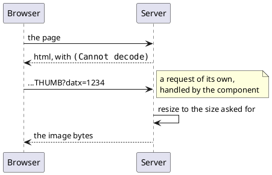

---
menu:
  sort: "60"
---
# DisplayImage

Shows a picture the application *has* - in a database, in a file, wherever - at
the size the screen wants it, without sending the original with the page.

```java
DisplayImage avatar = new DisplayImage(new Dimension(64, 64), true);
avatar.setValue(customer.getPhoto());
cp.add(avatar);
```

!demo(to.etc.domuidemo.pages.components.images.ImageUploadPage.ui, 100%, 600)

[TOC]

## Making one

| Constructor | What it gives |
| --- | --- |
| `DisplayImage()` | a 16x16 thumbnail |
| `DisplayImage(Dimension size, boolean thumbnail)` | that maximum size, and how to get there |

| Method | What it does |
| --- | --- |
| `setValue(IUIImage)` / `getValue()` | the picture; the component redraws when it changes |
| `setSize(Dimension)` | a different maximum size |
| `setThumbnail(Dimension)` | the same, and switch to thumbnailing |
| `setDisplayEmpty(boolean)` | show the theme's "no image" icon when the value is null (default: show nothing) |

The `thumbnail` flag is the difference between **cropping to a square-ish thumb**
and **scaling the whole picture down**: `true` thumbnails, `false` scales.

## It does not send the picture

The component writes an `img` tag whose `src` points **back at the component**,
and serves the picture from a second request:



That has three consequences worth knowing:

- the page stays small, however large the stored picture is;
- each size is resized **once** and then kept, so a table of a hundred rows
  showing the same picture resizes it once;
- the url carries a `datx` timestamp, regenerated whenever the component is
  built, so a changed picture is never served from the browser's cache.

!! It resizes **down**, never up. Ask for 96x96 of a 16x16 picture and you get
!! the 16x16 original - the component hands back the source untouched rather
!! than blowing it up. The aspect ratio is always kept, so a 128x123 picture
!! asked for at 96x96 comes back 96x92.

## Where the picture comes from

The value is an `IUIImage`, an interface with one real method:

```java
public interface IUIImage {
    IUIImageInstance getImage(Dimension size, boolean thumbnail) throws Exception;
    Long getId();
    void setId(Long id);
}
```

`LoadedImage` is the implementation the framework ships: a picture in a file,
which resizes with ImageMagick and remembers each size it has produced.
`LoadedImage.create(file, maxSize, null)` or `create(inputStream, maxSize, null)`
makes one - so a picture out of a database blob becomes an `IUIImage` in one
line. An application that stores its images elsewhere implements the interface
itself.

!! ImageMagick must be installed on the server: `identify` and `convert` are
!! what read the picture and resize it.

For a picture that ships **with** the application - a logo, a diagram - none of
this applies: that is an [`Img`](../img/index.md) pointing at a resource, and
the browser fetches and caches it.
