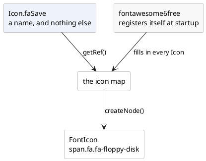

---
menu:
  sort: "10"
---
# IIconRef, Icon and Theme

An icon is referred to, not constructed. `IIconRef` is that reference, and the
two enums the framework ships - `Icon` and `Theme` - are the standard sets of
them.

```java
new DefaultButton("Save", Icon.faSave, a -> save());
```

!demo(to.etc.domuidemo.pages.components.images.IconsPage.ui, 100%, 900)

[TOC]

## The interface

```java
public interface IIconRef {
    NodeBase createNode();                     // The icon as a node, here and now
    NodeBase createNode(String cssClasses);    // ...with these classes on it
    String getClasses();                       // The classes this reference carries
    IIconRef css(String... classes);           // A new reference, with those added
}
```

`createNode()` is what a component calls when it builds itself; application code
calls it only when it wants the icon as a node of its own
(`cp.add(Icon.faHome.createNode())`).

`css()` returns a **new** reference and leaves the original alone, so the enum
constants stay what they are however often they are decorated:

```java
IIconRef warning = Icon.faExclamationTriangle.css("is-size-2", "is-warning");
```

## Where a reference comes from

| Source | What it gives |
| --- | --- |
| `Icon.<name>` | one of the generic set, drawn by whichever font pack the application includes |
| `Theme.<name>` | one of the icons the framework's own components use, from the current theme |
| `FaIcon.<name>` | any icon of the font pack itself - the full set, not just the generic one |
| `Icon.of(String path)` | a file: `.svg` becomes an [`SvgIcon`](../svgicon/index.md), `.png`/`.jpg`/`.gif` an [`ImgIcon`](../imgicon/index.md), a bare name a [`FontIcon`](../fonticon/index.md) |
| `Icon.of(char c)` | a single character, in a span of its own |

An application with icons of its own is best off putting them in **an enum that
implements `IIconRef`**, exactly as `Icon` and `Theme` do. Every icon the
application uses is then in one file, spelling mistakes do not compile, and
changing an icon everywhere is one line.

## Icon: the generic set

`Icon` names a standard set of icons, and does **not** say what draws them. It is
a map from the constant to a real reference, and a font pack fills that map in
when the application starts:



Include one of `fontawesome4`, `fontawesome5free` or `fontawesome6free` - **one**,
not several - as a dependency and there is nothing else to do: the module
registers an application initializer that adds its stylesheet to every page and
fills the map. Include none and the first icon used throws, saying so.

Because it is a map, any constant can be pointed at something else:

```java
Icon.setIcon(Icon.faSave, Icon.of("img/our-own-save.svg"));
Icon.updateIconMap(manyAtOnce);
```

The replacement need not be a font icon; an svg or an image is fine. The mapping
is global to the application, not per page.

## Theme: what the framework's own components use

`Theme` is the second set: the icons `MsgBox2`, `DataPager`, `LookupInput2` and
the rest draw themselves with. They are images from the current theme's
directory (`THEME/btnSave.png` and friends), and `Theme.update(...)` repoints one
the same way `Icon.setIcon` does.

The two sets have different jobs: **`Icon` is for your screens, `Theme` is for
the framework's components.** Restyling the framework means updating `Theme`;
picking an icon for your own button means `Icon` or the font pack's own enum.

## Adding a font pack of your own

The `fontawesome*` modules are the worked examples, and they are small:

1. an enum implementing `IFontIconRef`, one constant per icon, whose
   `getCssClassName()` is the font's css class;
2. an `IApplicationInitializer`, registered through
   `META-INF/services`, which adds the font's stylesheet as a
   [header contributor](../../../look-and-feel/header-contributors/index.md) and
   fills the `Icon` map;
3. the font and css files themselves, under `META-INF/resources` so the servlet
   container serves them.

Each module also carries `IconFromCss`, which reads a font's css file and writes
the enum - worth copying rather than typing several thousand constants.
