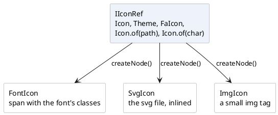

# Images, icons and file upload

Pictures, in the three roles they play in an application. An **icon** is the
small thing that marks a button or a row, and it is not a component: it is a
*reference* that components ask for a node. An **image** is a picture that is
part of the screen. And an **upload** is a file the user hands to the server -
usually, but not always, a picture.

[TOC]

## The components

Icons - one reference type, three kinds of node:

| Component | What it is for |
| --- | --- |
| [`IIconRef`, `Icon` and `Theme`](icons/index.md) | how an icon is referred to, and the two sets the framework ships |
| [`FontIcon`](fonticon/index.md) | a glyph from an icon font: text, so it takes the colour of text |
| [`SvgIcon`](svgicon/index.md) | an svg file inlined in the page, and recolourable |
| [`ImgIcon`](imgicon/index.md) | a small `img` tag, for icons that are really pictures |

...and the pictures:

| Component | What it is for |
| --- | --- |
| [`Img`](img/index.md) | the plain html image tag |
| [`DisplayImage`](displayimage/index.md) | shows a stored image, resized, without sending it with the page |
| [`ImageSelectControl`](imageselectcontrol/index.md) | the same, but the user can replace it |
| [`FileUpload2`](fileupload2/index.md) | one file, uploaded the moment it is chosen |
| [`FileUploadMultiple`](fileuploadmultiple/index.md) | the same, for any number of files |

## An icon is a reference, not a component

This is the thing to understand before anything else here. A DomUI component
lives at exactly one place in the page's node tree, so the same icon *component*
cannot mark two buttons. What components accept is therefore an
[`IIconRef`](icons/index.md) - a description of an icon, from which a node is
made whenever one is needed:

```java
IIconRef save = Icon.faSave;                       // A reference: reusable

new DefaultButton("Save", save, a -> save());      // ...used here
bar.addButton("Save this too", save, a -> save()); // ...and here
cp.add(save.createNode());                         // ...and here as a node of its own
```



Which of the three it makes is the reference's business, not yours: an
`Icon.of("x.svg")` makes an `SvgIcon`, an `Icon.of("x.png")` an `ImgIcon`, and an
entry of a font pack's enum a `FontIcon`. Code that accepts an `IIconRef` works
with all of them.

## Size and colour are css classes

`css(...)` on a reference returns a **new** reference carrying those classes, so
the same icon can be large in one place and small in another:

```java
cp.add(Icon.faTrash.css("is-size-2", "is-danger").createNode());
```

| Classes | What they do |
| --- | --- |
| `is-size-1` … `is-size-7` | the size, 1 being the largest |
| `is-size-small`, `is-size-normal`, `is-size-medium`, `is-size-large` | the same by name |
| `is-primary`, `is-link`, `is-info`, `is-success`, `is-warning`, `is-danger`, `is-white`, `is-black`, `is-light`, `is-dark` | the colour, from the theme's palette |

!! Colour works on a font icon and on a single-colour svg. It cannot work on an
!! image icon - a png is a picture, and css does not repaint it. That is the
!! practical reason to prefer a font or an svg icon for anything that has to
!! follow the theme.

!demo(to.etc.domuidemo.pages.components.images.IconsPage.ui, 100%, 900)

## A picture is not an icon

The other half of this group is about actual pictures, and the difference between
them is where the bytes are.

[`Img`](img/index.md) is the html tag: it points at a *resource* - something in
the web application, in the theme, or beside a class in a jar - and the browser
fetches it. Nothing about it is dynamic.

[`DisplayImage`](displayimage/index.md) and
[`ImageSelectControl`](imageselectcontrol/index.md) show an `IUIImage`: a picture
the application *has*, in a database or a file, at whatever size it happens to
be. They render an `img` tag pointing back at themselves and serve the picture,
resized to the size asked for, from a second request - so the page stays small
and the resizing happens once.

!! Those two need **ImageMagick** installed on the server: it is what identifies
!! an uploaded file and resizes it. The upload components below do not - they
!! hand over the file untouched.
