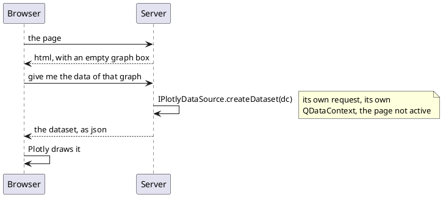

# Charts

One component draws every chart DomUI can draw: `PlotlyGraph`, a wrapper around
the [Plotly](https://plotly.com/javascript/) javascript library. What kind of
chart it is - a line, a bar chart, a pie, a sunburst, a gauge - is decided by the
**traces** in the dataset it is given, not by the component.

[TOC]

## The three pieces

| | What it is |
| --- | --- |
| [`PlotlyGraph`](plotlygraph/index.md) | the component on the page: a box that fetches its own data |
| [traces](traces/index.md) | the data: one trace per series, and its type is the chart's type |
| [layout](layout/index.md) | everything around the data: title, axes, legend, annotations, colours |

```java
PlotlyGraph.initialize(this);                    // Once per page

PlotlyGraph graph = new PlotlyGraph();
graph.setSource(dc -> {
    PlotlyDataSet ds = new PlotlyDataSet();
    PlTimeSeriesTrace sales = ds.addTimeSeries("Sales");
    // ...fill it from the database...
    ds.title("Sales over time");
    return ds;
});
cp.add(graph);
```

!demo(to.etc.domuidemo.pages.components.charts.TimeSeriesChartPage.ui, 100%, 700)

## The data comes in a second request

This is the thing to understand about the component. The page does **not** carry
the chart's data. The graph renders as an empty box, the browser then asks the
server for the dataset, and the `IPlotlyDataSource` is called *then* - in a
request of its own, with the page it belongs to no longer active:



Two consequences, and both matter:

- the datasource is handed a `QDataContext` **of its own** and must use it. It
  cannot use the page's shared context, and it must not touch the page's
  components or fields - it is not running inside the page;
- a slow query does not make the page slow to appear. The screen is there, with
  an empty box where the chart will be.

!! Because the source runs outside the page, everything it needs must be **in**
!! it. A source that reads a field of the page it was made in is a bug waiting
!! for a second user; pass values into the source object instead, the way the
!! demo's pie source takes its hole size as a constructor argument.

## Which chart to reach for

| Trace | Chart |
| --- | --- |
| `addTimeSeries(name)` | a line or scatter over time |
| `addLabeledSeries(name)` | a bar chart or a scatter over named categories |
| `addPie()` | a pie, or a donut when given a hole |
| `addSunburst()` | a hierarchy, as rings |
| `PlGaugeTrace` | one number, as a dial |

More than one trace in a dataset means more than one series on the same chart -
two lines, or a stacked bar chart when the dataset's `barMode` says so.
