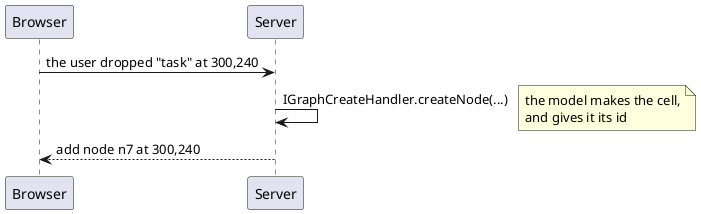

---
menu:
  sort: "30"
---
# A drawing the user changes

`setEditable(true)` lets the user move, resize, rename, bend and delete. Every
one of those goes to the server before it counts, and the page has the last word
on it:

```java
panel.setEditable(true).setModel(m_model)
    .setChangeHandler(change -> {
        if(change.getType() == GraphOpType.Remove && change.getCell() == m_hub) {
            return false;                        // The hub stays
        }
        return true;
    });
```

!demo(to.etc.domuidemo.pages.components.graph.EditableGraphPage.ui, 100%, 700)

[TOC]

## What a change is

`IGraphChangeHandler` has one method, `acceptChange(GraphChange)`, and it is
asked **before the model is touched**. Returning false refuses: the model keeps
what it had, and what it has is sent back to the browser, which puts the drawing
back to it. Without a handler every change is accepted.

| `change.getType()` | What the user did | What the change carries |
| --- | --- | --- |
| `Geometry` | moved or resized a node | `getGeometry()` |
| `Label` | renamed a cell (double click) | `getLabel()` |
| `Terminal` | dragged an edge end onto another node | `getSource()`, `getTarget()` |
| `Points` | bent an edge | `getPoints()` |
| `Remove` | deleted a cell (Delete) | nothing but the cell |

There is a `Style` change as well, carrying `getStyle()`, but the user has no way
of making one: styling a cell is the page's to do.

`getCell()` is the cell it is about, and the cell is still as it was: the change
has not been made yet. What the shape *stands for* is on the cell too - see the
user object in [the model](../model/index.md) - which is usually what a rule is
really about.

!! Deleting a node deletes the edges that hang on it, because that is what the
!! browser does with them. Those edges are one gesture with the node: they follow
!! its verdict, and the handler is **not** asked about them separately.

## Adding is a request, not a change

The browser never makes a cell. It cannot: ids are the model's, and a cell
invented in the browser would be one the server has no name for. So the browser
says what the user *did* - dropped a palette item here, drew a connection from
this node to that one - and the page answers with the cell it wants:

```java
panel.addPaletteItem(task)
    .addPaletteItem(decision)
    .setCreateHandler(new IGraphCreateHandler() {
        @Override
        public GraphNode createNode(GraphModel model, GraphPaletteItem item, double x, double y) {
            GraphNode node = item.create(model, x, y);
            node.setUserObject(item.getKey());
            return node;
        }

        @Override
        public GraphEdge createEdge(GraphModel model, GraphNode source, GraphNode target) {
            if("done".equals(source.getUserObject())) {
                return null;                     // Nothing leads out of a Done
            }
            return model.addEdge(source, target);
        }
    });
```

What the handler makes arrives in the browser as an ordinary change, with the id
the model gave it - one round trip, and no name that has to be corrected
afterwards.

**Returning null is how a drawing says what may not be drawn in it.** There is
nothing to take back, because nothing was made.



A `GraphPaletteItem` is what the user drags: a key, a label, a size and a style.
Only its look goes to the browser, and `item.create(model, x, y)` is the
one-liner a handler usually answers with.

!! Connections can only be drawn where the panel has a create handler. The dot
!! that starts one sits in the middle of a node - exactly where dragging the node
!! would otherwise move it - so a drawing that cannot gain edges does not lose
!! that.

!demo(to.etc.domuidemo.pages.components.graph.GraphEditorPage.ui, 100%, 860)

## Undo is the model's

```java
m_model.setUndoEnabled(true);                    // Off until it is asked for

bb.addButton("Undo", () -> m_model.undo());
bb.addButton("Redo", () -> m_model.redo());
```

The browser keeps no history of its own, and could not: the node the user
deleted still exists here, with its id and the page's own data on it, while over
there nothing is left to put back. So ctrl-Z and ctrl-Y in the drawing only say
that the key was pressed, and what comes back is an ordinary list of changes.

| Method | What it does |
| --- | --- |
| `setUndoEnabled(boolean)` | keep a history. Off by default, so building the drawing does not fill the stack |
| `undo()` / `redo()` | one step back or forward; false when there is nothing left |
| `canUndo()` / `canRedo()` | whether a button should be enabled |
| `edit(Runnable)` | everything done inside it is **one** step |
| `setUndoLimit(int)` | how many steps are kept; 50 by default |
| `clearHistory()` | start again - what loading another drawing calls |

**One gesture is one step**, and a gesture is often several changes: deleting a
node deletes its edges with it, and undoing that brings the node and its edges
back together. Everything one round trip does is one step, `model.edit()` groups
what the page does itself, and a change the handler refused never enters the
history at all - nothing was done, so there is nothing to take back.
