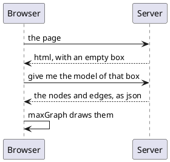

# Diagrams

One component draws diagrams: `MaxGraphPanel`, a wrapper around the
[maxGraph](https://github.com/maxGraph/maxGraph) javascript library. What it draws
is not html and not a picture but a **model**, built in Java: nodes, edges, and
what they look like.

```java
MaxGraphPanel.initialize(this);                  // Once per page

GraphModel model = new GraphModel();
GraphNode order = model.addNode("Order arrives", 60, 20, 160, 40)
    .styled(s -> s.shape(GraphShape.Ellipse).fillColor("#d5e8d4").strokeColor("#82b366"));
GraphNode stock = model.addNode("In stock?", 60, 110, 160, 60)
    .styled(s -> s.shape(GraphShape.Rhombus).fillColor("#ffe6cc").strokeColor("#d79b00"));
model.addEdge(order, stock);

MaxGraphPanel panel = new MaxGraphPanel();
cp.add(panel);
panel.size("100%", "420px").setModel(model);
```

!demo(to.etc.domuidemo.pages.components.graph.BasicGraphPage.ui, 100%, 600)

[TOC]

## The five pieces

| | What it is |
| --- | --- |
| [`MaxGraphPanel`](maxgraphpanel/index.md) | the component on the page: a box maxGraph draws in |
| [the model](model/index.md) | the drawing: `GraphModel`, its nodes and edges, and their style |
| [editing](editing/index.md) | letting the user change the drawing, and deciding what is allowed |
| [arranging](arranging/index.md) | laying the drawing out instead of placing everything by hand |
| [pictures](pictures/index.md) | the drawing as an svg or a png file |

## The drawing is not in the page

The page's html contains an empty `div` and nothing else. The browser asks the
server for the model once it has that div, and maxGraph builds the drawing from
what comes back:



Changing the model afterwards does not draw it again. The panel listens to the
model, and what changed during a request is sent at the end of it as a **list of
changes** which the browser applies to the drawing it already has - so the nodes
nothing happened to are not even repainted.

```java
node.setLabel("Renamed");                        // That is the whole of it
node.at(300, 40);
```

!demo(to.etc.domuidemo.pages.components.graph.ChangingGraphPage.ui, 100%, 700)

## Two rules that follow from it

- **The model is a field of the page; the panel is not.** The drawing is state
  and has to survive a rebuild; the panel is a component, and components are
  local variables of `createContent()` like every other component in DomUI.
- **The drawing must be rebuildable from the model at any time.** A
  `forceRebuild()` of the panel or of anything above it throws the browser-side
  drawing away, and the next render starts the whole exchange above again. It
  costs nothing, because the model holds everything the drawing is.
