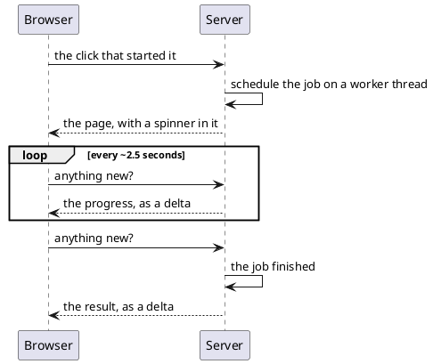

# Asynchronous and long-running work

Three components for the same problem in two shapes: **work that takes longer
than a request should**, and **a screen that has to change without the user doing
anything**.

[TOC]

## The components

| Component | For |
| --- | --- |
| [`AsyncContainer`](asynccontainer/index.md) | a long job, on a thread of its own, with a progress report and a cancel button |
| [`AsyncDiv`](asyncdiv/index.md) | the same job, where the component - not the job - builds the result |
| [`PollingDiv`](pollingdiv/index.md) | a piece of the screen that refreshes itself while the user watches |

## All three rest on the same poll

A DomUI page only changes when a request arrives. So a screen that has to change
by itself needs a request to arrive by itself, and that is what the framework's
poll is: while there is anything on the page that needs it, the browser asks the
server every couple of seconds - two and a half by default - whether anything
changed, and whatever changed comes back as an ordinary delta.



!! Polling can be switched off with the `domui.polling` developer option. With it
!! off, an `AsyncContainer` throws when it is created rather than hanging, which
!! is the message to read when a long job stops working on a development machine.

## The rule the two async components share

The job runs on a **different thread**, and while it runs the page it was started
from is not active at all. So it may not touch that page:

- not its components, and not its fields;
- not the page's shared `QDataContext` - a job that needs the database makes one
  of its own with `QContextManager.createUnmanagedContext()`, and closes it;
- what it produces goes into the job object itself, on synchronised fields, and
  is read out when it is done - in a request where the page is alive again.

The `Progress` it is handed is the exception: reporting into it is how the
spinner gets its percentage, and asking it is how the job learns it was
cancelled.

```java
public void run(Progress p) throws Exception {
    p.setTotalWork(rows.size());
    for(int i = 0; i < rows.size(); i++) {
        if(p.isCancelled())                 // Cancelling only works if the job checks
            return;
        process(rows.get(i));
        p.setCompleted(i, "row " + i);      // The text appears next to the percentage
    }
}
```

## Carrying context into the worker

A worker thread has none of the request's context - no logged-in user, no
locale, no transaction. An application that needs some of it registers an
`IAsyncListener` on its `DomApplication`:

```java
addAsyncListener(new IAsyncListener<MyContext>() {
    @Override public MyContext onActivityScheduled(IAsyncRunnable r) { return capture(); }
    @Override public void onActivityStart(IAsyncRunnable r, MyContext c) { install(c); }
    @Override public void onActivityEnd(IAsyncRunnable r, MyContext c) { clear(); }
});
```

`onActivityScheduled` runs on the request thread and collects whatever is needed;
`onActivityStart` and `onActivityEnd` run on the worker thread, around the job,
and put it in place and take it away again.
