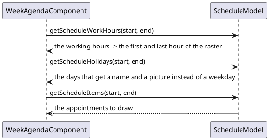

# Agenda and calendar

Two components that show time instead of data: a **week of appointments** on a
raster of half hours, and a **month as a small calendar** to pick a day from.

[TOC]

## The components

| Component | For |
| --- | --- |
| [`WeekAgendaComponent`](weekagenda/index.md) | a day, a work week or a full week of appointments, drawn on a time raster |
| [`MonthPanel`](monthpanel/index.md) | one month as a calendar; the days can be clicked and marked |

They are independent of each other: a screen that needs both puts a `MonthPanel`
next to the agenda and moves the agenda in its day click handler, which is what
most calendar applications look like.

## Where the appointments come from

The agenda does not hold appointments; it asks a **`ScheduleModel`** for them,
for the period it is showing:

The model also **tells the component when it changes**: adding an appointment to
the model makes it appear on the screen, without the page being rebuilt.

| Interface | What it is |
| --- | --- |
| `ScheduleModel<T>` | what the agenda asks; hands out work hours, holidays and items, and accepts listeners |
| `ScheduleItem` | one appointment: an id, a start, an end, a name, details, a type and an image |
| `ScheduleWorkHour` | a stretch of working time on one day; the raster is drawn around these |
| `ScheduleHoliday` | a day with a name and an image, drawn in the day header |

`BasicScheduleModel<T>` implements the model on a `List` in memory, and
`BasicScheduleItem`, `BasicScheduleWorkHour` and `BasicScheduleHoliday` are the
plain implementations of the three interfaces. An application with a database
behind it implements `ScheduleModel` itself and queries per period.

!! Everything the model is asked for is asked **per period**: when the user moves
!! to another week the component asks again, with the new dates. A model that
!! queries a database should query for exactly that period, not for everything.
