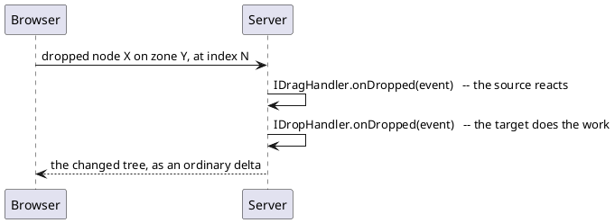

# Drag and drop

Drag and drop is not a component: it is two handlers you hang on nodes you
already have. A node with a **drag handler** can be picked up, a node with a
**drop handler** can receive one, and a type name decides which may land where.

```java
Div pet = new Div("pet");
pet.setDragHandler(dragHandler);            // This can be picked up

Div basket = new Div("basket");
basket.setDropHandler(dropHandler);         // Things can be dropped here
```

!demo(to.etc.domuidemo.pages.components.dragdrop.DragDropDivPage.ui, 100%, 700)

[TOC]

## The two handlers

`IDragHandler` says what the dragged thing **is**, and gets a chance to react
once it has landed:

```java
IDragHandler handler = new IDragHandler() {
    @Override public String getTypeName(NodeBase source) {
        return "pet";                       // What this is, for the drop zones
    }

    @Override public IDragArea getDragArea() {
        return null;                        // The node itself is the handle
    }

    @Override public void onDropped(DropEvent event) throws Exception {
        event.getDraggedNode().remove();    // Take it out of where it was, if you want that
    }
};
```

`IDropHandler` says what a zone **accepts**, and does the actual work when
something lands:

```java
IDropHandler drop = new IDropHandler() {
    @Override public String[] getAcceptableTypes() {
        return new String[]{"pet"};         // Only these types can be dropped here
    }

    @Override public void onDropped(DropEvent event) throws Exception {
        basket.add(event.getDraggedNode()); // Adding it to the new parent moves it
    }
};
```

A zone that does not accept the type of the thing being dragged does not light
up and cannot be dropped on, so the type names are the whole permission system.
Two directions need two names: in the demo above a pet in the shop is a
`shop-pet` and the basket accepts that, a pet in the basket is a `basket-pet` and
the shop accepts that, and the drop handler swaps the drag handler over as it
moves the node.

## Nothing is moved for you

The framework decides *that* a drop happened and *where*; what it means is up to
the handlers:



The drag handler runs **first**, then the drop handler. Adding the dragged node
somewhere else is what moves it - a node can only have one parent, so adding it
takes it out of the old place. A drop handler that builds something new instead
(a table row around the dragged node, say) usually pairs with a drag handler that
removes the original.

## Which nodes can do this

| Node | Can be dragged | Can be a drop zone |
| --- | --- | --- |
| `Div` | yes | yes |
| `TR` | yes | no - the `TBody` is where rows land |

Any component built on a `Div` is therefore draggable, including your own: put
the handler on the component and the whole thing moves.

## Two kinds of drop zone

A zone is in one of two modes, and the mode decides what the browser shows while
something hovers over it and what the drop handler is told.

### DIV mode: the zone as a whole

The default. The whole zone lights up while an acceptable thing hovers over it,
and the position inside the zone means nothing: the drop handler decides where
the node ends up. `setDropHandler()` alone gives you this.

### ROW mode: a position in a table

A zone is in ROW mode when it is given a `TBody` to drop into:

```java
Div zone = new Div();
Table table = new Table();
zone.add(table);
TBody body = table.getBody();

zone.setDropHandler(dropHandler);
zone.setDropBody(body, DropMode.ROW);       // Rows land in this body
```

The browser now shows an **insert marker** between the rows, following the mouse,
and the drop handler is told where it landed:

```java
@Override public void onDropped(DropEvent event) throws Exception {
    TR row = new TR();
    row.addCell().add(nameOf(event.getDraggedNode()));
    body.add(Math.min(event.getIndex(), body.getChildCount()), row);
}
```

`DropEvent.getIndex()` is the row number to insert at, `getColIndex()` the column
the mouse was over. The `TBody` must be inside the `Div` that carries the drop
handler; it does not have to be a direct child.

!demo(to.etc.domuidemo.pages.components.dragdrop.DragDropRowPage.ui, 100%, 620)

!! A row that is dragged **inside** the same table is removed by its own drag
!! handler before the drop handler runs, so the number of rows has already
!! changed by then. Clamp the index to the number of rows that are left, the way
!! the example above does.

## What the browser shows

| Css class | On what |
| --- | --- |
| `ui-drgbl` | every node with a drag handler; the theme gives it the move cursor |
| `ui-drpbl` | every node with a drop handler |
| `ui-drp-hover` | a DIV-mode zone while an acceptable thing hovers over it |
| `ui-drp-ins` | the cell of the placeholder row marking the insert position in ROW mode |

The drop zones are measured when a drag starts, so a zone that moved or changed
size since the last drag is still found correctly.
