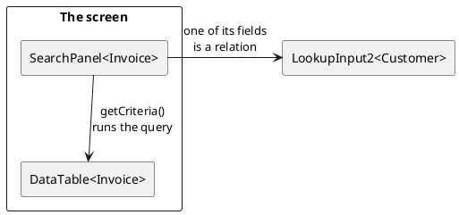

# Lookup and search

The controls in the [choice group](../20-choice-input/index.md) show every value
there is and let the user pick one. These do the opposite: the user says what
they are looking for, and the control goes and finds it. That is what a table of
twenty thousand customers needs.

[TOC]

## The components

| Component | What it is for |
| --- | --- |
| [`LookupInput2<T>`](lookupinput2/index.md) | one record as the value of a form field: type a few letters, or search in a dialog. |
| [`SearchInput2`](searchinput2/index.md) | the search box itself - what `LookupInput2` types in, usable on its own. |
| [`SearchAsYouType<T>`](searchasyoutype/index.md) | a value typed rather than picked, matched against a list held in memory. |
| [`SearchPanel<T>`](searchpanel/index.md) | a whole search *screen*: a form of search fields that produces a `QCriteria`. |

## Two different jobs

**Finding one record to put in a field** is `LookupInput2`. It is a control like
any other: it has a value, it can be mandatory, it can be bound. The customer on
an invoice, the album a track belongs to.

**Searching for the records a screen is about** is `SearchPanel`. It is not a
control and has no value: it is a form of search fields, and what it produces is
a `QCriteria` for the page to run. The list screen of invoices, the search page
of tracks.

They meet in one place: a `SearchPanel` field for a relation *is* a
`LookupInput2`, because searching for the invoices of a customer means finding
that customer first.

## What they have in common

All of them search a *table*, and none of them ask the user to know a key. Three
things follow from that, and they work the same way in each:

**Where the search fields come from.** Every one of these controls asks the
metadata of the class what may be searched on. A property is marked with
`@MetaSearch` (or `@MetaSearchItem` on the class) and gets a search type:

| Search type | Used for |
| --- | --- |
| `SEARCH_FIELD` | a field on a `SearchPanel` form - the default |
| `KEYWORD` | the quick search of a `LookupInput2` |
| `BOTH` | both of those |

**What a search value is.** A search control's value is not a value of the
property: it is what the user is allowed to *express* about it. A number search
holds `>= 5`, a date search holds a period. That is why the types turn up in the
API as `NumberLookupValue` and `DatePeriod`.

**Where the query comes from.** A control produces a value; an
`ILookupQueryBuilder` turns that value into restrictions on a `QCriteria`. The
two are separate on purpose, so either can be replaced without the other.

## Reading order

Start at [`LookupInput2`](lookupinput2/index.md): it is the control most screens
use, and the quick search rules described there are the same ones a
[`SearchPanel`](searchpanel/index.md) uses for a relation field.
