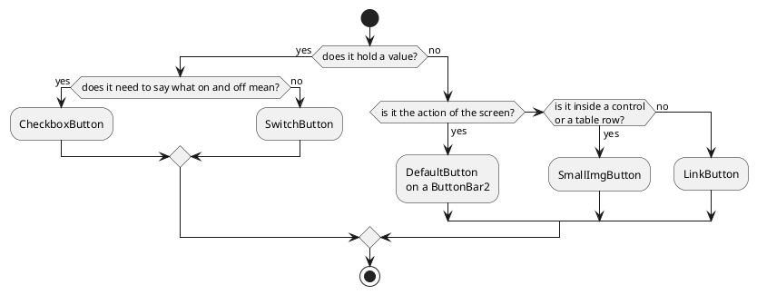

# Buttons and actions

Every button in DomUI does the same thing - it calls a handler on the server -
and they differ only in how loudly they ask to be pressed, and in whether they
carry a value.

[TOC]

## The components

| Component | What it is for |
| --- | --- |
| [`DefaultButton`](defaultbutton/index.md) | the ordinary button: a text, an icon, a click handler. |
| [`LinkButton`](linkbutton/index.md) | the same, rendered as a link. |
| [`SmallImgButton`](smallimgbutton/index.md) | a small icon-only button, for inside a control or a table row. |
| [`HoverButton`](hoverbutton/index.md) | an image button whose three states come from one image. |
| [`CheckboxButton`](checkboxbutton/index.md) | a two-sided button whose value is a `Boolean`. |
| [`SwitchButton`](switchbutton/index.md) | the same as a plain switch, without texts. |
| [`ActionButton` and `IUIAction`](actionbutton/index.md) | one description of what may be done, used by several buttons. |
| [`ButtonBar2`](buttonbar2/index.md) | the bar a screen's buttons sit on. |

## Which one to use

## What they share

**A click handler.** `setClicked(handler)`, or the handler passed to the
constructor. The handler runs on the server, in the request the click caused,
and may do anything a handler may do - change the page, open a message box,
navigate away.

**Disabled, and why.** All of them have `setDisabled(boolean)`, and the ones
that implement `IActionControl` - `DefaultButton`, `LinkButton` and
`HoverButton` - also have `setDisabledBecause(String)`, which disables the
button and makes the reason its tooltip. A disabled button sends nothing when it
is pressed.

**An icon.** Everywhere an icon is taken it is an `IIconRef`, so a font icon
(`Icon.faHeart`), an image (`Icon.of("img/save.png")`) or a themed resource
(`Theme.BTN_SAVE`) are interchangeable.

**An accelerator.** A `!` in a button's text marks the next letter as the
accelerator: `"S!ave"` renders Save with an underlined *a*, and alt-A presses
it. Write `\!` for a real exclamation mark.

## Buttons that hold a value

`CheckboxButton` and `SwitchButton` are not really buttons but controls: they
are `IControl<Boolean>`, they go in a form, and they can be bound. The plain
[`Checkbox`](../20-choice-input/checkbox/index.md) is the third member of that
family - the same value, drawn as an ordinary tick box.
