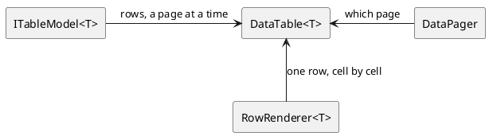

# Tables, lists and trees

Showing more than one record at a time. Everything in this group works the same
way: a **model** says what the rows are, a **renderer** says what one row looks
like, and a **component** puts them on the screen.

[TOC]

## The components

| Component | Shows |
| --- | --- |
| [`DataTable<T>`](datatable/index.md) | rows in a table, a page at a time |
| [`DataPager`](datapager/index.md) | the bar that walks a table through its pages |
| [`RowRenderer<T>`](rowrenderer/index.md) | what a row looks like: the columns and everything about them |
| [the table models](tablemodels/index.md) | where the rows come from - a query, a list, your own |
| [`ExpandingEditTable<T>`](expandingedittable/index.md) | a small table that opens one row at a time for editing |
| [`DataCellTable<T>`](datacelltable/index.md) | the same rows as a grid of cells rather than lines |
| [`ListShuttle`](listshuttle/index.md) | two lists with values moving between them |
| [`Tree3<T>`](tree3/index.md) | a tree, over a tree model |

## The three parts

None of the three knows what the others do. The model can be a database query
or a list you built; the renderer does not care which; the table asks the model
for the rows of one page and hands each of them to the renderer. That is what
lets a screen swap its query without touching its columns, and its columns
without touching its query.

The rule that follows from it is worth stating once: **every change to the data
goes through the model.** `model.add()`, `model.delete()`, `model.modified()` -
those are what tell the table which rows to redraw. A list changed behind the
model's back leaves the screen showing what was there before.

## Which one to use

| You want | Use |
| --- | --- |
| a screen full of records, paged | `DataTable` + `DataPager` |
| a handful of records, all edited together | `ExpandingEditTable` |
| items as tiles rather than lines | `DataCellTable` |
| to pick some values out of a list, in order | `ListShuttle` |
| records that contain records | `Tree3` |

## Where to start

The walkthrough page [showing rows](../../building-pages/70-showing-rows/index.md)
builds a list screen from nothing and explains the model, the renderer and the
pager as it goes. The pages here are the reference: everything a column can be
told, every model that ships, and what selection does.
