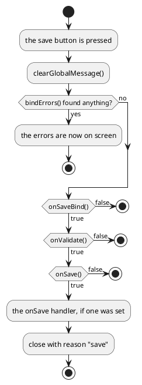

---
menu:
  sort: "20"
---
# Dialog

A [`Window`](../window/index.md) with a button bar and the handling that belongs
to a save button: check the input, move it to the model, save, close.

```java
Dialog dlg = new Dialog(true, false, 460, -1, "Order \"Big Ones\"") {
	@Override protected void createFrame() throws Exception {
		super.createFrame();
		createButtons();                          // A Dialog does not make its buttons by itself
	}

	@Override public void createContent() throws Exception {
		FormBuilder fb = new FormBuilder(this);
		fb.label("Copies").control(copies);
	}

	@Override protected boolean onValidate() throws Exception {
		Integer value = copies.getValueSafe();    // Empty: the control reports that itself
		if(null == value) {
			return false;                         // Refused: the dialog stays open
		}
		return true;
	}

	@Override protected boolean onSave() throws Exception {
		order(copies.getValue());
		return true;
	}
};
dlg.setButtonsOnBottom(true);                     // Before the bar exists, or it throws
add(dlg);
```

!demo(to.etc.domuidemo.pages.components.dialog.DialogPage.ui, 100%, 620)

[TOC]

## The buttons

`getButtonBar()` returns the bar - a [`ButtonBar2`](../../40-buttons/buttonbar2/index.md),
behind the `IButtonBar` interface - and creates it in the **top** area the first
time it is asked for. `setButtonsOnBottom(true)` puts it in the bottom area
instead, and has to be called before anything else touches the bar - afterwards
it throws `IllegalStateException`.

What is on the bar is up to the dialog:

- **`createButtons()`** makes the usual pair: a save button (labelled with the
  application's "okay" text) and a cancel button. Nothing calls it for you - the
  dialog above does it from `createFrame()`, which is where a subclass is
  expected to do it.
- **`getButtonBar().addButton(...)`** adds buttons of your own, exactly as on any
  other button bar. A dialog that never calls `createButtons()` has only these.

| Method | What it is for |
| --- | --- |
| `createButtons()` | the default pair; override to make a different set |
| `createSaveButton()` / `createSaveButton(String, IIconRef)` | the save button, with a text and icon of your own |
| `createCancelButton()` / `createCancelButton(String)` / `createCancelButton(String, IIconRef)` | the same for cancel |
| `noIcons()` / `noIcons(boolean)` | this dialog's buttons carry no icons |
| `Dialog.setAllNoIcons(boolean)` | ...the same for every dialog in the application |

The two buttons carry the test ids `saveButton` and `cancelButton`.

## What the save button does



Every step that returns `false` leaves the dialog standing, which is how it
refuses to be closed. The three that are meant to be overridden divide the work:

| Method | What belongs in it |
| --- | --- |
| `onSaveBind()` | move what the controls hold into the model |
| `onValidate()` | decide whether that model is acceptable |
| `onSave()` | do the actual saving |
| `setOnSave(IExecute)` | ...or, for a dialog you do not subclass, one handler run after all three succeeded |
| `onCloseException(Exception)` | return `true` to swallow an exception thrown while closing; the dialog stays open |

A dialog that refuses has to say why: post a message on the control
(`setMessage`), on the dialog (`addGlobalMessage`) or in a box
(`MsgBox2.on(this).error(...)`) before returning `false`. The dialog is an error
fence, so the first two are shown inside it.

## How it closed

| Reason | When |
| --- | --- |
| `Dialog.RSN_SAVE` (`"save"`) | the save button, and all four steps agreed |
| `FloatingDiv.RSN_CLOSE` (`"closed"`) | the cancel button, the close cross, or a click next to a modal dialog |

```java
dlg.setOnClose(reason -> {
	if(!Dialog.RSN_SAVE.equals(reason)) {
		//-- Cancelled.
	}
});
```

For a dialog that asks for one single value there is a subclass that writes all
of this for you: [`InputDialog`](../inputdialog/index.md).
