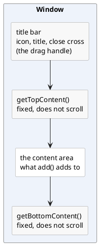

---
menu:
  sort: "10"
---
# Window

A floating window: a title bar you can drag, a content area that scrolls, and a
fixed area above and below it. It has no buttons and no logic of its own - that
is what [`Dialog`](../dialog/index.md) adds.

```java
Window w = new Window("The album");         // Modal, not resizable, as large as its content
add(w);                                     // Added to the page, not to the content panel
w.add(new Para().add("Anything added to the window lands in its content area."));
```

!demo(to.etc.domuidemo.pages.components.dialog.WindowPage.ui, 100%, 700)

[TOC]

## Making one

The constructors differ only in how much they set:

| Constructor | What it gives |
| --- | --- |
| `Window()` | a modal, non-resizable window without a title |
| `Window(String title)` | ...with a title |
| `Window(boolean resizable, String title)` | ...and a say in resizing |
| `Window(boolean modal, boolean resizable, String title)` | ...and in modality |
| `Window(int width, int height, String title)` | a modal, resizable window of that size |
| `Window(boolean modal, boolean resizable, int width, int height, String title)` | all of it |

The same things can be said after the fact, and those calls chain:
`title(String)`, `title(IBundleCode, Object...)`, `modal()`, `modal(boolean)`,
`resizable()`, `size(int, int)`, `width(int)`.

**A size is optional.** Without one the window is as wide and as high as its
content; with one it is exactly that size and the content scrolls inside it. A
height of `-1` in the five-argument constructor means "no height given". The
minimum that may be *set* is 250 wide by 100 high; anything smaller throws.

## The parts of it



`add()` on the window adds to the **content area** - the window delegates to it -
so building the inside of a window is no different from building a page.

| Method | What it does |
| --- | --- |
| `getTopContent()` / `getBottomContent()` | the two areas that stay put while the content scrolls |
| `setClosable(boolean)` | whether the title bar has a close cross (default: it has) |
| `setIcon(IIconRef)` / `getIcon()` | an icon in front of the title: a font icon, an svg or an image |
| `setIcon(String)` | the same by resource url (`THEME/...` for an image from the current theme) |
| `setWindowTitle(String)` | change the title of a window that is already up |

!! The height of a top or bottom area **must be set** before anything is put in
!! it (`getBottomContent().setHeight("40px")`). The layout of the window is
!! computed from those two heights, and without them the content area does not
!! know where it ends.

## Closing it

| Call | What happens |
| --- | --- |
| `close()` | the window disappears, and the close handler is **not** called |
| `closePressed()` | the window disappears and the close handler is called with `RSN_CLOSE` (`"closed"`) |
| the close cross | exactly `closePressed()` |
| a click next to a modal window | the same again, unless `setAutoClose(false)` |

```java
w.setOnClose(reason -> {
	//-- reason is "closed" here; a Dialog also sends "save"
});
```

So `close()` is what code uses when *it* decided the window is done, and
`closePressed()` is the user's cancel. A subclass can override
`onClosed(String reason)` instead of setting a handler.

## What it does not have

A `Window` has no buttons, does not validate anything and does not know what
saving is. When the window is a form the user must fill in and confirm, the
component to use is [`Dialog`](../dialog/index.md); for a sentence and a couple
of buttons it is [`MsgBox2`](../msgbox2/index.md).

A window *is* an error fence, so messages raised inside it are shown inside it
rather than on the page behind it.
