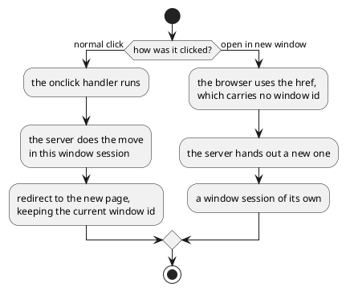

---
menu:
  sort: "50"
---
# ALink

A link to another page of the application. It is a real hyperlink *and* a click
handler, which is why the browser's own "open in a new tab" works on it while an
ordinary click stays inside the window the user is in.

```java
ALink link = new ALink(AlbumEditPage.class, new PageParameters("albumId", album.getId()));
link.setText("Edit this album");
cp.add(link);
```

!demo(to.etc.domuidemo.pages.components.navigation.ALinkPage.ui, 100%, 620)

[TOC]

## Where it goes

| Constructor | Where it points |
| --- | --- |
| `ALink(Class<? extends UrlPage>)` | that page, as a `SUB` move |
| `ALink(Class, IPageParameters)` | ...with parameters for it |
| `ALink(Class, MoveMode)` | ...and a say in what the move does |
| `ALink(Class, IPageParameters, MoveMode)` | all three |
| `ALink(String url, IPageParameters, WindowParameters)` | some other url, not a DomUI page |

`setTargetClass(Class, Object...)` and `setTargetParameters(PageParameters)`
change where an existing link points; the href is recomputed when they do.

Without a `MoveMode` the move is `SUB`: the page the user is on is shelved and
the new one is opened on top of it, so the back arrow and the breadcrumb lead
back to it. `REPLACE`, `NEW` and the rest are the same modes `UIGoto` uses, and
what each does to the page stack is described in the walkthrough under
[page navigation](../../../building-pages/60-page-navigation/index.md).

## Why it is a link and not a button

An `ALink` renders an `a` tag with **both** an `href` and an onclick handler:



That is the whole point of the component. The page stack, the conversations and
the state of a window session belong to one browser window, and a link opened in
a second window must not join the first one's session. A plain
[button](../../40-buttons/defaultbutton/index.md) calling `UIGoto` cannot be
opened in a new window at all.

## A window of its own, on purpose

```java
link.setNewWindowParameters(WindowParameters.createFixed(500, 400, "detail"));
```

With window parameters set, clicking the link opens a browser window of that size
and starts a new window session in it - what the right-click route does by
accident, done deliberately. `WindowParameters` also says whether the window is
resizable and which of the browser's own bars it shows.

## What it looks like

| Method | What it does |
| --- | --- |
| `setText(String)` | the text of the link |
| `add(NodeBase)` | ...or build its content, an icon in front of the text for instance |
| `setImage(String url)` / `setImage(Class, String name)` | a background image of at most 16x16 in front of the text |

The link is written under `.ui-alnk`, and `.ui-alnk-i` when it has an image.

## The plain tag

`ATag` is the html anchor `ALink` is built on, and is the right component when
the target is not a page of this application:

```java
ATag external = new ATag();
external.setHref("https://www.domui.org/");
external.setTarget("_blank");
external.add("The DomUI site");
```

Give an `ATag` a `setClicked()` handler instead and it is a button that looks
like a link - though for that, a
[`LinkButton`](../../40-buttons/linkbutton/index.md) says what it is.
