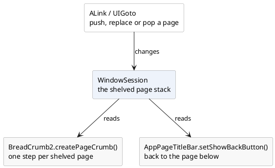

# Navigation and menus

Getting somewhere else, and choosing what to do. The components in this group are
the visible handles on two things the framework does underneath: the **page
stack**, which remembers where the user came from, and the **action**, which
knows its own name, icon and whether it may be done at all.

[TOC]

## The components

Where you are, and how you get somewhere else:

| Component | What it is for |
| --- | --- |
| [`BreadCrumb2`](breadcrumb2/index.md) | the path that led here, as steps you can click |
| [`AppPageTitleBar`](apppagetitlebar/index.md) | the bar at the top of a page: icon, title, back button, buttons |
| [`ALink`](alink/index.md) | a link to another page of the application |

...and the two menus:

| Component | What it is for |
| --- | --- |
| [`PopupMenu2`](popupmenu2/index.md) | a small menu that opens at a component and closes when it is done |
| [`HamburgerMenu`](hamburgermenu/index.md) | the list of actions behind a three-bar button |

## Moving is not this group's job

None of these decides what a move *does*. Whether the page you leave is shelved,
replaced or thrown away is the `MoveMode` of the move, and what happens to the
page object, its fields and its conversation is described once, in the
walkthrough under
[page navigation](../../building-pages/60-page-navigation/index.md).

An `ALink` and a `UIGoto` make the same move; the link is the one you can click,
right-click and open in a new window. A `BreadCrumb2` made with
`createPageCrumb()` is that same page stack, drawn.

## A menu is made of actions

Both menus take their entries from
[`IUIAction`](../40-buttons/actionbutton/index.md): the name, the tooltip, the
icon and the reason the entry cannot be used right now all come from the action
rather than from the menu. That is why the same operation can sit on a button, in
a popup menu and behind a hamburger without being described three times.

`PopupMenu2` can also be filled by hand, item by item, when there is nothing to
reuse. `HamburgerMenu` cannot: it is a list of actions and nothing else.

!! Neither menu is a component you keep. Both are built when the button is
!! pressed, put on the page, and removed again the moment something is chosen or
!! the mouse goes elsewhere. Do not hold on to one, and do not put one in a
!! field.
