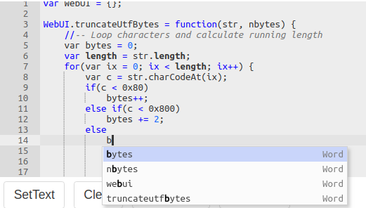

---
menu:
  sort: "70"
---
# The AceEditor component

The AceEditor component wraps the Ace code editor. The component looks like this (using the default monokai theme):


The editor implements IControl<String>, and the value of the editor is the code to be edited.

<a id="using-the-editor"></a>

## Using the editor

A typical piece of code to create the editor looks like this:

```
AceEditor editor = new AceEditor();
editor.setMode("ace/mode/pgsql");
editor.setTheme("ace/theme/iplastic");
editor.setHeight("200x");
editor.setWidth("600px");
```

!w Do not forget to set a width and a height for the editor. Without those it might not show.

The editor then looks like this (live demo):

<a id="manipulating-the-editor"></a>

### Manipulating the editor

The editor implements IControl, so it has the usual assortment of methods and bindings for enable/disable, readonly etc.

In addition the following methods are implemented:

| Method | Description |
| --- | --- |
| setTabSize(int) | Sets the tab size (defaults to 4) |
| gotoLine(int \[, col\]) | Moves the caret to the specified 1-based line and column |
| select(line1, col1, line2, col2) | Select the text from line1,col1 to line2,col2 |
|     |     |

<a id="code-completion"></a>

### Code completion

The editor supports code completion. To make this work you need to create a method which, depending on the text position and context, returns a list of AceEditor.Completion instances. The method will be called when the user presses CTRL+Spacebar in the editor, and the editor will allow the user to pick one of the values which will then be inserted.

An example code completion method:

```
private List<Completion> completeCode(String text, int row, int col, String prefix) {
   String[] split = text.split("\\W+");            // All words in the document
   Set<String> set = Arrays.asList(split)
      .stream()
      .map(a -> a.toLowerCase())
      .collect(Collectors.toSet());

   //-- Now find all words starting with prefix
   return set.stream()
      .filter(a -> a.toLowerCase().contains(prefix))
      .map(a -> new Completion(a, a, "Word", 10))
      .collect(Collectors.toList())
      ;
}
```

This method takes the current content of the editor (text) and splits it into words. It then lowercases them and removes duplicates by making a Set. And finally it takes from that Set all words that contain the prefix, which is the set of letters before the cursor in the editor at the time that the ctrl+space was pressed. This results in the following:



The prefix is calculated by the Ace editor itself. It contains only characters and letters. This makes it impossible to complete a "dotted identifier" like "day.number". To do this you need to decode the identifier to complete yourself. You can do that by calling getDottedPrefix() on the editor, passing in the position and a method which returns true for all characters you consider valid in the prefix.

<a id="markers"></a>

### Markers

You can use editor markers to highlight problems inside the editor. Press the "mark vars" button and the clear markers buttons to see, and look in the source code of that page how to use them.

<a id="internals"></a>

## Internals

The editor loads the Ace editor's javascript from a CDN ([https://cdnjs.cloudflare.com/ajax/libs/ace/](https://cdnjs.cloudflare.com/ajax/libs/ace/){version}/xxx). This allows easy caching and deployment. To add the required parts as HeaderContributors to a page there are two methods:

- If the editor is used on a page immediately then the editor itself registers the header contributors.
- If it is dynamically added to a page you need to call AceEditor.initialize(UrlPage) to get the contributors to register in your main page's createContent.

The Ace editor requires a size to be set using setWidth(String) and setHeight(String), or the thing does not really show.

The setTheme(String) method can be used to set/change the editor's theme, like: editor.setTheme("/ace/theme/monokai");

The setMode(String) method can be called to set the editor's mode (which language is being edited), like: editor.setMode("/ace/mode/javascript");
