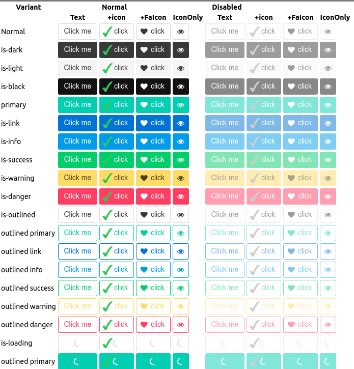

---
menu:
  sort: "30"
---
# The DefaultButton component

The DefaultButton component is your basic button. It can have a text and an icon, and both are optional (although having one or the other is important).

<a id="creating-buttons"></a>

## Creating buttons

A button can be created as follows:

```
add(new DefaultButton("Click me", FaIcon.faHeart, b -> MsgBox.info(this, "Hi, I was clicked!")));
```

<a id="rendering-and-styles"></a>

## Rendering and styles

The DefaultButton component renders the following structure when both text and icon are present:

```
<button class="ui-button" type="button>
  <span class="ui-icon">
    <span class="fa fa-heart />
  </span>
  <span class="ui-btntext">Click me</span>
</button>
```

The button class' rendering was modeled after Bulma's buttons, and the code and styling of the scss steals a lot from there:



<a id="style-sheets-and-remarks"></a>

### Style sheets and remarks

The styles for the buttons have been stolen from Bulma, mostly. But some fixes were done with mixed results:

- The is-{color} set of buttons had the following changes:
  - The color of the buttons when hovering for dark buttons was not visible. Root cause was that the hover color was set using "darken", but it's damn difficult to darken black, really. I added a new method "findColorHighlight" which uses the luminance of the color: if the luminance is > .3 then we darken, otherwise we lighten. I also increased percentages a bit.
  - Focus was impossible to see on the darker buttons, because it was done by a whitish shadow. This does not work that well on a white background. I added a method findButtonFocusBorderColor which tries to calculate a border color for the button from its main background color by changing the hue 180 degrees and playing with luminance.
