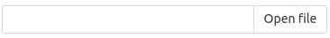
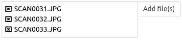

---
menu:
  sort: "60"
---
# FileUpload components

DomUI has several components that allow file uploads. The current versions are:

- FileUpload: the initial, now deprecated version (moved to legacy package)
- FileUpload2: allows uploading of a *single* file of a given type(s).
- FileUploadMultiple: allows uploading multiple files of the given type(s).

The main difference between FileUpload2 and FileUpload can be seen from how their getValue() call is defined:

- public UploadItem getValue() for FileUpload2 because this allows only a single file to be uploaded
- public List<UploadItem> getValue() for FileUploadMultiple because this allows 0..n files to be uploaded.

## The FileUpload2 component

The FileUpload2 component looks more or less as follows:

By clicking the "open file" button you can pick a single file which then gets uploaded to the server (the upload takes place immediately). During the upload the control shows a progress bar. Once the upload has completed the control looks something like this:

The file name that was picked is shown inside the box, and the button changes to a "clear" button with which you can again clear the file to load another one.

## The FileUploadMultiple component

The FileUploadMultiple component looks like this when empty:

It is very similar to the first one, only the button text hints that multiple files are allowed. You can pick the multiple files as is usual for your browser, usually just clicking the button and then selecting one or more files by keeping the CTRL key pressed while clicking the files. Once you selected a few the control shows like this:

Each selected file is shown on a single line, and is preceded by a small cross which is a button; pressing that button will remove that file from the input. You can easily keep adding files by just pressing the "add files" button again and selecting more files. A few things should be noted though:

- If you again add a file that is already present in the control you will actually get two copies of the same file there. The control cannot really know from the filename only that the files are the same.

## Common settings for the FileUpload components

All components allow the following:

- restricting the file types that can be selected by specifying either their file extensions (like "png", "jpg") or the acceptable mime types ("image/jpeg").
- restricting the maximal size of the thingy that can be uploaded. This size check gets executed at the browser end if supported by the browser.

## Using uploaded files

An uploaded file is represented by an UploadFile instance. Each uploaded file gets its own instance. The UploadFile data class holds:

- The remote file name of the file, as it was selected from the remote machine. This is a file name only, it has no path.
- The MIME content type of the file as specified by the browser.
- The size, in bytes, of the uploaded file
- A tempfile that contains the data from the upload.

!w The temp file is only valid while the page is still active/live! As soon as the page gets destroyed it will also delete all temp files that were allocated for the page. If you want to keep the data in the tempfile you must either copy or rename it.

## Upload events

The file upload component always uploads the file(s) as soon as they are selected. It does not wait for any "save" button or whatnot. One advantage of this is that the onValueChanged event for a FileUpload component fires as soon as those uploads complete, and this can be used to play with the file as soon as it is uploaded. Things you can do for instance:

- Load the file as an image, resize it using the ImageCache toolset, then replace the FileUpload control with the uploaded and rescaled image.
- Check whether the data format of the file is acceptable and if not show an error and clear the FileUpload component again.

## Layout notes

The current layout uses too many classes in my op.

The layout was [tested with this fiddle](https://jsfiddle.net/fjalvingh/b726k7Lb/).
