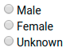
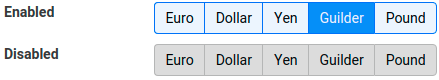

---
menu:
  sort: "50"
---
# RadioButton and RadioGroup

A radio button represents the input type='radio' control. This control represents a single choice in a list of choices, where each choice excludes the others: in a set of radio buttons only one of the buttons can be selected. Radio buttons that belong together are part of a *group*, and only one button in the group can be selected at any time.

<a id="domuis-radiobuttont"></a>

## DomUI's RadioButton<T>

In DomUI the Radio button is implemented by RadioButton<T>. A RadioButton actually has a *value*, and the type of that value is represented by that T. A typical value type for a button is an enum or Boolean.

To group RadioButtons together we need a RadioGroup<T>; RadioButtons that belong to a group will set their value as the group's value when the button is selected.

For example:

```
RadioGroup<Gender> g = new RadioGroup<Gender>();
add(g);
RadioButton<Gender> a = new RadioButton<>(g, Gender.MALE);
g.add(a);
g.add("Male");
g.add(new BR());

RadioButton<Gender> b = new RadioButton<>(g, Gender.FEMALE);
g.add(b);
g.add("Female");
g.add(new BR());

RadioButton<Gender> c = new RadioButton<>(g, Gender.UNKNOWN);
g.add(c);
g.add("Unknown");
g.add(new BR());
```

In this example, when the radiobutton for "Female" has been selected the g.getValue() would return Gender.FEMALE.

The above example builds a radio button group the hard way. A better way is to use the special add method inside RadioGroup:

```
RadioGroup<Gender> g = new RadioGroup<Gender>();
add(g);
g.addButton("Male", Gender.MALE);
g.addButton("Female", Gender.FEMALE);
g.addButton("Unknown", Gender.UNKNOWN);
```

This has the same effect as above in less lines.

To use the value selected by the radio buttons you can use the group only. The individual buttons will always return their own value when you ask them for it. The RadioGroup acts as the real IControl for the buttons, and it has the usual set of disabled, readonly and binding methods.

!w While it is technically possible to use a radio group without it being added to the page this does mean that data binding does not work on it!

The RadioButton class has some static methods that lets you quickly create a set of radio buttons to select the values from an enum, for instance. As usual the enum labels come from metadata if that is available. So the above UI could also have been created using:

```
RadioGroup<TestEnum> rg = RadioGroup.createFromEnum(Gender.class);
add(rg);
```

<a id="button-look"></a>

## Button look

The default look for a RadioGroup is just as expected:



You can change the look to a button-selection horizontal layout by adding the css class "ui-rbb-buttoned" to the RadioGroup:

```
RadioGroup<TestEnum> rg = RadioGroup.createFromEnum(TestEnum.class);
rg.addCssClass("ui-rbb-buttons");
```

This creates an UI that looks like:


