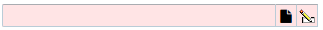

---
menu:
  sort: "20"
---
# Text2 layout and behavior details

The new Text2<T> component replaces the Text<T> component. All DomUI components that before used/created Text<T> components now use Text2<> instead.

The Text2<> component has mostly the same Java interface as the Text<> component, with the following exceptions:

- TBD

The biggest difference is in the rendering of the component. The Text component itself *was* an input tag, so it always rendered as an <input> tag. This caused several issues.

The new Text2 component renders as the following structure:

```
<div id="_H1" testid="t23" title="TestID: t23" class="ui-txt2 ui-input-err">
    <table id="_K3" class="ui-txt2-tbl">
        <tbody id="_L3">
        <tr id="_M3">
            <td id="_N3" class="ui-txt2-in"><input id="_O3" name="_O3" type="text" size="40" value=""></td>
            <td id="_P3" class="ui-txt2-btn">
                <button id="_Q3" class="ui-sib" onclick="return WebUI.clicked(this, '_Q3', event)" type="button"><span id="_T3" class="ui-sib-icon fa fa-file"></span></button>
            </td>
            <td id="_R3" class="ui-txt2-btn">
                <button id="_S3" class="ui-sib" onclick="return WebUI.clicked(this, '_S3', event)" type="button">
                </button>
            </td>
        </tr>
        </tbody>
    </table>
</div>
```

This example shows as follows on the page (in error state, as in the example):



The component is wrapped inside a div with inline-block, this div contains a table with one cell for the input, and optionally other cells that can contain buttons.
