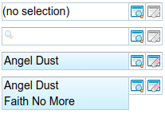
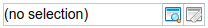
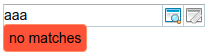
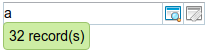
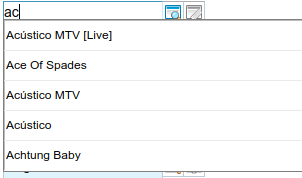
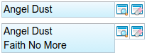

---
menu:
  sort: "20"
---
# LookupInput/LookupInput2 behavior and layout rules

The definitions in this article apply to both controls. When behavior/display differs it will be marked.

The LookupInput(2) control is one of the most complex controls in DomUI. It allows selection of some data record either by doing a "quicksearch" or by opening a full lookup form to find the record. For example, when adding an "order" this control would be used to find the customer that the order is added for by allowing the user to search the "customers" table and to select one of those.

This control is highly configurable and has several display states. Some examples:

All of these are LookupInput controls in different states.

The control has three main modes of operation:

- Normal mode: the user *must* use the "lookup" button at the end of the control, which opens a lookup popup where the user can search for the desired value.
- QuickSearch mode: the control shows an input field where the user can start typing a part of the name of the thing sought. The control will then show a list of matched records from where the user can pick the desired value.
- Value mode: in this mode a value has been selected and is shown in the control's area.

Whether a control is in "normal" or "quicksearch" mode depends on the configuration of the control; to be able to do quicksearch the control must "know" which fields of the entity must be used to search on. If no such fields are defined/known the control works in "normal" mode.

## Behavior and display in "normal" mode

In normal mode the control looks as follows:

The "no selection" text is fixed and the box is not an input box. FIXME: this should be visible in another way, because this looks like an input.

To select a value the user clicks the lookup button which opens the lookup dialog. If a value is selected there the control changes to "value" state.

In this mode the "clear" button is disabled as the value's already empty.

Requirements:

- The baseline of the text inside the box **must** align with any baseline of a label before it ([see the form4 layout description](../../rules/vertical-form-builder-details/index.md) for details).

## Behavior and display in "quick search" mode

In this mode the control looks like this:

In this case the box is an input box, and the user can start typing a search term there. What field(s) are being used to find the record is defined by the quicksearch parameters of the control. The control starts to do a search as soon as one or more letters are being typed and there is a small pause in input (or 250 ms have passed and no search has been done yet). If the user continues to type the control will do multiple searches so that the result will most closely represent whatever is typed by the user.

In this state the "clear" button is disabled, even when there is some "partial result" substate (see below).

Depending on the result of the search we have the following "substates" for the control:

### No results display

If the text entered so far results in zero results then the control will show that as follows:

The "no matches" label acts as a small popup: it floats over the screen and obscures (part of) what is under it. Because it is a popup this means that the layout of the screen does not change when the popup shows (requirement).

To get rid of the no results all the user has to do is to change the typed text in such a way that either the control is empty or there are results.

:star:

 The LookupInput control makes this label stay if focus moves away from the control. This is fixed in LookupInput2, there the label disappears when the control loses focus.

### Too many results display

If the text typed results in too many results to show we have a variant of the above:

This presentation follows the same rules as the "no results" display.

### Actual results popup

When the search results in between 2 and 10 records then these records are shown in a pick list where one of them can be selected either by using the mouse or by using the arrow keys and the enter key. This looks as follows:

The list of values to pick from overlays the rest of the screen and does not cause a relayout of the underlying screen (requirement).

In this mode the following should work:

- Use up/down cursor keys followed by enter: move a cursor (colored bar) over the selections, and with enter pick the current one. When the cursor reaches a boundary it moves to the opposite boundary.
- Clicking an entry with the mouse must select the entry.
- Pressing escape must remove the popup and leave the input text.
- Continuing to type should just add the characters to the input box, and should cause another search after a few milliseconds further limiting the result.

In all of the above cases where a selection is being made the display moves to "Value State".

### Exactly one match result

If typing leads to exactly one match then that match is immediately selected as soon as the search returns, and the display changes to "Value State".

## Common rules for all of the "input" formats

Both input formats should have exactly the same horizontal and vertical size.

The baselines of any texts inside either input or "no selection" value **must** match the baseline of any label before it inside a form.

## Value Display state

When the control is "filled in" it shows the selected value. The display of that selected value can vary greatly as it can be heavily customized by using a custom renderer. But the default formats (and usually the custom renderers) should obey the rules described here.

Two examples of a filled in control:

The default renderers use one or more lines to show the selected value, depending on how they are configured. By default each value column is shown on a separate line but this can be changed so that columns are joined in one line.

How the value is to be presented depends on how many lines it has, but both representations must take care not to show as an "input" control. In the above example this is done by giving them a background gradient. FIXME: what to do for colorblindness?

In this state both the lookup and the clear buttons are enabled. Pressing the "clear" button will remove the selected value and move back to either "normal" or "quicksearch" state. Pressing the lookup button will show the lookup dialog with empty search fields. If the user selects a new value there then the value will be overwritten and the control remains in "Value Display" state. If no value is selected the old value remains.

### One-line values

A one line value must show at the same size as the input box, and the tops and bottoms of the box around the value **must** align with the top and bottom of the button boxes so that top and bottom of the whole control form one continued line. A one line value *should not* show anything else than that value, and value should be self-evident from the label before/above the control.

### Multiline values

For a multiline value the value box should extend downwards *without* extending the apparent boxes around the buttons behind the control (as can be seen in the 2nd example above).

Each line *should* have some indication of what the line's text represents (either a label or an icon), unless the text is self-evident from the context.
