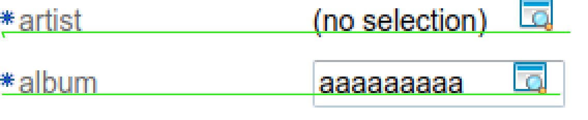

---
menu:
  sort: "10"
---
# Vertical form builder details

A vertical form is built using a table. The table has class ui-f4 and ui-f4-v, the latter indicates that the form is a vertical form.

Each row is a single label/control pair (unless the format is manually altered).

In most cases the label is some kind of text, and the control contains something like an input, select or display text. To look correct it is of big importance that the *baselines* of the labels and the texts inside the controls match up, like this:



As can be seen the texts align on the baseline, and that is important. We can also see that the icons are incorrectly aligned - that is a bug that we'll fix later.

Aligning the stuff like this is decidedly non-trivial, so let's explain how it's done currently.

<a id="addressing-things-inside-the-form"></a>

## Addressing things inside the form

All parts of the form have separate classes. The td that contains a label has the classes:

- ui-f4-lbl: intended for things shared between horizontal and vertical forms
- ui-f4-lbl-v: specifies that the label is for a vertical form.

The td that contains a control (or a value) has the classes:

- ui-f4-ctl: shared between vertical and horizontal forms
- ui-f4-ctl-v: for vertical input specifically.

<a id="vertical-baseline-alignment-between-label-and-control"></a>

## Vertical (baseline) alignment between label and control

While the label is typically small the area for the control can vary greatly in size: from a simple input to a textarea. For all of these we want to align the baselines - if at all possible.

In the above picture we have two labels but two completely different parts in the control area:

- A value string span from the LookupInput (the 'no selection' text)
- An input type='text'

To have these share the baseline the following was done...

The baseline itself is mostly determined by the **line-height property**. So all data in both cells must share the same line-height. This line-height needs to be a bit bigger than normal to allow input to be rendered correctly. This ONLY applies to things inside a form, so we do not add it to the generic html tags but to things inside the form, and the variable $form-line-height is used to define the size, and to serve as an indication that this value is shared between things.

We also need to take special care of input line components: these have a border which takes space around the component. Using an outline would be easier because that goes *outside* the bounding-box, but of course that was way too useful so the outline cannot do most of what is border is capable of, so it's unusable.

Being stuck with a border on input and textarea means the following:

- We need to add padding-top: 1px to the label area, so that it skips the part used by the input border
- Any thingy rendered inside the control area that has *no* border needs to have padding applied so that its text aligns.

The label inside the label td also needs some TLC: label is an inline component so it cannot be padded. To fix this we do the following:

```
.ui-f4-lbl-v label {
   display: block;                   // Chrome aligns the label on the td baseline without this, causing 1px diff
   vertical-align: bottom;
   line-height: $form-line-height;       // Important: this defines where the baseline is! Mirror the same setting on input.
   padding-top: 1px;              // Inputs have 1px border; mirror that here so that the tops align
}
```

The styles for controls include the following:

```
.ui-f4-ctl-v input {
   line-height: $form-line-height;
}
```

This ensures that input shares the same line-height inside forms.

<a id="vertical-alignment-of-the-left-side-of-controls"></a>

## Vertical alignment of the left side of controls

To align the left sides of controls we assign a minimum-width to all label tds with ui-f4-lbl-v of 150px. As long as the label is not growing larger all controls will then start at the same location.

This does require that controls have no left padding or margin(!).\\

<a id="links"></a>

### Links

The following was used to help:

- [https://stackoverflow.com/questions/3098831/aligning-the-baseline-of-field-labels-with-the-baseline-of-text-in-text-inputs](https://stackoverflow.com/questions/3098831/aligning-the-baseline-of-field-labels-with-the-baseline-of-text-in-text-inputs)
