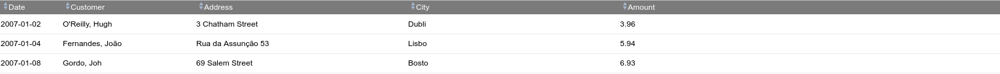

---
menu:
  sort: "10"
---
# The DataTable component

The DataTable<T> component renders a tabular data source like a List<T> or a QCriteria query as a table on the screen. The DataTable is one of the most complex components in the framework. An example of the DataTable in use:

TBD

<a id="the-rowrenderer"></a>

## The RowRenderer

Actual rows are rendered by a RowRenderer<T>. This is not a component but a helper which creates the presentation of each row when asked by the DataTable.

The RowRenderer can create one or more TR's per data item if so desired, but defaults to one TR per item.

<a id="column-widths"></a>

### Column widths

Each column in the RowRenderer can be assigned a width in one of two ways:

- Using width(String) to set a css width spec, like *width("15%")*
- Using width(int) to set a width in characters, like width(32)

By default the RowRenderer will use the widths set in characters as these are actually initially set from metadata if not specified. But if one or more rows use width(String) then *all rows should use it*, and only these will be used to specify the widths.

<a id="using-character-widths-only"></a>

### Using character widths only

The character widths are initialized from metadata. If the metadata knows some display length for the property then this gets used as the default. If no metadata length is known then the character count will default to 10. As long as the metadata-derived count is correct you only need to specify the width(int) for columns where the defaults are incorrect or missing. To render the actual width of a column the renderer adds a style="width: 29em" setting on the th of the column. The number used is not the actual characters specified in the column width though: all character widths are multiplied by a "emFactor" set inside the RowRenderer which defaults to 0.65 (this may be slightly different in different versions). The reason for this is that 'em' is a shitty measure for length: texts do not consist of all 'M' characters so using em directly makes the columns way too large.

The last column is treated differently depending on whether the DataTable is defined as having width("100%"). If so then the last column does **not** get a width assigned. This will cause the last column to take up remaining space in the table, like here:



For 100% tables this is usually what is wanted, because specifying the widths everywhere would cause the table to spread out the columns over the full width which is usually very ugly.

For tables with width(null) the last column does contain a length, and this would cause the table to be only as wide as the sum of the column widths.

!w It is important to specify some realistic width because otherwise the column sizes will change with every render of the table. This is very ugly especially when paging the table: every time the user presses 'next page' the sizes of the columns change. This is especially so when you use odd widths, like all columns with "1%" except the last one at '90%'. Do not do that.

<a id="column-width-changes-by-the-user"></a>

### Column width changes by the user

The RowRenderer allows the user to change column widths by dragging the side of the column to another position. DomUI uses a mostly rewritten version of the [jQuery extension colResizable (version 1.6) for this](http://www.bacubacu.com/colresizable/).

Column resizing is controlled by the resizeMode property on the data table which can have the following values:

| Mode | Description |
| --- | --- |
| NONE | Column resizing is disabled |
| FIXED | The total width of the table never changes; resizing column X will work by changing the width of column X+1 |
| OVERFLOW | Column resizing is totally "free": resizing column X by dx pixels means that the table's width changes with dx pixels, possibly causing overflow of the table in its container.<br><br>This is the default mode. |
| FLEX | TBD |

When the user changes a column width DomUI calls a server callback so that the column size change can be saved if that is wanted. Column width change events can be received by adding a listener to the row renderer as follows:

```
renderer.setColumnListener(new IColumnListener<Object>() {
   @Override public void columnsChanged(TableModelTableBase<Object> tbl, List<ColumnWidth<Object, ?>> newWidths) throws Exception {
      saveColumnWidths(tbl, newWidths);
   });
```

Since  doing this for every row renderer is a lot of work you can also register a "global" listener inside DomApplication's initialize method, as follows:

```
setAttribute(RowRenderer.COLUMN_LISTENER, new IColumnListener<Object>() {
   @Override public void columnsChanged(TableModelTableBase<Object> tbl, List<ColumnWidth<Object, ?>> newWidths) throws Exception {
      saveColumnWidths(tbl, newWidths);
   }
});
```

This listener gets called for **every** data table / RowRenderer when a column width changes, and can be used to implement some global mechanism to handle the storing of column sizes.
