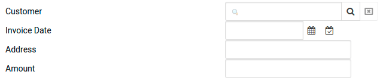
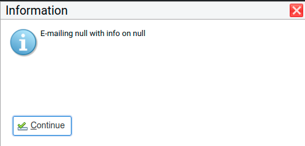

# Data binding

DomUI components use *data binding* to easily move data from the UI component to any underlying data model. Data binding makes it possible (and relatively easy) to separate the code for UI and business by using MVC or MVVC like patterns. Using data binding decouples the UI from the logic, and makes it possible to test the logic using normal JUnit tests instead of having to write Selenium like UI tests.

<a id="data-binding-example"></a>

## Data binding example

Before we go into a long monologue about how Data Binding works - let's look at few examples. We will use the Demo application's database and create a screen to edit an Invoice. This is done using the following code:

```
public class EditInvoicePageB1 extends UrlPage {
   private Invoice m_invoice;

   @Override public void createContent() throws Exception {
      ContentPanel cp = new ContentPanel();
      add(cp);

      //-- Default invoice fields
      if(null == m_invoice.getInvoiceDate())
         m_invoice.setInvoiceDate(new Date());

      //-- Manually create a form layout for educational pps - usually this is done using FormBuilder.
      TBody tb = cp.addTable();
      tb.addCssClass("ui-tbl-spaced");

      LookupInput2<Customer> custLI = new LookupInput2<Customer>(QCriteria.create(Customer.class));
      tb.addRowAndCell().add(new Label(custLI, "Customer"));
      tb.addCell().add(custLI);

      DateInput2 dateC = new DateInput2();
      tb.addRowAndCell().add(new Label(dateC, "Invoice Date"));
      tb.addCell().add(dateC);

      TextStr addrC = new TextStr();
      tb.addRowAndCell().add(new Label(addrC, "Address"));
      tb.addCell().add(addrC);

      Text<BigDecimal> amountC = new Text<>(BigDecimal.class);
      tb.addRowAndCell().add(new Label(amountC, "Amount"));
      tb.addCell().add(amountC);
   }

   @UIUrlParameter(name = "invoice")
   public Invoice getInvoice() {
      return m_invoice;
   }

   public void setInvoice(Invoice invoice) {
      m_invoice = invoice;
   }
}
```

If we open this screen using the url [http://localhost:8088/demo/to.etc.domuidemo.pages.binding.tut1.EditInvoicePage.ui?invoice=2](http://localhost:8088/demo/to.etc.domuidemo.pages.binding.tut1.EditInvoicePage.ui?$cid=0OUCkoO90006VhO5NqK000KH.c1&invoice=2) this will show a screen like this:



The controls are there but the data is not. To do that we would normally code things like:

```
customerLI.setValue(m_invoice.getCustomer());
dateC.setValue(m_invoice.getInvoiceDate());
// and so on, for all controls.
```

What is worse- we have to repeat this - or the reverse order (from components back to the Invoice instance) every time we want the data there. This is tedious and error prone.

So instead we will use data binding. We add the following at the end of createContext():

```
custLI.bind().to(m_invoice, "customer");
dateC.bind().to(m_invoice, "invoiceDate");
addrC.bind().to(m_invoice, "billingAddress");
amountC.bind().to(m_invoice, "total");
```

and we now have the following screen (live):

Data binding works two ways. Let's add a button to the screen and change the data inside the Invoice instance with the following code added at the end of createContent:

```
add(new DefaultButton("Clear amount", a -> {
   m_invoice.setTotal(BigDecimal.ZERO);
}));
```

The screen now looks like (live):

Press the button, and you will see that the screen amount is set to zero even though we did not touch the component. So we manipulate *only* the model, and the view adapts itself. This means that business logic does not need to know much about the screens.

<a id="how-does-it-work"></a>

### How does it work?

DomUI data binding works on the request/response cycle. When you add a data binding using the bind().to() construct the binding is stored inside the **component**. Now, every time that a new request from the browser *enters* the server DomUI executes the *moveControlToModel()* code: it accepts all of the data that the browser sends as the current value for all of the controls there, and then asks each (changed) control to move their data along their bindings. This means that the value that is inside the control is converted (if needed) and then sent to the invoice instance's property.

When the logic inside the server has finished DomUI runs the reverse operation: it now executes moveModelToControl(). This will again ask all controls for their bindings, and will then move the data from all instance properties into the control's value. After that the controls are rendered back to the browser.

<a id="binding-to-other-things-than-the-value-of-a-component"></a>

## Binding to other things than the value of a component

We can apply bindings to a lot of things, and using bindings makes a screen very dynamic without much work. Take the following example:

```
final public class BindingTut3 extends UrlPage {
   @Override public void createContent() throws Exception {
      List<CssColor> cssColors = CssColor.calculateColors(16);
      List<String> list = cssColors.stream().map(c -> c.toString()).collect(Collectors.toList());

      ComboLookup2<String> colorC = new ComboLookup2<>(list);
      add(colorC);

      VerticalSpacer vs = new VerticalSpacer(50);
      add(vs);
      vs.setBackgroundColor("#000000");

      colorC.bind().to(vs, "backgroundColor");
      colorC.immediate();
   }
}
```

This shows the following (live):

By selecting the color in the combobox the VerticalSpacer below it changes color immediately, because the background property of the VerticalSpacer is bound to the value of the combobox with:

```
colorC.bind().to(vs, "backgroundColor");
```

We also see something else: the colorC.immediate() method. We need this because we want the binding to be executed *as soon as the combobox changes value*. Usually DomUI only sends the values to the server when some action is needed, like a click on a button. The immediate() method on a control forces updates to be sent as soon as the control value changes.

<a id="another-example-of-binding-to-other-values-handling-disabled-buttons-with-ease"></a>

## Another example of binding to other values: handling disabled buttons with ease

Say we have a screen like this, where we want both values to be selected before the user can press the "Send Info" button:

The code for the page is this:

```
final public class BindingTut4 extends UrlPage {
   @Override public void createContent() throws Exception {
      LookupInput2<Artist> artistC = new LookupInput2<Artist>(QCriteria.create(Artist.class));
      add(new Div()).add(artistC);

      LookupInput2<Customer> customerC = new LookupInput2<Customer>(QCriteria.create(Customer.class));
      add(new Div()).add(customerC);

      DefaultButton btn = new DefaultButton("Send info", a -> {
         MsgBox.info(this, "E-mailing " + customerC.getValue() + " with info on " + artistC.getValue());
      });
      add(btn);
   }
}
```

Problem here is that pressing the "send info" button now would have an unwanted effect:



The button should be *disabled* as long as the user has not made both choices. This can be easily done with binding. We change the code as follows:

```
final public class BindingTut5 extends UrlPage {
   private Artist m_artist;

   private Customer m_customer;

   @Override public void createContent() throws Exception {
      LookupInput2<Artist> artistC = new LookupInput2<Artist>(QCriteria.create(Artist.class));
      add(new Div()).add(artistC);
      artistC.bind().to(this, "artist");

      LookupInput2<Customer> customerC = new LookupInput2<Customer>(QCriteria.create(Customer.class));
      add(new Div()).add(customerC);
      customerC.bind().to(this, "customer");

      DefaultButton btn = new DefaultButton("Send info", a -> {
         MsgBox.info(this, "E-mailing " + customerC.getValue() + " with info on " + artistC.getValue());
      });
      add(btn);
      btn.bind("disabled").to(this, "buttonDisabled");
   }

   private boolean isButtonDisabled() {
      return m_artist == null || m_customer == null;
   }

   private Artist getArtist() {
      return m_artist;
   }

   private void setArtist(Artist artist) {
      m_artist = artist;
   }

   private Customer getCustomer() {
      return m_customer;
   }

   private void setCustomer(Customer customer) {
      m_customer = customer;
   }
}
```

- We added properties for the customer and artist, and bound these properties to the controls
- We added the isButtonDisabled() method, this returns TRUE as long as either of the properties is NULL
- And we bound the disabled property of the button to this method.

This is an important thing: the bind() call binds to the value property (actually the bindValue property of the control if that exists), but by adding a control's property as parameter to bind you can use data binding to control the control :wink:

And now the button works as desired:
