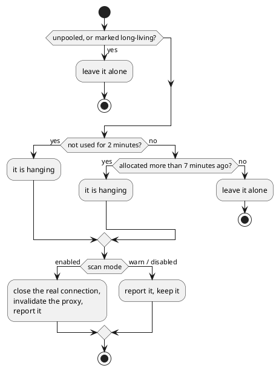

---
menu:
  sort: "20"
---
# The connection pool

DomUI brings its own JDBC connection pool, in the module `to.etc.db` (package
`to.etc.dbpool`). It hands out a normal `javax.sql.DataSource`, so Hibernate,
Flyway and plain JDBC all use it without knowing what it is.

What makes it worth using instead of any other pool is what it does *besides*
pooling: every connection, statement and result set it hands out is a proxy that
remembers who allocated it, what SQL ran on it and how long that took. That turns
the pool into the thing that tells you a connection was never closed, that a page
fired the same query four hundred times, or which statement and which parameters
produced that `SQLException`.

[TOC]

## Defining a pool

```java
ConnectionPool pool = PoolManager.getInstance().definePool(
	"demo",                                     // the pool id
	"org.hsqldb.jdbcDriver",                    // driver class
	"jdbc:hsqldb:file:/tmp/demoDb",             // url
	"sa", "",                                   // userid, password
	null, null                                  // driver jar, extra properties
);
pool.initialize();

DataSource ds = pool.getPooledDataSource();
```

That is the whole thing: the demo application's database is set up with exactly
this call, in `TestDB` in `to.etc.domui.derbydata`.

A pool goes through two states, and the two calls above are that split:

- **Defining** it registers the id and its parameters with the `PoolManager`.
  A defined pool already works - you can ask it for connections - but it keeps
  nothing: every close throws the real connection away.
- **Initializing** it allocates the minimum number of connections up front and
  switches the pool to pooled mode, where a close returns the connection to the
  free set instead of dropping it.

Defining the same id twice is allowed as long as the parameters are identical;
the second call returns the pool that already exists. Defining it with
*different* parameters is an error, which is how two pieces of startup code
disagreeing about the database get caught.

## The pool file

Connection parameters do not belong in code, so the normal way to define a pool
is to name it and let the pool manager read the rest from a file:

```java
ConnectionPool pool = PoolManager.getInstance()
	.initializePool(new File("/etc/myapp/pools.properties"), "demo");
```

In a properties file every key is `<poolid>.<parameter>`, so one file holds as
many pools as you like:

```properties
demo.driver=org.postgresql.Driver
demo.url=jdbc:postgresql://localhost:5432/demo
demo.userid=someuser
demo.password=somepassword
demo.minconn=5
demo.maxconn=20
```

The same pool written as XML, in a file ending in `.xml`, is a `pool` element per
pool with the parameters as attributes:

```xml
<pools>
	<pool name="demo"
		driver="org.postgresql.Driver"
		url="jdbc:postgresql://localhost:5432/demo"
		userid="someuser" password="somepassword"
		minconn="5" maxconn="20"/>
</pools>
```

`definePool(id)` and `initializePool(id)` without a file look for
`~/.dbpool.xml` and then `~/.dbpool.properties` in the user's home directory,
and fail if neither exists. That is the developer-workstation form: the pool
names live in the code, the credentials live in one file per machine that is
never committed.

Whichever file is used, a file with the same name plus `.local` next to it wins
for every parameter it defines. `pools.properties.local` is where a developer
points `demo` at their own database without touching the committed file.

### Parameters

| Parameter | Default | What it does |
| --- | --- | --- |
| `url` | - | JDBC url. Required. |
| `driver` | - | Driver class name. Required. |
| `userid`, `password` | - | Credentials; `userid` is required. |
| `driverpath` | - | A jar to load the driver from when it is not on the classpath. A relative path is resolved against the home directory. |
| `minconn` | 5 | Connections allocated by `initialize()`. |
| `maxconn` | 20 | Connections handed out before allocation blocks. Raised to `minconn + 5` when it is below `minconn`. |
| `check` | false | Run a statement on a connection before handing it out, and discard it when that fails. |
| `checksql` | per database | The statement `check` runs. Defaults to `select 1 from dual` on Oracle and `select 1` on PostgreSQL and MySQL; on any other database `check` without a `checksql` is an error. |
| `scan` | `enabled` | Hanging connection handling: `enabled`, `warn` or `disabled` - see below. |
| `statistics` | false | Collect per-statement statistics. |
| `logstatements` | false | Print every statement to stdout. |
| `logallocation` | false | Print every connection allocation and close to stdout. |
| `logallocationstack` | false | Print a stack trace with each of those. |
| `logrslocations` | false | Record the allocation point of every result set. Defaults to true in `warn` scan mode. |
| `ignoreunclosed` | false | Do not report resources the connection had to close itself. |
| `printexceptions` | false | Print SQL exceptions as they happen. |
| `binaryLog` | - | File to write the binary statement log to. |
| `sqltrace` | false | Oracle: `alter session set sql_trace=true` on every connection. |

Anything else the driver needs is passed through: a key `demo.p.ssl=true` (or
`demo.extra.ssl=true`, or a `p-ssl="true"` attribute in XML) reaches the driver
as the connection property `ssl`.

## Pooled and unpooled connections

A pool hands out two kinds of `DataSource`, and the difference is not whether
connections are pooled - both come from the same set - but what the pool expects
of them:

```java
DataSource pooled = pool.getPooledDataSource();
DataSource unpooled = pool.getUnpooledDataSource();
```

**Pooled** connections are for request handling. They are counted against
`maxconn`, and they are expected to be closed quickly; the janitor described
below will take one away that is not.

**Unpooled** connections are for the code that legitimately holds a connection
for minutes: batch jobs, imports, a schema migration at startup. They are not
counted against `maxconn`, so there is no limit on how many exist, and the
janitor never closes one. This is why `DbUtil` runs the Flyway migration on
`getUnpooledDataSource()` and only gives Hibernate the pooled one.

!w "Unpooled" is a bad name for it - the connections *are* pooled. Read it as
!w "not subject to the pooled-connection rules".

## What the proxies add

Everything the pool returns is a wrapper: `ConnectionProxy` for the connection,
and statement and result set proxies for what is created from it. Three things
come out of that.

**Resources are closed with the connection.** Every statement and result set is
registered with the connection that made it. Closing the connection closes all
of them, so a forgotten `ResultSet` cannot keep a cursor open on a connection
that is already back in the pool and being used by someone else. What it had to
close is reported, unless `ignoreunclosed` says otherwise.

**Exceptions carry the statement.** A failing statement is not reported as the
driver's bare `SQLException`; the pool wraps it in a `BetterSQLException` whose
message contains the SQL that failed and the parameter values that were bound to
it, with the original exception as the cause and its `getErrorCode()` and
`getSQLState()` passed through. The stack trace tells you what broke *and* what
it was running.

**Everything is timed.** Each statement's execution time is measured, which is
what the statistics below are built from.

## Hanging connections

The `PoolManager` runs a janitor thread that scans every pool every minute for
connections that are still allocated. What it does with them is the `scan`
parameter:



- `enabled`, the default, is the production setting: a connection nobody closed
  is taken away, and the code still holding the proxy gets an exception the next
  time it uses it. The report on stdout names the allocation point, so you know
  which code leaked it.
- `warn` reports the same thing but destroys nothing, and turns
  `logrslocations` on so the report can say where each result set came from. It
  is the development setting: you get told about the leak but the run continues.
- `disabled` scans nothing.

`disabled` is not absolute. When a pool runs out of connections it retries for a
minute, and if it is still empty it runs the scan itself in forced mode
regardless of the setting - closing anything unused for two minutes - before
giving up with `pool is exhausted`. Before that it panics through the pool
manager's message listeners, with a dump of every used connection and where it
was allocated.

A connection that is *meant* to be held for a long time is exempted explicitly:

```java
PoolManager.setLongLiving(connection);
```

## The monitoring page

`to.etc.db` ships a single JSP, `pool.jsp`, that shows every pool defined in the
running application. Drop it in the webapp and it works - there is nothing to
configure. It is live in the demo application:

!demo(pool.jsp, 100%, 620)

The overview is one row per pool: connections in use and peak use for pooled and
unpooled separately, how many connections are allocated against how many are
allowed, how many allocations were served from the pool versus opened against
the database, and the counts that mean trouble - waits, failures and hanging
connections. Behind the links are the list of currently used connections with
the stack trace of the code that allocated each one, the saved errors, and the
statistics below.

The page also acts: it can switch allocation stack traces and error saving on
and off for a pool, and force the hanging-connection scan to run now.

!w Those actions are why `pool.jsp` is not something to leave open to the world.
!w It is a diagnostic page, not a status page - put it behind whatever protects
!w the rest of your application's administrative screens.

## Statistics

With `statistics=true` on the pool, every statement's SQL, parameters and
execution time are collected. To attribute them to the request that caused them,
register the pool's request listener in `web.xml`:

```xml
<listener>
	<listener-class>to.etc.dbpool.StatisticsRequestListener</listener-class>
</listener>
```

From then on `pool.jsp` can show, per request url, how many statements it ran and
how long they took, and the totals over all requests since the counters were
cleared - which is how a page doing one query per row in a loop is found. Turning
on session statistics from the page keeps the last fifty requests of your own
session with the full statement list of each, so you can look at one page's SQL
rather than at an average.

!! Session statistics keep every statement of every request in memory. The page
!! says so when you enable it: switch it off again when you have what you need.

## Replaying a database log

Setting `binaryLog` writes every statement the pool executes to a file, with its
timing. `to.etc.dbreplay.DbReplay` plays such a file back against a database:

```bash
$ java to.etc.dbreplay.DbReplay -pf ~/.dbpool.properties dblog.bin target
```

By default it replays with the original time gaps between statements, so the
target database gets the same load in the same shape as the system that recorded
it. `-maxwait` caps the gaps, and `-speedy` with `-perwait` replays at a chosen
rate instead - a recorded morning's work becomes a load test. `-dump` prints the
file instead of running it.

This is a load and regression tool for a real workload: record on the system that
is slow, replay against the one you changed.
