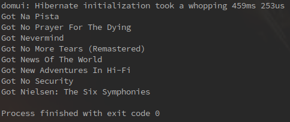

---
menu:
  sort: "20"
---
# The Generic Query framework - QCriteria

- [Summary](#summary)
  - [Where is the code](#where-is-the-code)
  - [My first query](#my-first-query)
  - [Combinators: and and or in QCriteria queries](#combinators-and-and-or-in-qcriteria-queries)
  - [Building trees](#building-trees)
  - [Parent and child relation queries: joins](#parent-and-child-relation-queries-joins)
  - [Differences between JPA/Hibernate Criteria and DomUI QCriteria](#differences-between-jpa-hibernate-criteria-and-domui-qcriteria)
    - [Simple differences](#simple-differences)
    - [Big differences](#big-differences)
      - [Join explosions and the limit clause](#join-explosions-and-the-limit-clause)
      - [Circumventing the join problem](#circumventing-the-join-problem)
      - [Sidestep: how about fetching the albums - eager fetch problems](#sidestep-how-about-fetching-the-albums-eager-fetch-problems)
  - [Child conditions in QCriteria](#child-conditions-in-qcriteria)

<a id="summary"></a>

# Summary

An important part of many applications is to use a database and generate queries in it. Normally when you do you'd create some SQL and fire it off to get a result set, but for a user interface this will be less optimal. For instance, we have an Artists table, and it is big.. So instead of having to show the entire table we want the user to fill in some lookup criteria in a [Search Panel](../../components/lookup-and-search/searchpanel/index.md), then do a query to find only those artists that match those criteria, like only the artists born in 1964, or only those on the album "In Search Of Sunrise 6: Ibiza".

To implement this we have to "generate" the SQL select statement to include a "where" clause, and that can get quite complex. The where clause needs to have an "and" statement if we're querying multiple conditions, and every condition itself can be of several types: a numeric value for the "Album" foreign key, a String for the Artist's name etc. To make matters worse we cannot just create the SQL statement as a big string, because this would open the door to SQL injection trouble which can compromise the security of our application.

To help with this DomUI defines a generic query layer called the QCriteria layer. For people that know Hibernate or JPA: this is the same idea as its "Criteria API", but with a cleaner implementation and some important differences. Lets see how we do queries using this layer.

<a id="where-is-the-code"></a>

## Where is the code

The examples in here can be found in the "tutorial" module. Get the domui code from github, then find the module at examples/tutorial. The tutorial project is a standalone project configured with Maven, and you can open it in IntelliJ by just opening the directory and importing the POM file.

!i All class names mentioned in here are in the package to.etc.domui.tutorial.criteria, unless otherwise mentioned.

<a id="my-first-query"></a>

## My first query

To do a QCriteria query you need two things:

- You need a QCriteria<T> object which represents the select statement or query question itself
- and a QDataContext object which is a Database Connection or often a Hibernate Session in disguise

Let's start with QCriteria. All QCriteria queries use the entity objects, the Java classes that represent the "tables" in your database. In our tutorial these are the Artist, Album etc classes we just added. To create a simple query on Album we'd write:

```
QCriteria<Album> q = QCriteria.create(Album.class);
```

This is the equivalent of "select \* from ALBUM", i.e. a select for all records in the database. To actually add a restriction, so called because it restricts the number of results, we add one of the comparator methods on it, like this:

**CritTest.java**

```
public class CritTest {
 public static void main(String[] args) throws Exception {
   QCriteria<Album> q = QCriteria.create(Album.class);
   q.eq("title", "Nevermind");

   System.out.println("Q= " + q);
 }
}
```

When you run this class the console output looks like this:

```
Q= FROM my.test.db.Album WHERE title='Nevermind'
```

It looks like a select statement :wink:

 but instead of selecting columns it selects the entire record (the class) - which is what we usually want.

We can easily extend the query by adding more restrictions on the query:

```
QCriteria<Album> q = QCriteria.create(Album.class);
q.eq("title", "Nevermind");
q.ilike("artist.name", "a%");
```

when we run the program again it now shows:

```
Q= FROM my.test.db.Album WHERE title='Nevermind' and artist.name ilike 'a%'
```

As you can see it automatically added the "and". But there are a few more things to notice here:

- QCriteria's are *typeful*; they specify the type that they are querying.
- You query by using the *property names of the data objects*, not the column names
- There are many comparator methods present on a QCriteria, eq, like, ilike, gt, ge, lt, le etc.
- Multiple restrictors are combined with "and" on a QCriteria
- You can query *parent relation* properties as easily as the properties on the actual object itself. By querying a parent object (the [artist.name](http://artist.name) above) you will force a *join* to take place.

So far we only printed output. Lets actually do a query. Let's make a new class "Criteria1":

**Criteria1.java**

```
package to.etc.domui.tutorial.criteria;

import to.etc.domui.derbydata.db.Album;
import to.etc.webapp.query.QCriteria;

/**
 * @author <a href="mailto:jal@etc.to">Frits Jalvingh</a>
 * Created on 2-4-18.
 */
public class CritTest {
    public static void main(String[] args) throws Exception {
        QCriteria<Album> q = QCriteria.create(Album.class);
        q.eq("title", "Nevermind");

        System.out.println("Q= " + q);
    }
}
```

This code does the following:

- It initializes the test database, and creates the Hibernate configuration.
- It creates a QCriteria query
- Then we allocate a QDataContext (which is like the JDBC Connection, Hibernate's Session or JPA's EntityManager) and run the query with it
- And finally we loop through the result.

The query that is sent to the database is both typesafe and also injection safe: it looks like:

```
select this_.AlbumId as AlbumId1_0_, this_.ArtistId as ArtistId1_0_, this_.Title as Title1_0_ from Album this_ where lcase(this_.Title) like ?
```

The parameter is actually a JDBC parameter (the ?) so SQL injection is not possible.

The result of the class is as we would expect:



<a id="combinators-and-and-or-in-qcriteria-queries"></a>

## Combinators: and and or in QCriteria queries

We have seen that when we use multiple comparator methods on a QCriteria it will combine them with the "and" operator. So using "and" is easy ;-) But how do we make an "or"? Before we can answer that we need to explain something.

The QCriteria instance you get from the create operation is an instance of a QRestrictor<T>. The QRestrictor "restricts" the result set by adding stuff to the where clause. This QRestrictor has a "combination" mode which is "AND" - so all comparator methods added to it are combined with AND's. To make an OR you must create a QRestrictor that uses a combination mode of OR. You get such a thing as the result of the or() call: a QRestrictor<T> where every comparator method called is combined with or. For example: the query

where year=2010 or year=2011

is coded as follows:

```
QCriteria<Album> q = QCriteria.create(Album.class);
QRestrictor<Album> or = q.or();
or.eq("year", 2010);
or.eq("year", 2011);
```

When you add new conditions to the "parent" QRestrictor (q) they will be combined with and:

```
QCriteria<Album> q = QCriteria.create(Album.class);
QRestrictor<Album> or = q.or();
or.eq("year", 2010);
or.eq("year", 2011);
q.ilike("name", "A%");
```

will result in:

where (year=2010 or year=2011) and name ilike 'A%'

To create something like

where (year=2010 and name ilike 'A%') or (year=2011 and name ilike 'Z%')

you would code:

```
QCriteria<Album> q = QCriteria.create(Album.class);
QRestrictor<Album> or = q.or();

or.and().eq("year", 2010).ilike("name", "A%");
or.and().eq("year", 2011).ilike("name", "Z%");
```

The "or.and()" method call returns another restrictor that uses and again.

<a id="building-trees"></a>

## Building trees

When you use QCriteria you are building an expression tree. The tree has nodes that represent operations and leaves that represent subexpressions or terms in the expression. For instance, the expression tree for:

(2 + 2) + (2 + 2) + (3 + 3)

is:


QCriteria creates such a tree for boolean expressions, and important parts in it are the and and or operations:


Now if we look at this tree we see something special. We have multiple levels, and "ands" and "ors" are each on a separate level. This behavior occurs because "and" and "or" nodes can be merged:

a and (b and c) = a and b and c

a or (b or c) = a or b or c

So every and or or "sublevel" that has the same operation as the level above it can be merged in that level above it, and QCriteria will do that.

<a id="parent-and-child-relation-queries-joins"></a>

## Parent and child relation queries: joins

TBD

<a id="differences-between-jpa-hibernate-criteria-and-domui-qcriteria"></a>

## Differences between JPA/Hibernate Criteria and DomUI QCriteria

There are some important differences between Hibernate's Criteria API and DomUI's QCriteria API. These are not just in use but also in behaviour. It is important to understand the differences if you have used Hibernate's implementation before - QCriteria is not simply a Hibernate Criteria wrapper.

<a id="simple-differences"></a>

### Simple differences

There are some simple differences:

- QCriteria queries are more like Hibernate's "Detached Criteria". They do not know about a Session or data connection at all. This is better than Hibernate's Criteria implementation because it does not bind the QCriteria to any session or database, so they can exist standalone and are reusable.
- Hibernate's DetachedCriteria and Criteria are a kludge: they serve mostly the same goal, have the same API, but do not derive from each other nor implement a common interface. Very bad design.
- QCriteria are typed, and consequently calls using them are typed better. The disadvantage is that slightly more typing is required...
- QCriteria are fully database and ORM agnostic: they do not know anything about how they are actually executed. Special factories called query executor factories are handing the translation of QCriteria queries to the ORM or database used.
- This makes it easy to "switch" ORM implementations. You can even write your own simple variant, and a JDBC-only "poor man's" implementation is actually present in DomUI, look for the @QJdbcTable and related annotations.
- Because QCriteria's are typed it is easier to create code to check them for correctness. For example the DomUI Eclipse plugin uses the typefulness of QCriteria to help with filling in the property names of the criteria, and can also check if QCriteria are not referring to some unknown property and report an error.

<a id="big-differences"></a>

### Big differences

<a id="join-explosions-and-the-limit-clause"></a>

#### Join explosions and the limit clause

Take the tutorial's database Artist and Album tables. An Artist has a "child" relation which is a list of albums by that artist. Now lets create a query that returns all Artists that have an album that was released in 2010. This query in Hibernate is generated as a SQL Join between Artist and Album, and adds a condition on album.year = 2010:

select artists.\*, albums.\* from artists, albums where [artists.id](http://artists.id) = albums.artistid and albums.year=2010

Now consider what happens if artist 'Henk' has released 5 albums in 2010. Because this is a join, the result set will contain 5 rows for Henk. All of these rows are for the same 'Henk' (i.e. all artists.\* fields are the same in those 5 rows), but for separate albums (the albums.\* fields differ).

In Hibernate/JPA the result set of this query will return the "Henk" Artist instance 5 times in the result List<>, even though they are the same. You can do some special magic to prevent this- but you MUST do that magic or you'll get 5.. Even when you do that magic another problems remains: the above query will cause trouble with any "limit" or "start" clause. The database will count the actual number of rows in the result set (the joined rows), not just the number of "Henks in rows". So limit(10), instead of limiting to 10 artists, actually limits to 10 joined rows- which usually means less than 10 artists even when more can be returned.

It means that these limits do not work, and do not work without any indication that they are failing!

Another way to say it is that limit() and start() in DomUI are defined as limits on it's model, i.e. it formally limits the number of Artist instances, while in Hibernate these are defined as limits on the underlying implementation. The latter is very confusing and can be seen as a model violation.

Hibernate has more places where this "Join Explosion" occurs unexpectedly (for instance it often happens when eagerly fetching data too). Instead of failing a request that tries to limit() they run the code with wrong results. Bad design.

<a id="circumventing-the-join-problem"></a>

#### Circumventing the join problem

DomUI does not allow you to specify a query in this way: it tries to have different semantics for QCriteria queries. We define the above query not as a join, but as an "exists subselect". What we really want in the above query is:

*Give me all Artists that (Have an album in 2010)*.

Instead of creating a direct Join we create a subselect join statement like:

*select \* from Artists a where exists ( select 1 from Albums b where b.year=2010 and b.artistid=a.id)*;

In this query we will always have only one Artist, even when he has 5 albums in 2010. Because the number of rows is now correct limit() and start() work as they should too. It's still a join in database terms but of a different kind. It's often also a cheaper statement than the earlier statement because the database needs to read less data: instead of reading all 5 album rows to create the result set it can stop reading when it sees the 1st row with year=2010.

<a id="sidestep-how-about-fetching-the-albums-eager-fetch-problems"></a>

#### Sidestep: how about fetching the albums - eager fetch problems

A common misunderstanding is that the above makes it harder to fetch the child "album" records to put into the List<Album> field for each Artist that is read (eager fetching). This is of course not true. In the first statement the join does contain some of the albums to put in the list, but not all of them - it only contains the 2010 albums. But the List<Album> for an Artist must, by definition, contain all albums for the artist, not just those you queried. If we would allow only those 2010 albums there- what would we need to do to get the full list later? And what would it mean when we add a single record there- must the missing ones be deleted too?

What this makes clear is that the where part of the query (the part that decides on which records to return) in ORM queries should be fully separate from the select part of the query (the part that decides what data to return). If we want to eagerly fetch data we would have to rewrite the query like:

*select a.\*,f.\* from Artists a,Albums f where exists ( select 1 from Albums b where b.year=2010 and b.artistid=a.id) and f.artistid=a.id*

In here we have two joins to the same table. The subselect joins but just returns as soon as a row is found with year=2010. The second one does the full join, returning all albums per artists - but again repeating the artist in the result!

This kind of eager fetch cannot be done at all with limit() and start() restrictions in place. DomUI will abort your query if it can see that you are eagerly fetching with limit() in place. You need to find another solution.

<a id="child-conditions-in-qcriteria"></a>

## Child conditions in QCriteria

In DomUI, very simple conditions on a child relation like the above will be automatically translated into an "exists" subquery by it. This only works for simple queries because it is hard to do right for complex ones (combinatory conditions on both a child and the parent record are hard to specify properly). The best way to handle child relation criteria is to create the subselect yourself using QCriteria, like this:

```
QCriteria<Artist> q = QCriteria.create(Artist.class);
QRestrictor<Album> subq = q.exists(Album.class, "albums");
subq.eq("year", 2010);
```

This uses the "exists" method to explicitly create the joined subselect. It returns the QCriteria for the subselect, so you can add to it's where clause at will.

There are some unfortunate oddities in the interface: because Java is still lacking first-class properties (sigh) the compiler cannot know the type of the "albums" list. But QCriteria is typeful and requires that type.. This means you have to pass it in, hence the Album.class parameter. As soon as Oracle gets a brain and provides proper support for Java Properties this will be fixed; this is expected just before Hell freezes over.
