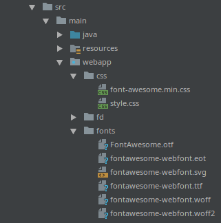

# FontAwesome support

!w This is not completely done yet; new functionalities will be added to support more of FontAwesome.

To use [FontAwesome](https://fontawesome.com/) with DomUI you need to do the following:

- Download the appropriate FontAwesome css and font files. DomUI should work with any release.
- Drop the css files in your web application's "css" folder, and the font files in the "fonts" folder:


- Add the following line to your Application class inside the initialize() method:
```
addHeaderContributor(HeaderContributor.loadStylesheet("css/font-awesome.min.css"), 10);
```

This adds the resources needed, and makes all pages include the required style sheet - which in turn loads the correct fonts.

<a id="fontawesome-specific-support"></a>

### FontAwesome specific support

The component FaIcon can be used to add a FontAwesome icon to a page/component/whatever. An example usage is:

```
FaIcon icon = new FaIcon("fa-folder");
node.add(icon);
icon.addCssClass("dm-tree2-icon fa-2x");
```

This shows a folder icon. The fa-2x is a standard FontAwesome class which makes the icon twice as big as the normal font size. The dm-tree2-icon used in the example here defines a color for the icon so that it can be purple instead of black.

To add a FA icon to a button accepting an icon use the FontAwesome name without any embellishments, like:

```
bb.addBackButton("Back", "fa-arrow-left");
```

<a id="to-be-done"></a>

### To be done

Support for FA icons in button(s).
