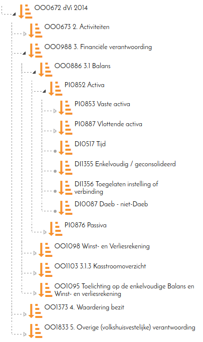

# The Tree2 component

This component is a replacement for the old Tree component. It has largely the same interface but renders the tree in a better way. In addition the code has seen a big cleanup.

The component looks like this:

In the picture above the orange icon and the text are part of the program (and defined by the user). The rest of the display is rendered by the tree.

The Tree2 component uses the same ITreeModel interface as the Tree component, so it should be easy to replace a Tree component.

The following is possible with a Tree2 component:

- Nodes are shown as expanded, compressed when there are children.
- Leaf nodes are clearly marked (with the small ball)
- The content area is configurable and scales automatically
- The tree supports both single- and multiple node selection (TBD)
- Node selection can be prevented using an INodePredicate<T> predicate.
- The node's data is rendered using an INodeContentRenderer<T>.

### Demo page

The demo for the control [can be found here](https://etc.to/demo/to.etc.domuidemo.pages.overview.tree2.Tree2DemoPage.ui).
