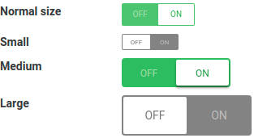

# The CheckboxButton component



It is an IControl<Boolean> which returns the boolean value for the selection, just like a checkbox. The button is created as:

```
add(new CheckboxButton());
```

Besides the usual properties that belong to an IControl the button has two additional properties:

| Name | Type | Description |
| --- | --- | --- |
| onLabel | String | The text to show as the "on" value. Defaults to a Msgs label when null. |
| offLabel | String | The text to show as the "off" value. |
