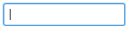
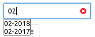
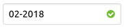
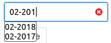
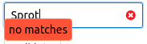
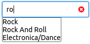
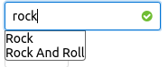

# The SearchAsYouType component

This component is an input box with which you can select one of a list of values by typing the text for the value. While you type the list of possible values pops up if matches are found. For example the following input will let you select a year-month value from a list of possibilities:

```
List<Date> list = new ArrayList<>();
Calendar cal = Calendar.getInstance();
DateUtil.clearTime(cal);
for(int i = 0; i < 24; i++) {
   cal.add(Calendar.MONTH, -1);
   list.add(cal.getTime());
}
SearchAsYouType<Date> st = new SearchAsYouType<>(Date.class)
   .setData(list)
   .setSearchProperty("name")
   .setConverter((a, v) -> {
      SimpleDateFormat f = new SimpleDateFormat("MM-yyyy");
      return f.format(v);
   })
   ;
st.setMandatory(true);
add(st);
```

The control, when empty, looks as follows:



Just like an input. When you start typing and the string is a partial match for values a list appears:



In addition we see a red cross. The red cross means that the current value (the 02) is not valid, and hence the control's state is invalid. We also see the list-of-values and we can pick one by either using the cursor keys + enter or a mouse click. If we select a value like that the control becomes valid (holds a valid value):



The green icon now signifies that the content is valid.

The box remains an input control, so as soon as we change the value (for instance by removing the 8) we become invalid again as 02-201 is not valid:



This means that it is immediately obvious whether the value shown is valid or invalid.

If you start to type something that cannot be matched at all an error will be shown:



This means that typing more will not help; text should be removed.

This control is a full IControl and has both a value model (as specified by the IControl<T>'s T) and a list-of-values to pick from. In that respect it is functionally equivalent to the ComboLookup2<T>.

<a id="overlapping-values"></a>

## Overlapping values

We can also have values that overlap. Take the following example from the demo app:

```
List<Genre> genreList = getSharedContext().query(QCriteria.create(Genre.class));
SearchAsYouType<Genre> st = new SearchAsYouType<>(Genre.class)
   .setData(genreList)
   .setSearchProperty("name")
   ;
st.setMandatory(true);
cp.add(st);
```

This will select from a list of musical genres, like rock. But if we enter ro we get this:



We actually have two values: Rock and Rock and Roll.

If we complete typing Rock we get the following:



Even though we're not finished typing the icon becomes valid because rock is a valid value. But the alternatives are shown. If you want to accept rock as the anwer press enter and the dropdown list disappears.

<a id="how-searching-is-handled"></a>

## How searching is handled

Something very specific to this control is that the user is expected to be able to type the string that represents the value. **This means that the value must be easily and uniquely be representable as a string!** It should be obvious from context what should be typed, and it should be unambiguous. So while the control is of a value type T it requires that all values T can be converted to a String. It can do this in several ways:

- If T is a primitive type like enum, Number or String then by default the string representation of the value is used to search with.
- If T is some class there are multiple ways to handle the presentation:
  - You can specify a single property on the class T, which must be of type String, Enum or Number. The control will use the value of this property to both show the value and to search for matches.
  - You can specify an IObjectToStringConverter<T> instance and set it using setConverter(). This converter must be able to properly convert the T into a String for both display and search purposes.

There are several ways to match the strings entered, which can be specified by setMode() on the control. The possible values are:

- MatchMode.CONTAINS: show all values that *contain* the string typed. If the whole string matches we have a match (the icon becomes green selected).
- MatchMode.CONTAINS\_CI: same as above, but the comparison is done case-independent. This is the default search mode.
- MatchMode.STARTS: show all values that *start* with the string typed.
- MatchMode.STARTS\_CI: same as above, but using case-independent compare.

<a id="searching-in-a-database"></a>

## Searching in a database

The SearchAsYouType component is like a combobox, it has a fixed number of possible values set as a List<T>. To search the text in a database you need another component: SearchAsYouTypeQ. This component has the same user interface as the above one, but it queries the database for the data typed using a QCriteria based query.

COMPONENT TBD.
