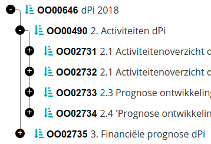
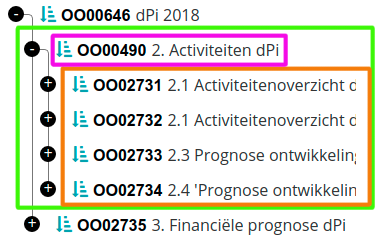
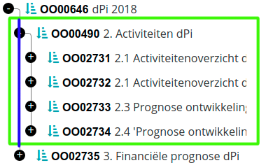

# Tree rendering in HTML

Rendering trees in html is quite complex, because each node in the tree has lots of state, and rendering all parts of the tree (nodes, branches, expand/collapse button) take part in this state.

The following gives a detailed example of how DomUI trees should be rendered in such a way that we can easily style them.

<a id="terminology"></a>

## Terminology

- A leaf node is a tree node that has no children
- A branch node is a tree node that potentially HAS children
- The label is the part of the tree that describes the node, i.e. the node's visible content. The label is *only* the user-defined part of the tree; it does not include the open/close button nor any part of the rendering.
- The expand button is the name for the button that would open or close a branch
- The branch line(s) are the visible lines that show the tree's structure

<a id="example-renderings-and-their-structure-tree3"></a>

## Example renderings and their structure (tree3)

The basic structure of a tree, as far as rendering is concerned, is a nested set of <ul> and <li> items. The <ul> part represents the children of a list node; the <li> represents an entire child node and its (optional) children. So the basicv structure of the tree is as follows:

```
<ul>
  <li>
    <div class="ui-tree3-fbtn">-</div>
	<span class="label">Root item 1<span>
	<ul>
		<li>
            <div class="ui-tree3-fbtn">+</div>
			<span class="label">Leaf item 1.1</span>
		</li>
	</ul>
  </li>
</ul>
```

The tree3 renders the following structure from this:



We need to define how we get each of the parts of this rendering.

The simplest part is the label. Each label is part of a *label container* which is a span. This label container can contain other html. In the example here the other html is an image, a bold text and a normal weight text.

Before we discuss the rest, let's define the major structural elements in the above image in terms of the above structure.



The purple part is the label container, containing the user-defined label (which in this case is the three parts)

The brown part is the <ul>, which is contained in the higher level's li (the green part).

<a id="the-expand-fold-buttons"></a>

### The expand/fold buttons

These are made from a div which has either a + or a - inside, depending on the folding state. They also change a css class: ui-tree3-opened or ui-tree3-closed depending on the state of the node they belong to. They are rendered as follows:

```
// Fold/unfold button
.ui-tree3-fbtn {
	background: #000;
	color: #fff;
	position: relative;
	z-index: 1;
	float: left;
	margin: 0 1em 0 -2em;
	width: 1em;
	height: 1em;
	border-radius: 1em;
	content: '+';
	text-align: center;
	line-height: .9em;
}
```

The z-index makes sure that the thing falls "over" any horizontal or vertical branch line that is being rendered as a border on some parts. The negative margin ensures we have place for the item before the actual label is shown.

<a id="branch-lines"></a>

### Branch lines

The vertical lines between items at the same level are defined as a generated :before class on the <li>, see the blue line:



We only use border-left and use the following to make the :before item as large as the li:

```
position: absolute;
top: 0;
bottom: 0;
content: "";
width: 0;
left: -.5em;
border-left: 1px solid #777;
```

This line now automatically takes the size of the whole li, so if the li has its children expanded it forms a long line; if the li is not expanded it forms a short line.
