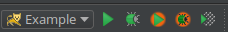

# Creating a new DomUI application from scratch (using a Maven archetype)

<a id="getting-started-with-a-new-client-application"></a>

## Getting started with a new client application

The easiest way to get started with DomUI is by using Apache Maven to create an example DomUI project, as follows:

```
mvn archetype:generate -DarchetypeGroupId=to.etc.domui -DarchetypeArtifactId=domui-hello -DarchetypeVersion=1.1
```

Maven will ask you for a groupid and an artefactId for your new project to use in the poms the thing generates, plus the Java package name to use as the root for the structure:

```
Define value for property 'groupId': my.domui
Define value for property 'artifactId': example
Define value for property 'version' 1.0-SNAPSHOT: :
Define value for property 'package' my.domui: : my.domui.web
Confirm properties configuration:
groupId: my.domui
artifactId: example
version: 1.0-SNAPSHOT
package: my.domui.web
Y: : y
```

This will generate the directory "example" (same name as the artefact ID you provided) with all demo code present.

Now cd to that directory, then use the usual maven commands to build the code:

```
$ cd example
$ mvn install
[INFO] Scanning for projects...
[INFO]
[INFO] ------------------------------------------------------------------------
[INFO] Building domui :: example 1.0-SNAPSHOT
[INFO] ------------------------------------------------------------------------
(rest skipped)
```

which should end with "Build Success".

To run the example application use mvn jetty:run, then point your browser at [http://localhost:8080/ui](http://localhost:8080/ui)

This should give you:


which is not much, I agree :wink:

<a id="running-in-intellij"></a>

## Running in IntelliJ

With the above setup it is trivial to get the code running in IntelliJ Idea. Just take the following steps:

- Start IntelliJ
- In the welcome screen click "Open..."
- Navigate to the "example" directory created above, and open the directory.

IntelliJ should automatically recognize that the project is a Maven project and import the POM's. If not click on the "Event Log" in the status bar (bottom right) and check if there are questions there to import the pom.

After import you can run the example from IntelliJ by adding a web runtime, as follows:

- In the menu select Run → Edit configurations
- Press the green "+" on the dialog that follows, and select "Tomcat Server" → "Local"
- Name the project, then click the Deployment tab
- In the deployment tab click the green "+" on the right of the dialog, then select Artifact.
- In the dialog that follows select example:war exploded
- Now back in the dialog, fill in "/ui" at "Application Context

Press OK on the dialog.

You can now run the application from IntelliJ using the buttons on the top right of the screen:


