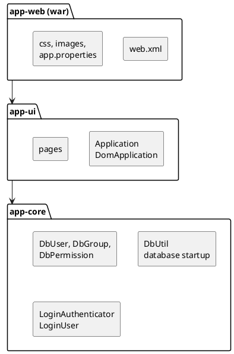
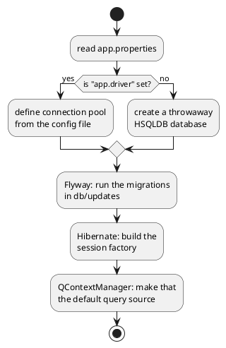
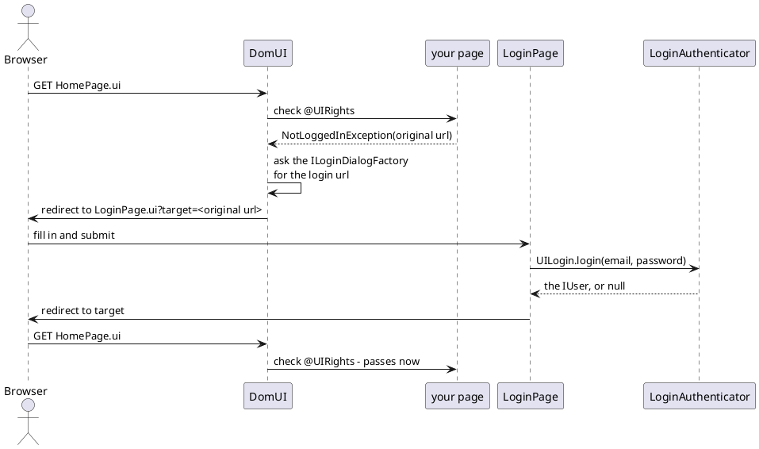

---
menu:
  sort: "20"
---
# Use the "example" skeleton to create a new application

[TOC]

The skeleton is a working DomUI application with nothing in it. It is the fastest
way to a new program: clone it, rename it, and start adding pages to something
that already has a database, a login and a build.

It lives in its own repository,
[fjalvingh/domui-skeleton](https://github.com/fjalvingh/domui-skeleton), and it
includes DomUI itself as a git submodule, so a clone gives you the framework and
the application together.

## Getting it running

```bash
$ git clone --recursive https://github.com/fjalvingh/domui-skeleton petshop
$ cd petshop
$ mvn clean install -DskipTests -Dmaven.javadoc.skip=true
```

The `--recursive` is what pulls in the DomUI submodule; without it the build has
nothing to compile against. You need **Java 21** and **Maven 3.9 or newer**. The
build takes about twenty seconds and builds DomUI and the application in one
reactor.

Then run it:

```bash
$ cd app-web
$ mvn jetty:run
```

and open [http://localhost:8082/ui/](http://localhost:8082/ui/). You get a login
screen; log in with **admin@example.com**, password **admin**, and you land on a
page with a single link to the user maintenance screen.

!v No database setup was needed for any of that. The application noticed it has
!v no database configured, created an HSQLDB one in a temporary directory,
!v created the tables in it and filled them with three users. Configuring a real
!v database is described [below](#the-database).

## The three modules



- **app-core** holds everything that is not user interface: the entities, the
  code that starts the database, and the authenticator. Nothing in it imports a
  DomUI page.
- **app-ui** holds the `DomApplication` subclass and the pages.
- **app-web** is the war assembly: `web.xml`, the stylesheet, the images, and the
  configuration file. It has no Java code of its own.

Splitting it this way is a suggestion, not a requirement, but it is worth
keeping: it stops business logic from quietly growing a dependency on the screen
it happens to be used by. Adding a fourth module is just Maven.

To make the skeleton yours, rename the four Maven artifacts and the `my.domui.app`
package, and change `Constants` - it holds the application code, title and motto
that the rest of the code reads.

## The AppFilter: how a request becomes a page

All of DomUI hangs off a single servlet filter, declared in
`app-web/src/main/webapp/WEB-INF/web.xml`:

```xml
<filter>
    <filter-name>DomFilter</filter-name>
    <filter-class>to.etc.domui.server.AppFilter</filter-class>
    <init-param>
        <param-name>application</param-name>
        <param-value>my.domui.app.ui.Application</param-value>
    </init-param>
    <init-param>
        <param-name>extension</param-name>
        <param-value>ui</param-value>
    </init-param>
    <init-param>
        <param-name>auto-reload</param-name>
        <param-value>ui.pages.*, ui.component.*, .*\.component[s?]\..*, .*\.pages\..*</param-value>
    </init-param>
</filter>
<filter-mapping>
    <filter-name>DomFilter</filter-name>
    <url-pattern>/*</url-pattern>
</filter-mapping>
```

There is one filter and it is mapped to `/*`. There are no servlets, and there is
nothing to add to `web.xml` when you add a page.

The three parameters:

- **application** names your `DomApplication` subclass. `AppFilter` instantiates
  it once and calls its `initialize()`; that class is the application-level
  singleton where everything else gets configured.
- **extension** is the suffix that marks a URL as a page. A page's URL is its
  fully qualified class name plus that suffix, so
  `my.domui.app.ui.pages.login.LoginPage` is served at
  `/ui/my.domui.app.ui.pages.login.LoginPage.ui`. `ui` is the default.
- **auto-reload** lists class name patterns that DomUI watches while you develop.
  When a class matching one of them changes on disk, DomUI throws away its class
  loader and reloads it, so an edited page is live on the next click without a
  redeploy.

!! auto-reload only does anything on a *developer workstation*: DomUI checks for
!! a `.developer.properties` file in your home directory and skips all of this
!! when there is none. A deployed application never reloads, whatever `web.xml`
!! says.

Requests that are not a page URL still pass through the filter, but you write no
code for them. DomUI serves what it owns - it compiles `css/appstyle.scss` to css
on the way out, and it serves resources that live inside jars, which is how the
icon set gets its stylesheet and fonts - and it lets the container serve the rest
straight from `src/main/webapp`.

## The Application class

`my.domui.app.ui.Application` extends `DomApplication`, and its `initialize()` is
where the application is wired together. Reading it top to bottom tells you what
the skeleton actually sets up:

```java
public class Application extends DomApplication {
	@Nullable @Override public Class<? extends UrlPage> getRootPage() {
		return HomePage.class;
	}

	@Override protected void initialize(@NonNull ConfigParameters pp) throws Exception {
		//-- Redirect all JUL logging to slf4j
		LogManager.getLogManager().reset();
		SLF4JBridgeHandler.removeHandlersForRootLogger();
		SLF4JBridgeHandler.install();

		setShowProblemTemplate(true);
		setDefaultThemeFactory(SassThemeFactory.INSTANCE);
		addHeaderContributor(HeaderContributor.loadStylesheet("css/appstyle.scss"), 10);
		addHeaderContributor(new FaviconContributor("img/favicon.ico"), 100);

		//-- Read the config file, then start the database
		File propertyFile = getPropertyFile();
		Properties properties = getProperties(propertyFile);
		initializeDatabase(propertyFile, properties);

		//-- Login
		LoginAuthenticator loginAuthenticator = new LoginAuthenticator();
		defineLoginAndLoginPage(loginAuthenticator);
	}
}
```

`getRootPage()` is what the application's root URL shows - `HomePage` here, so
`http://localhost:8082/ui/` is that page. The stylesheet added as a header
contributor is `css/appstyle.scss`; it is compiled by DomUI's sass support, and
so is the theme selected by `SassThemeFactory`. Icons need no line here at all:
the skeleton has the `fontawesome6free` artifact as a dependency, and DomUI
registers an icon pack that is on the classpath by itself.

### Where the configuration file comes from

`getPropertyFile()` looks for the file called `app.properties` - `app` being
`Constants.APPCODE` - in this order:

1. the file named by the `config` system property, if that is set;
2. `~/.app/app.properties`;
3. `~/app.properties`;
4. `WEB-INF/app.properties` inside the war.

It fails loudly when it finds nothing. The order is deliberate: the file in the
war is the one you commit, and the ones in the home directory are how a developer
or a server overrides it without changing the deployment. The name itself can be
overridden by putting `domui.app.config=someothername.properties` in your
`.developer.properties`.

## The database

Database startup lives in `app-core`, in `DbUtil`, and is three separate things
that happen in a fixed order:



**The connection pool.** DomUI has its own pool (`to.etc.dbpool`). It is
configured from the same `app.properties` that configures the rest of the
application: a pool has an id, and every property of that pool is named
`<poolid>.<property>`. The pool id is the application code, so:

```properties
app.driver=org.postgresql.Driver
app.url=jdbc:postgresql://localhost:5432/domui_app
app.userid=someuser
app.password=somepassword
```

Those four lines are the whole database configuration. As long as `app.driver` is
absent - as it is in the file the skeleton ships - `DbUtil` builds a throwaway
HSQLDB database instead, which is why the application runs straight after a
clone.

**The schema.** `DbUtil.updateDatabase()` runs [Flyway](https://flywaydb.org/)
over `app-core/src/main/resources/db/updates`:

```java
Flyway.configure()
	.dataSource(ds)
	.locations("db/updates/common", "db/updates/" + dbtype.name())
	.schemas("PUBLIC")
	.callbacks(new MigrationLogger())
	.load()
	.migrate();
```

`db/updates/common` holds the scripts that work on every database, and
`db/updates/<type>` the ones for a specific one - `type` being the
`SystemDatabaseType` that `DbUtil.initialize()` passes in, which is `postgres`
as the skeleton stands. Change that call when you target something else. The
skeleton ships a single `V1__create_database.sql` in `common`, which creates the
four tables the login uses and seeds three users. You extend the schema by adding `V2__...sql`,
`V3__...sql` next to it; Flyway records what it has run and applies only what is
new, at every application start.

**Hibernate.** `HibernateConfiguration` lists the entity classes and `DbUtil`
starts the session factory on the pool:

```java
public static void configure() {
	HibernateConfigurator.addClasses(DbGroup.class);
	HibernateConfigurator.addClasses(DbGroupMember.class);
	HibernateConfigurator.addClasses(DbPermission.class);
	HibernateConfigurator.addClasses(DbUser.class);
}
```

Every entity you add needs a line here. The last step registers that Hibernate
setup as the default for [QCriteria](../../70-implementation-details/qcriteria/index.md), which is
what makes `getSharedContext()` on a page return a working `QDataContext` without
any page having to know where it came from.

!! The tables are created by the Flyway script, not by Hibernate. The entity
!! annotations and the SQL have to agree, and nothing checks that for you at
!! build time - it fails when the query runs. Change both, together.

## Login and rights

Three pieces do the work, and they are independent of each other.

**Who is allowed in** is `LoginAuthenticator` in `app-core`, an
`ILoginAuthenticator`. Its main method takes a user id and a password and returns
an `IUser`, or null:

```java
@Nullable @Override
public IUser authenticateUser(@Nullable String uid, @Nullable String pw) throws Exception {
	QDataContext dc = QContextManager.createUnmanagedContext();
	try {
		DbUser p = dc.queryOne(QCriteria.create(DbUser.class).eq("email", uid));
		if(p == null)
			return null;
		if(pw != null && !isEncryptedPasswordCorrect(p.getPassword(), pw))
			return null;
		return new LoginUser(dc, p);
	} finally {
		dc.close();
	}
}
```

Passwords are stored as `salt;hash`, PBKDF2 with HMAC-SHA512 over a 20 byte
random salt. `getEncyptedPassword()` produces that format and is what the user
edit page calls when a password is changed. Replace the whole class if your users
live in LDAP or behind single sign-on - nothing else in the application looks at
`DbUser.password`.

**Who the user is** is `LoginUser`, an `IUser2`. It is built once at login and
kept in the session. Its constructor walks the user's groups and flattens every
permission it finds into a set, so the rights check is a set lookup rather than a
query:

```java
@Override
public boolean hasRight(@NonNull String r) {
	return m_permissionNameSet.contains(r) || m_permissionNameSet.contains(Rights.ADMIN);
}
```

The four tables behind that are `au_user`, `au_group`, `au_group_member` and
`au_group_permission`: a user is in groups, a group has named permissions, and a
permission name is just a string. `Rights` holds those names as constants, and
`admin` is treated as "may do everything".

**Where the rights are demanded** is the `@UIRights` annotation, on the page:

```java
@UIRights                       // any logged-in user
public class HomePage extends UrlPage { ... }

@UIRights(Rights.ADMIN)         // only users with the "admin" permission
public class UserListPage extends AbstractListPage<DbUser> { ... }
```

That annotation is the entire access control story for a page. With several
rights listed the user needs at least one of them.

### What happens when a page needs a login



DomUI raises `NotLoggedInException` and needs to be told which page to send the
user to. That is the second half of `defineLoginAndLoginPage()`:

```java
setLoginAuthenticator(loginAuthenticator);
setLoginDialogFactory(new ILoginDialogFactory() {
	@NonNull @Override public String getLoginRURL(String originalTarget) {
		StringBuilder sb = new StringBuilder();
		sb.append(LoginPage.class.getName() + ".ui?target=");
		StringTool.encodeURLEncoded(sb, originalTarget);
		return sb.toString();
	}

	@Nullable @Override public String getAccessDeniedURL() {
		return null;                    // use the built-in access denied page
	}
});
```

The factory gets the URL the user was trying to reach and returns the URL to send
them to instead, with that original target encoded in it. `LoginPage` is an
ordinary DomUI page with no annotation - it must be reachable by someone who is
not logged in - and the only framework call in it is:

```java
if(m_failcount > 10 || !UILogin.login(email, pw)) {
	error(errorContainer, "Invalid login");
	m_failcount++;
	...
} else {
	String tgt = getPage().getPageParameters().getString("target");
	UIGoto.redirect(tgt == null ? "" : tgt);
}
```

`UILogin.login()` calls your authenticator and, when it returns a user, puts that
user in the session. Everything after that - `@UIRights`, `UIContext.getCurrentUser()`,
`LoginUser.getCurrent()` - reads it from there. Because the login screen is your
page rather than the framework's, changing how it looks is just editing
`LoginPage`.

!! The three users the migration script creates are for getting started only.
!! Delete them from `V1__create_database.sql`, or add a later migration that
!! removes them, before this goes anywhere real.

## Where to go from here

The user maintenance screens are worth reading before you write your own:
`UserListPage` and `UserEditPage` are small, and between them they show a
search page, a list, an edit form and a save, in the shape the rest of your
application can follow.
