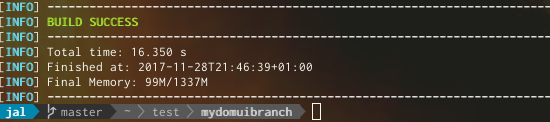
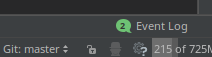
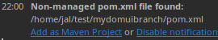
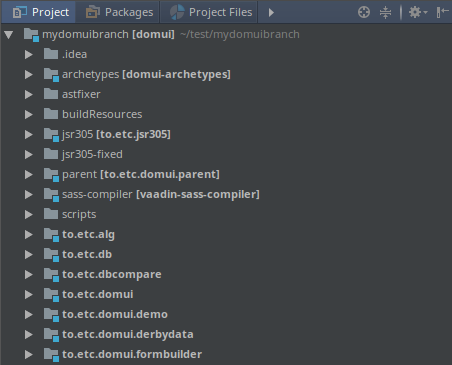
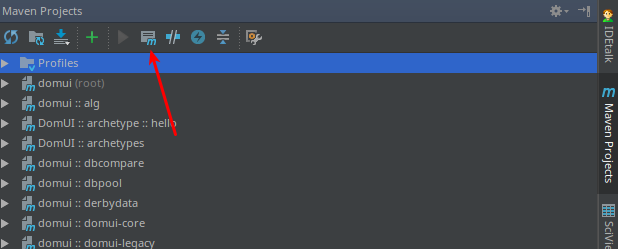
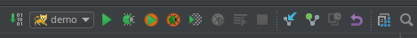

# Getting started

<a id="working-on-domui-itself"></a>

## Working on DomUI itself

To discover how DomUI works, to fix issues or to add new DomUI code you will need to check out the repository and be able to edit/compile/run DomUI.

<a id="checking-out-the-repository-from-github"></a>

### Checking out the repository from github

There are multiple branches of DomUI, and which one you need depends on what you want to do. The most important branches are as follows:

- master: the tip of development, and for that reason not always stable. Used when you want to see the newest code, or if you want to add new functionality. The master branch will become the next release, usually.
- 2.0-stable: as I am currently working on the next release (2.0), this is a more or less stable snapshot of master. It can be used to have something that is reasonably functional but still up-to-date with most of the recent improvements.
- 1.1 is the branch that represents the released 1.1 version (which is currently quite old). The branch is used when 1.1 has trouble and needs fixes (leading to 1.1.1, 1.1.2 maintenance like releases). No work is being done here.

For hacking DomUI we want master, so let's get that:

```
$ git clone -b master https://github.com/fjalvingh/domui mydomuibranch
```

This makes a clone of the git repository in a new directory "mydomuibranch".

!w The above checkout does an anonymous checkout, meaning that pushing back is hard. If you already have a github account you can of course also use the usual ssh url to access the repository, i.e. [git@github.com](mailto:git@github.com):fjalvingh/domui.

<a id="building-the-code"></a>

### Building the code

DomUI uses Maven as its build tool. To compile you need a maven version >= 3.5 [which you can find here](https://maven.apache.org/download.cgi?Preferred=ftp%253A%252F%252Fmirror.reverse.net%252Fpub%252Fapache%252F). Linux users should download a version because the version present in your distribution may be old.

To compile do the following:

```
$ cd mydomuibranch
$ mvn clean install -Dmaven.test.skip=true -Dmaven.javadoc.skip=true
```

This should end quickly with something like:



You might wonder why the above command line disables JUnit tests and Javadoc generation. Javadoc generation is not usually interesting when building and it takes a lot of time, so this speeds up the build.

The tests are disabled because for successful testing you need to have some software installed locally: the integration tests use Selenium Webdriver and the default configuration uses headless Chrome to run the tests. To run this you need to install the correct version of chromedriver for your platform/Chrome version. This can be [downloaded from here](https://sites.google.com/a/chromium.org/chromedriver/), and should be installed according to your platform (somewhere along your PATH= for windows, and usually in /usr/bin for Linuxes).

<a id="running-the-demo-web-application"></a>

### Running the demo web application

To run the demo application after the build change to the demo application's directoty (to.etc.domui.demo) and run the following:

```
$ cd to.etc.domui.demo
$ mvn jetty:run
```

This will start a web server on port 8088; you can reach the demo application at: [http://localhost:8088/demo/](http://localhost:8088/demo/).

To stop the web server again press CTRL+C on the terminal running maven.

<a id="working-on-domui-with-intellij-idea"></a>

### Working on DomUI with IntelliJ Idea

IntelliJ Idea has great support for Maven out of the box, and makes it very easy to work on DomUI. To work with IntelliJ on the branch we just checked out do the following:

- Start IntelliJ, en select "Open" from the welcome menu.
- Select the root directory of the repository you cloned. In the above example you would select the "mydomuibranch"  directory.

IntelliJ sometimes recognizes the Maven pom's automatically, but if it does not look in the bottom right for the "event log" icon and click it:



This will open the log which should show:



Click "Add as Maven project" and wait for IntelliJ to complete its work. When you open the project pane it should look something like this:



We are almost there, but we need to fix a few things:

- In the project browser, select any project then press F4 (or select File → Project Structure from the menu)
- Select the "Project Settings" panel
- You will probably see that no SDK is selected. Either select a Java 8 SDK on your machine or add one by pressing the "new" button.
- Make sure that "Project language" is set to at least 8.
- Click OK to close the dialog.

If you built DomUI before using Maven then you should now be able to compile DomUI from IntelliJ (press CTRL+F9, Build → Rebuild Project). But if you did not you might get compile errors in something called vaadin-sass-compiler. These are caused by the fact that Maven has not run: maven generates some source files but IntelliJ's maven support does not know how to do that.

To fix, click on "Maven Projects" in the sidebar at the right of the screen, then click the "Maven" icon:



In the box that follows type "compile" to force Maven to generate the sources, then try IntelliJ's build again.

Once the build works you can start the "demo" application by using the provided webapp run profile. Look in the top right of the screen:



Run the webapp by either using the run or debug buttons.

If you do not see the run configuration you probably lack Tomcat, or IntelliJ cannot read the config. In that case please follow IntelliJ's own excellent guides to add the webapp generated under to.etc.domui.demo.
